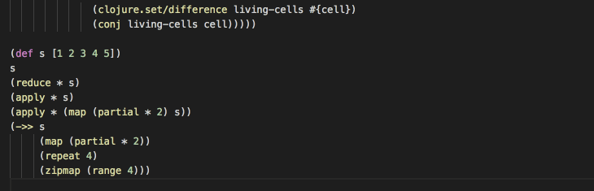

# Calva: Clojure 4 VS Code

[Clojure and ClojureScript support](https://marketplace.visualstudio.com/items?itemName=cospaia.clojure4vscode). nREPL and Cider powered.

## Raison d´être

Try to bring some of the Emacs CIDER experience to VS Code. Supporting both Clojure and ClojureScript. If I can bring some productive concepts from other Clojure dev environments, like Cursive, to code as well, I will.

Demo: evaluate files



Demo: Peek at defintions, etcetera:


Demo: lint errors are marked in the editor. (As are unit test failures)


### Based off of Visual Clojure
You think Calva looks similar to the **visual:clojure** extension? It's because it is based on that one. 🤠

Calva then adds some tricks:
- Running tests through the REPL connection, and mark them in the Problems tab
  - Run namespace tests: `alt+v t`
  - Run all tests: `alt+v a`
  - Marks test failures using the Problem tab
  - User setting to evaluate namespace on save/open file (defaults to **on**)
  - **Caveat**: Right now the tests are reported only when all are run, making it painful to run all tests in larger projects. I'll fix it. Promise!
- Improved code evaluation
  - Evaluate code and show the results as annotation in the editor: `alt+v e`
  - Evaluate code and replace it in the editor, inline: `alt+v r`
  - Pretty printing evaluation resuls: `alt+v p`
  - Error information when evaluation fails (at least a hint)
  - Support for `cljc` files and you can choose if they should be evaluated by the `clj` or the `cljc` repl session.
  - Enables `clj` repl for all files/editors. You now can evaluate those clojure code snippets in Markdown files.
  - The evaluation commands will auto-”detect” vectors and maps as well as list. (It still will only auto-detect up to the next or previous bracket, and thus will miss things like reader markers, like conditional `#?`, before lists, and more. I am working on fixing that, se below under Future Stuff.)
- Integrated REPLs using the Terminal tab (I call them **Terminal REPLs**)
  - Switch to current namespace in the terminal REPL: `alt+v n`
  - Load current namespace in the terminal REPL: `alt+v alt+n`
  - Evaluate code from the editor to the terminal REPL: `alt+v alt+e`
  - The extension defaults to trying to use **Leiningen** for connecting, but is somewhat prepared for other tools. Check the `clojure4vscode.connectREPLCommand` user setting (untested, please let me know if it works or not).
- When editing `cljc` files, easily choose if repl commands should go to the `clj` or `cljs` repl
- Enables `clj` repl in all files (not just Clojure files).
- Selection of current form: `alt+v s`. Auto-detected the same way as for evaluation. Will select the form preceding or following the cursor first, otherwise the form the cursor is inside. (Only when the cursor is directly adjacent to any bracket so far.)

Demo: switch between clj and cljs repl sessions for cljc files:


NB: **You shouldn't run both extensions, beacuse that will get very confused.**

## Current Features
The above mentioned, plus:
* Intellisense
* Underlining compile-time errors
* Go to / Peek at definition
* View docstrings on hover
* View function signatures on hover
* Supports all clojure filetypes, clj, cljc and cljs.


## Future Stuff
* Test reporting while tests are being run. HIGH PRIORITY.
* Rerun of last failing tests.
* Custom user commands to execute over the REPL connection
* Let me know what you want. PRs welcome, file an issue or tweet me: [@pappapez](https://twitter.com/pappapez)

## Autolinting

The extension comes with autolinting disabled. This is because you will need to have [Joker](https://github.com/candid82/joker) installed in order for it to work. You will probably want to have Joker installed regardless so, just do it and then enable autolinting by setting:
```
"clojure4vscode.lintOnSave": true
```

## Dependencies

(See also about Autolinting above.)

Calva uses nrepl for evaluation / communication, and cider-nrepl for added nrepl functionality

Best place, imho, to configure them is in the `~/.lein/profiles.clj` like so:

```
{:user {:plugins [[cider/cider-nrepl "0.16.0"]]
        :dependencies [[org.clojure/tools.nrepl "0.2.12"]]}
```

If you are only using Clojure then you are all set.

### For Clojurescript

Add piggiback and its nrepl middleware `wrap-cljs-repl`:

```clojure
{:user {:plugins [[cider/cider-nrepl "0.16.0"]]
        :dependencies [[com.cemerick/piggieback "0.2.2"]
                       [org.clojure/tools.nrepl "0.2.12"]]
        :repl-options {:nrepl-middleware [cemerick.piggieback/wrap-cljs-repl]}}}
```

## Connecting to the REPL

Calva defaults to automatically connecting to a running nrepl session, it does not start the repl for you. Start it from the terminal/command prompt if it is not running. Leiningen users do it like so:

```
$ lein repl
```

WHen the repl has started, start VS Code and open the project root directory. The extension will then connect, and you are ready to bend the laws of nature using Clojure.

Yay! 🍾 🎆 ✨

### ClojureScript REPL

If you want to use ClojureScript, you start its repl off of the repl you have just started, i.e. **not** using `lein figwheel` because then the extension will not know how to connect. Open the project in VS Code and the extension will connect to the ClojureScript repl for `cljs` files and to the Clojure repl for `clj` and `cljc` files.

Yay! 🥂 🤘 🍻

Read on for some pointers on this if you are not familiar.

#### Figwheel

Most people use Figwheel (bacause awesome).

**To initiate a figwheel-repl you need the figwheel-sidecar dependency -> [figwheel-sidecar "0.5.8"] as well correct cljs classpaths**
read more about this [here](https://github.com/bhauman/lein-figwheel/wiki/Using-the-Figwheel-REPL-within-NRepl)

If you have created a figwheel-project from a template (using e.g. lein new), you should be good to go as long as you start the repl in the projects folder.

Having started the initial repl like above with ```lein repl```, initiate figwheel from there (beacuse reasons stated above). Then:

```
 (use 'figwheel-sidecar.repl-api)
 (start-figwheel!)
 (cljs-repl)
```

I can recommend adding a start function to your projects `dev` namespace to pack these calls into something like:

```
dev=> (start)
```

#### W/o Figwheel

If you want to start a ClojureScript REPL-session sans Figwheel, you can start this from the existing clojure-REPL that we just created.
Using piggieback we can initiate a cljs-repl using e.g. rhino:

Run the following command in the REPL to start a cljs-session with rhino: ```(cemerick.piggieback/cljs-repl (cljs.repl.rhino/repl-env))```

## Happy coding

I hope you will find tons of use for this extension! Please let me know what you think or want. PRs welcome, file an issue or tweet me: [@pappapez](https://twitter.com/pappapez)

❤️

**Calva** works nicely together with [Paredit](https://marketplace.visualstudio.com/items?itemName=clptn.code-paredit) and [Parinfer](https://marketplace.visualstudio.com/items?itemName=shaunlebron.vscode-parinfer).