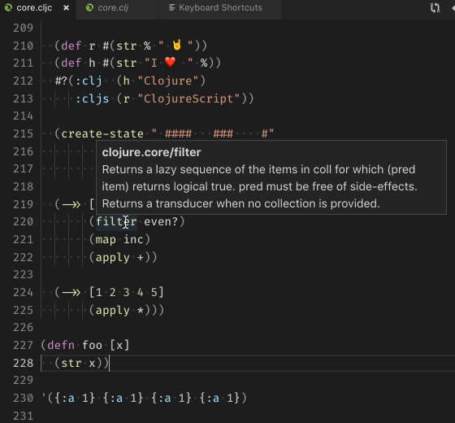

# Calva: A Clojure & ClojureScript IDE in Visual Studio Code

_Distilled from [CIDER](https://cider.mx/)*._

Welcome to [Calva](https://marketplace.visualstudio.com/items?itemName=betterthantomorrow.calva), an integrated, REPL powered, development environment for enjoyable and productive [Clojure](https://clojure.org) and [ClojureScript](https://clojurescript.org) programming in [Visual Studio Code](https://code.visualstudio.com). It includes:

* inline [code evaluation](https://calva.io/evaluation/)
* [structural editing](https://calva.io/paredit/)
* code [formatting](https://calva.io/formatting/)
* code navigation
* a [debugger](https://calva.io/debugger/)
* [linting](https://calva.io/linting/)
* syntax highlighting
* Clojure aware rainbow brackets
* a [test runner](https://calva.io/test-runner/)
* refactoring support
* and much more.

A lot of effort has been put into making Calva a good choice to start if you are new to Clojure. [Calva is open source](https://github.com/BetterThanTomorrow/calva) and free to use.

(*) Calva is short for Calvados, a liquid gifted to humanity from God. Calvas's REPL power is harvested from the produce of [The Orchard](https://github.com/clojure-emacs/orchard).

## Users Like it 😍

Crispin Bennett's review:
> This is great, and makes VS Code a truly viable IDE/editor for clojure development. It has great REPL support (including inline evaluation), an extensive Paredit implementation, and excellent linting (care of the bundled clj-kondo). Calva is being improved on at an impressive clip by maintainers who appear solidly committed to its ongoing development. It's well-documented, and manages to be both approachable and capable. A no-brainer if you're already a VS Code user, and well worth a look if you're not.

## It's Easy to Get Started

[Get Started with Clojure in VS Code in 20 seconds](https://www.youtube.com/embed/O6GrXXhCzCc)

## There is Documentation

Head over to [calva.io](https://calva.io/) to learn more about how to use Calva. The most important stuff would be:

* [Connect Calva to Your Project](https://calva.io/connect/) (TL;DR; Use **Jack in**.)
* [Quirks](https://calva.io/quirks/) (Yes, there are quirks.)
* [Paredit – a Visual Guide](https://calva.io/paredit/) (Clojure editing is for civilized people.)

## Why Calva?

From [The Tao of Calva](https://github.com/BetterThanTomorrow/calva/wiki):

> Calva's _raison d´être_ is to provide Visual Studio Code users with an easy to use and productive environment for [Clojure](https://www.clojure.org) and [ClojureScript](https://clojurescript.org) development.

From the same page you can also learn that we want Calva to be a good choice for VS Code users asking:

> _How do I use my favorite code editor for Clojure development?_

We also hope that Calva will contribute to making it easier to pick up Clojure as a new language.

## Getting Started with Calva

Go to the [documentation](https://calva.io/) to find info on how to connect Calva to your project and start evaluating code and such. The documentation is built from this repository, and the source files are located in `docs/site`. So if you know about workarounds or gotchas or anything that is good to know about when using Calva, please edit the appropriate page (or create a new page) by PR.

## Features

* Syntax highlighting, plus:
  * Rainbow parens
  * Rainbow indent guides
  * Highlight active indent guide
  * Highlights misplaced brackets
  * LISP friendly bracket matching
  * Ignore form (`#_`) dimming and `(comment)` form highlighting
* Code formatting and autoindent according to [The Clojure Style Guide](https://github.com/bbatsov/clojure-style-guide)
* Structural Editing (via [Paredit](https://calva.io/paredit/))
* [Linting](https://calva.io/linting/)
* Intellisense
* Go to / peek at definition
* Find all references
* Rename symbol
* Change all occurrences
* References code lens (enable in settings)
* Outline view
* View doc strings on hover
* View function signatures on hover, including help with knowing which argument you are typing
* [Debugger](https://calva.io/debugger/)
* Support for [Clojure tools/deps](https://clojure.org/guides/deps_and_cli), [Leiningen](https://leiningen.org), [shadow-cljs](http://shadow-cljs.org), [Figwheel Main](https://figwheel.org), [lein-figwheel](https://github.com/bhauman/lein-figwheel), [Clojurephant](https://github.com/clojurephant/clojurephant) (Gradle) and the built-in ClojureScript browser/node repls. (For [Boot](https://boot-clj.com), only Connect scenarios work, there is no Jack-in there.)
* Your [Custom Connect Sequences](https://calva.io/connect-sequences/), including fully customized ClojureScript REPLs.
* Switch the ClojureScript REPL connection between your different builds at will.
* When editing `cljc` files, easily choose if REPL commands should go to the `clj` or `cljs` REPL by clicking the `cljc/clj[s]` indicator in the status bar.
* And more

### Powered in Part by Clojure-lsp

Calva uses a mix of static and dynamic analysis to power the experience. A lot of the static abilities come from [clojure-lsp](https://github.com/clojure-lsp/clojure-lsp), and you can read more about [Calva's integration of clojure-lsp](https://calva.io/clojure-lsp/) in the documentation.

### Demo: Evaluate top level forms inside `(comment...)`

The gif demos several more features, apart from the in-comment evaluation, like:

* Signature help while typing function calls
* Evaluation result display is a bit sticky (so you can examine several evaluations at once)
* There is a richer display of results in the hover of the evaluated expression. (From where you can also copy the results to the clipboard)
  * Edit: This feature has been removed in favor of using peek definition. See [here](https://calva.io/output/#peek-at-results). This decision was made due to high memory usage from storing results, but may be added back at some point if it's desired by many users over the peek definition feature. Please [let us know here](https://github.com/BetterThanTomorrow/calva/issues/736) if you'd like this added back.
* Some [structural editing](https://calva.io/paredit/)

### Demo: Signature Help, while Typing

It is pretty educational using the signature help hover to see which argument you are typing when the argument list is using destructuring, or when an argument is threaded in first before the arguments you provide inside the form.

### Demo: Syntax highlighting, rainbow parens and guides

### Demo: Syntax highlighting, dimming ignored forms

### Demo: Peek at definitions, etcetera

### Demo: switch between `clj` and `cljs` repl sessions for `cljc` files

### Demo: References code lens (enable in settings)

### Demo: Outline

## How to contribute

I'm glad you are reading this section! There are many ways and you are welcome to combine them at will. Be creative 😄:

* Give us feedback.
  * Via [#calva](https://clojurians.slack.com/messages/calva/) at the Clojurians Slack.
  * Via filing issues.
* Fix issues. PRs welcome! Calva is built using a combination of TypeScript and ClojureScript. The ClojureScript part uses the [shadow-cljs](http://shadow-cljs.org) tool chain. See the [How to Contribute](https://github.com/BetterThanTomorrow/calva/wiki/How-to-Contribute) page on the wiki for instructions on how to hack on Calva. TL;DR _It is super easy to get started!_
* Fix typos in the UI and in the docs. It might seem like a small enough thing to not bother about it, but really, typos get in the way of comprehension. Typos are bad, uhm?
* Become a GitHub sponsor. Read on.

## Calva Sponsors ❤️

A considerable amount of time, creativity, energy, worries, sweat, and tears (well, no tears, but anyway 😄), is being spent on Calva. Please consider sponsoring us to show us that extra level of appreciation. Here are the ways you can do it:

* Sponsor [Peter Strömberg](https://github.com/sponsors/PEZ)
* Sponsor [Brandon Ringe](https://github.com/sponsors/bpringe)
* Sponsor [Cora Sutton](https://github.com/sponsors/corasaurus-hex)
* Sponsor [Lukas Domagala](https://github.com/sponsors/Cyrik)

Please see [this statement from Cognitect](https://cognitect.com/blog/2020/12/15/sponsoring-open-source-developers) about the importance of supporting open source developers.

Significant additions to Calva has been made possible by funding from [Clojurists Together](https://www.clojuriststogether.org). And this has often been transformational for the whole project.

The following people are helping to keep Calva maintained and improved by sponsoring with their hard earned money. It is fantastic. Thank you!

Patrons, Gold, and Silver sponsors are also displayed here: https://calva.io/#sponsors.

### Calva Patrons

### Calva Gold Sponsors

### Calva Silver Sponsors

### Calva Pro Fans

### Calva Super Fans

### Calva Fans

### Calva Friends

## The Calva Team

We are Clojure and Visual Studio Code fans who care about the ergonomics of using our favorite programming language with our editor of choice.

### Current Maintainers

* [Peter Strömberg](https://github.com/PEZ)
* [Brandon Ringe](https://github.com/bpringe)
* [Cora Sutton](https://github.com/corasaurus-hex)
* [Lukas Domagala](https://github.com/Cyrik)

### Alumni

* [Kevin Ahlbrecht](https://github.com/kstehn)
* [Christian Fehse](https://github.com/cfehse)
* [Matt Seddon](https://github.com/mseddon)
* [Pedro Girardi](https://github.com/pedrorgirardi)
* [Stian Sivertsen](https://github.com/sivertsenstian) (Creator of Visual:Clojure)

### Code Contributors

Calva is an open source project with surprisingly many code contributors. We take great care to keep it easy and fun to contribute. See the [Calva Development Wiki](https://github.com/BetterThanTomorrow/calva/wiki) for more on this.

## Happy Coding

We hope you will find good use for Calva. Please let us know what you think. PRs welcome, file an issue or chat us up in the [#calva](https://clojurians.slack.com/messages/calva/) channel in the Clojurians Slack.
