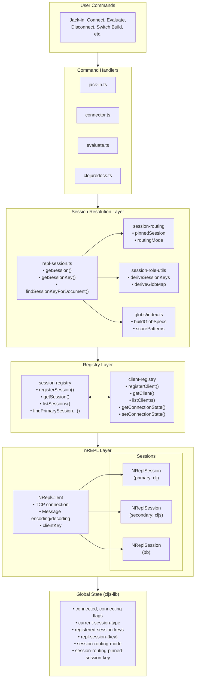
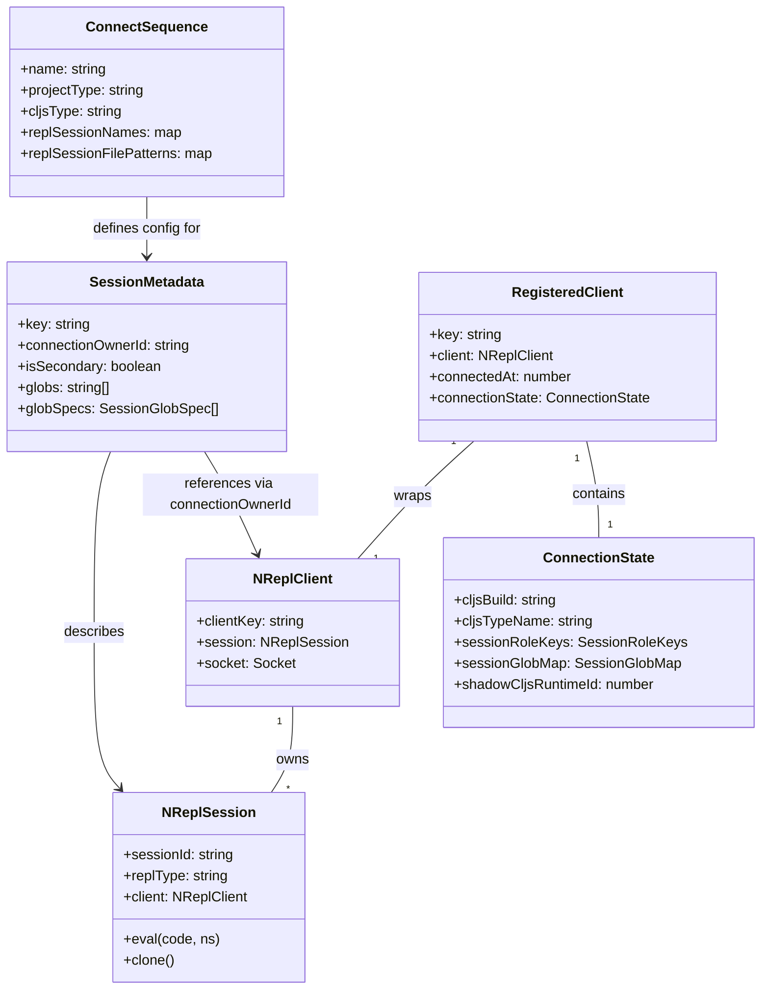
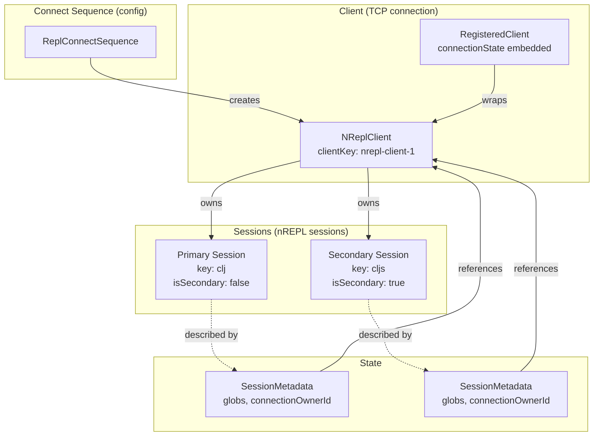
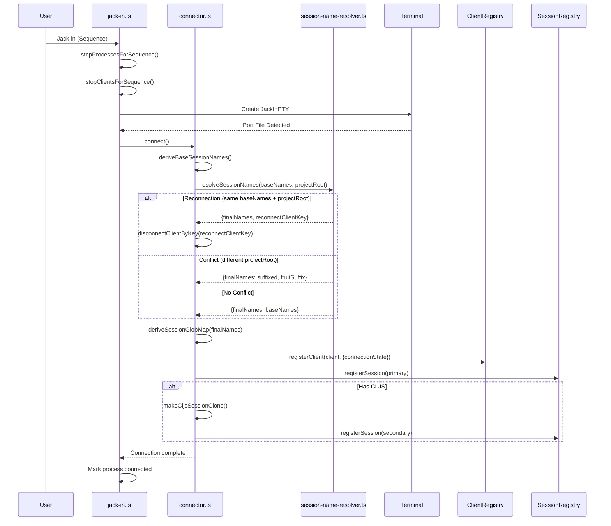
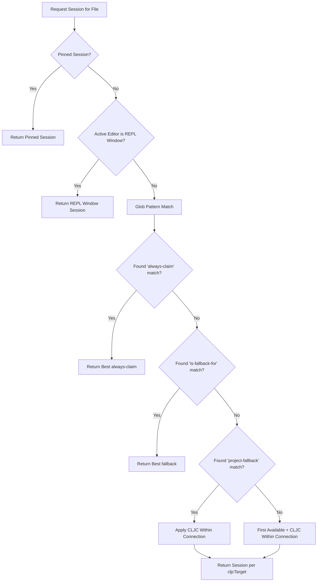
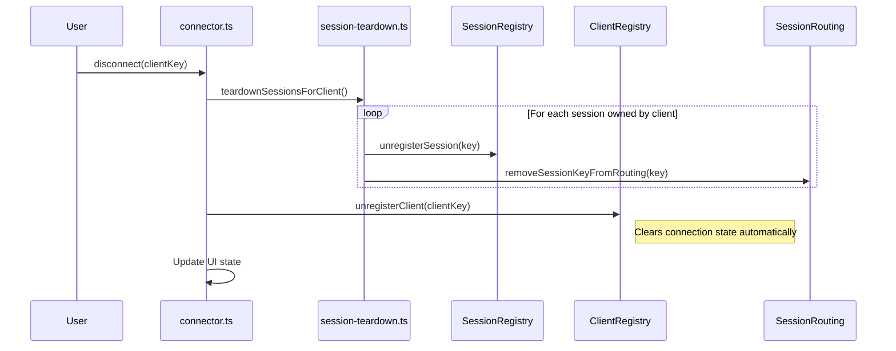
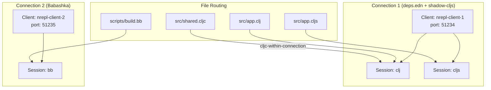

# Calva Multi-Session Architecture

This document describes the architecture of Calva's multi-session support. It is intended to aid in reasoning about the system for re-architecture and simplification efforts.

## Status: Unreleased

This multi-session system is **not yet released**. See the [Unreleased section in the changelog](../../CHANGELOG.md#unreleased) for details. This means we have significant freedom to reshape the architecture before it becomes a compatibility concern.

**Backward Compatibility Constraint:** The primary compatibility requirement is that users who only use a single connect sequence (the current default behavior) should experience no breakage. This is already achieved.

## Document Structure

- [Core Concepts](#core-concepts) - Key terminology and relationships
- [Architecture Overview](#architecture-overview) - Component diagram and registries
- [Data Structures](#data-structures) - TypeScript interfaces and state shape
- [Connection Scenarios](#connection-scenarios) - Jack-in, Connect, Disconnect flows
- [Feature Usage](#feature-usage) - How features use sessions
- [Session Routing Details](#session-routing-details) - Detailed routing algorithm
- [Component File Index](#component-file-index) - Where to find what

---

## Core Concepts

### Connect Sequences

A **Connect Sequence** describes how Calva should connect to a project. It defines:

| Property | Description |
|----------|-------------|
| `name` | Display name shown in menus |
| `projectType` | e.g., `deps.edn`, `Leiningen`, `shadow-cljs` |
| `cljsType` | e.g., `Figwheel Main`, `shadow-cljs`, `none` |
| `replSessionNames` | Custom keys for sessions: `{ primary: "clj", secondary: "cljs" }` |
| `replSessionFilePatterns` | File routing patterns for sessions (overrides project type defaults) |
| `nReplPortFile` | Path segments to port file, e.g., `[".shadow-cljs", "nrepl.port"]` |

A connect sequence typically results in one **Primary Session** (usually Clojure) and optionally one **Secondary Session** (usually ClojureScript).

**Built-in sequences** are defined in `src/nrepl/connectSequence.ts`. User-defined sequences come from `calva.replConnectSequences` setting.

### Sessions

A **Session** (`NReplSession`) represents an nREPL session. Sessions are registered with metadata:

| Property | Description |
|----------|-------------|
| `key` | Unique identifier (e.g., `clj`, `cljs`, `bb`, `worker-1`) |
| `connectionOwnerId` | The `clientKey` of the owning `NReplClient` |
| `isSecondary` | Boolean flag for CLJS sessions via Piggieback/shadow-cljs |
| `globs` | Simple glob patterns this session handles |
| `globSpecs` | Detailed glob specifications with tier and score |
| `projectRoot` | Project root URI |

### Session Roles

Sessions have one of two roles within a connection:

| Role | Description | Default Key |
|------|-------------|-------------|
| **primary** | Primary session, always created | `clj` |
| **secondary** | Secondary session for CLJS via Piggieback/shadow-cljs | `cljs` |

The term "secondary" reflects that this session is created as a companion to the primary session, typically by cloning the primary and upgrading it for ClojureScript via Piggieback or shadow-cljs middleware.

**Non-CLJS connections:** Sessions like Babashka (`bb`) or Joyride are always **primary sessions** in their own connection—they have no secondary session. The `isSecondary` flag specifically means "spawned/cloned from the primary within the same nREPL connection." This distinction matters because:
- Primary sessions represent independent entry points (each their own TCP connection)
- Secondary sessions share the TCP connection with their primary and are created by cloning
- The ecosystem may create more secondary session types in the future (beyond CLJS), but for now only the CLJ+CLJS case uses this pattern

### Clients

A **Client** (`NReplClient`) represents a TCP connection to an nREPL server. Key properties:

- `clientKey`: Unique identifier (e.g., `nrepl-client-1`)
- Owns the socket connection
- Can host multiple sessions (primary + secondary)

### Session Routing

**Session Routing** determines which session handles evaluation for a given context (file, REPL window, etc.).

| Mode | Description |
|------|-------------|
| **Auto-routing** | Calva selects session based on: 1) REPL window session (when evaluating from REPL window), 2) Glob patterns (from sequence config, project type defaults, or generic role defaults), 3) Per-connection CLJC target preference for project-fallback files and files outside any project. |
| **Pinned Session** | User forces a specific session for all evaluations, bypassing auto-routing. |

### REPL Window

The **REPL window** is a special `.calva-repl` file that serves as an interactive prompt. There is one global REPL window (not per-connection). It has its own **targeted session** that determines where evaluations from the REPL window are sent.

**Terminology note:** The REPL Windoww is **not** the same as the "Output Window" (see `outputWindow.ts`). These are distinctly different things.

| Concept | Description |
|---------|-------------|
| **REPL window targeting** | Which session the REPL window sends evaluations to. Changed via "Select REPL Window Session" command. |
| **Session pinning** | User override that forces ALL evaluations (from any file) to use a specific session. Independent of REPL window targeting. |

The REPL window's targeted session is used during routing only when the active editor is the REPL window itself.

### Session Name Resolution

Session names are resolved at connection time using the following rules:

1. **Base names** come from the connect sequence's `replSessionNames` configuration, or project type defaults
2. A connection is identified by the tuple `(baseNames, projectRoot)`
3. If the base names conflict with an existing connection at a *different* project root, a **fruit suffix** is applied (e.g., `clj` → `clj-apple`)
4. If the base names match an existing connection at the *same* project root, this is a **reconnection** — the existing connection is disconnected and names are reused
5. Fruit suffixes are released back to a global pool on disconnect

This automatic conflict resolution allows multiple projects with the same session names to be connected simultaneously without manual configuration.

**Reconnection criteria:** Two connections are considered "the same REPL" when they share both `projectRoot` AND `baseSessionNames`. When reconnecting to such a REPL, the existing connection is disconnected first and the session names are reused. This means:
- Connecting to the same project with the same session names → reconnection (old connection replaced)
- Connecting to a different project with the same session names → new connection with fruit suffix
- Connecting to the same project with different session names → new connection (names don't conflict)

**Note:** Port number is *not* part of the sameness criteria. A future enhancement could add port to the criteria to support multiple REPLs of the same type in one project root.

---

## Architecture Overview

The system is built around several registries and managers:

### Component Diagram



### Key Registries

#### Session Registry (`src/nrepl/session-registry.ts`)

Central storage for all registered sessions across all connections.

| Function | Purpose |
|----------|---------|
| `registerSession(key, session, metadata)` | Store session with metadata |
| `getSession(key)` | Retrieve session by key |
| `unregisterSession(key)` | Remove session |
| `listSessions()` | Get all session metadata |
| `listSessionsByClient(clientKey)` | Sessions owned by a specific client |
| `findPrimarySessionForConnection(sessionKey)` | Find primary session for same connection |
| `getConnectionStateForSession(sessionKey)` | Get per-connection state |

**Storage mechanism**: Uses `cljs-lib.setStateValue/getStateValue` with prefixed keys.

#### Client Registry (`src/nrepl/client-registry.ts`)

Tracks active nREPL client connections.

| Function | Purpose |
|----------|---------|
| `registerClient(client, metadata)` | Store client entry |
| `unregisterClient(clientKey)` | Remove client |
| `listClients()` | Get all registered clients (sorted by connectedAt) |
| `getClient(clientKey)` | Get client by key |

**Storage mechanism**: Uses an in-memory `Map<string, RegisteredClient>`.

#### Connection State (embedded in `src/nrepl/client-registry.ts`)

Per-connection state for CLJS-specific information. This used to live in a separate `connection-state.ts` module but is now stored on each `RegisteredClient` entry inside the client registry.

| Function | Purpose |
|----------|---------|
| `getConnectionState(clientKey)` | Get state for a connection |
| `setConnectionState(clientKey, state)` | Set/merge state |

**Storage mechanism**: In-memory `Map<string, RegisteredClient>` inside `client-registry`, with the connection state embedded on each entry. Clearing happens when the client is unregistered.

### Connector (`src/connector.ts`)

Orchestrates the connection process:

- Creates `NReplClient` instances
- Handles CLJS REPL setup (cloning sessions, evaluating start/connect code)
- Manages the transition from single CLJ session to CLJ+CLJS pair
- Handles disconnection and cleanup

### Session Routing (`src/nrepl/session-routing.ts`)

Manages routing state (but not the routing logic itself—that's in `repl-session.ts`):

| Function | Purpose |
|----------|---------|
| `getRoutingMode()` | Returns `'auto'` or `'pinned'` |
| `pinSession(key)` | Pin a specific session |
| `enableAutoRouting()` | Switch back to auto |
| `resolvePinnedSession()` | Returns pinned session key if mode is 'pinned', else undefined |
| `removeSessionKeyFromRouting(key)` | Clean up on disconnect |

### Client Registry CLJC Helpers (`src/nrepl/client-registry.ts`)

CLJC preference is now per-connection, stored in `ConnectionState`:

| Function | Purpose |
|----------|---------||
| `getCljcTargetForConnection(clientKey)` | Get the cljc target ('primary' or 'secondary') for a connection |
| `setCljcTargetForConnection(clientKey, target)` | Set the cljc target for a connection |

### Repl Session (`src/nrepl/repl-session.ts`)

Primary entry point for session access:

| Function | Purpose |
|----------|---------|
| `getSession()` | Get session for current context (main entry point) |
| `getSessionKey()` | Get session key for current context |
| `getReplSessionType(connected)` | Get session type for display/state |
| `updateReplSessionType()` | Update stored session type |

---

## Data Structures

*Note: See source files for authoritative type definitions. These may drift as the codebase evolves.*

### SessionMetadata

```typescript
// src/nrepl/session-registry.ts
interface SessionMetadata {
  key: string;                    // Unique identifier (e.g., 'clj', 'cljs')
  projectRoot?: string;           // Project root URI
  lastActivity?: number;          // Timestamp of last activity
  globs?: string[];               // Simple glob patterns (legacy)
  globSpecs?: SessionGlobSpec[];  // Detailed glob specifications
  connectionOwnerId?: string;     // Client key that owns this session
  isSecondary?: boolean;          // Whether this is a secondary CLJS session
}
```

### SessionGlobSpec

```typescript
// src/nrepl/globs/index.ts
interface SessionGlobSpec {
  pattern: string;                // Full glob pattern (absolute path)
  displayPattern?: string;        // Human-readable pattern for UI (e.g., '**/*')
  normalizedPattern: string;      // POSIX-normalized pattern
  tier: 'always-claim' | 'is-fallback-for' | 'project-fallback';  // Routing priority tier
  score: number;                  // Pattern specificity score
}
```

### RegisteredClient

```typescript
// src/nrepl/client-registry.ts
interface RegisteredClient {
  key: string;                    // Unique client identifier
  client: NReplClient;            // The actual nREPL client object
  connectSequenceName?: string;   // Name of connect sequence used
  projectRoot?: string;           // Project root path
  host?: string;
  port?: number;
  connectedAt: number;            // Connection timestamp
  connectionState: ConnectionState; // Per-connection state (embedded)
}
```

### ConnectionState

```typescript
// src/nrepl/client-registry.ts (embedded in RegisteredClient)
interface ConnectionState {
  cljsBuild: string | null;       // Current CLJS build (e.g., ':app')
  cljsTypeName: string | null;    // CLJS type (e.g., 'shadow-cljs')
  hasBuilds: boolean;             // Whether CLJS type has selectable builds
  sessionRoleKeys?: SessionRoleKeys;
  sessionGlobMap?: SessionGlobMap;
  connectSequence?: ReplConnectSequence;
  shadowCljsRuntimeId?: number;   // Selected shadow-cljs runtime
  shadowCljsRuntimeInfo?: any;    // Runtime metadata
  baseSessionNames?: SessionRoleKeys;  // Names before fruit suffix
  fruitSuffix?: string;                // Applied fruit suffix, if any
  cljcTarget?: 'primary' | 'secondary'; // Per-connection CLJC target preference
}
```

### SessionRoleKeys

```typescript
// src/nrepl/session-role-utils.ts
interface SessionRoleKeys {
  primary: string;       // Primary session key (e.g., 'clj')
  secondary?: string;    // Secondary session key (e.g., 'cljs')
}
```

### SessionGlobMap

```typescript
// src/nrepl/session-role-utils.ts
type SessionGlobMap = Record<string, SessionGlobSpec[]>;
```

---

## Connection Scenarios

### Jack-in

Jack-in starts a REPL process and connects to it.

**Step-by-step flow:**

1.  **User Action**: Triggers Jack-in command
2.  **Selection**: User selects a **Connect Sequence** (or auto-selected)
3.  **Cleanup**: Stop existing jack-in processes and clients for this sequence
    - `stopProcessesForSequence()` - terminates terminal processes
    - `stopClientsForSequence()` - disconnects existing clients with same sequence
4.  **Terminal**: Create jack-in terminal with `JackInPTY`
5.  **Process**: Start the project command (lein, clj, shadow-cljs, etc.)
6.  **Port Detection**: Wait for nREPL port file to appear
7.  **Connection**: Call `connector.connect()` which calls `connectToHost()`
8.  **Session Setup**:
    - Derive base session names from connect sequence
    - Resolve final names using `resolveSessionNames(baseNames, projectRoot)`
    - If reconnection detected, disconnect existing client
    - If conflict detected, apply fruit suffix
    - Derive glob map from connect sequence
    - Create `NReplClient`
    - Register client in client-registry
    - Initialize connection state (including baseSessionNames and fruitSuffix)
    - Register **Primary Session**
9.  **Secondary Session** (if CLJS configured):
    - Clone primary session
    - Evaluate CLJS start/connect code
    - Register **Secondary Session**
10. **State Update**: Mark jack-in process as connected, update status bar

**Key functions involved:**

| File | Function | Purpose |
|------|----------|---------|
| `jack-in.ts` | `jackIn()` | Entry point |
| `jack-in.ts` | `executeJackIn()` | Orchestrates cleanup and execution |
| `jack-in.ts` | `stopProcessesForSequence()` | Kill existing terminals |
| `jack-in.ts` | `stopClientsForSequence()` | Disconnect existing clients |
| `jack-in.ts` | `executeJackInTask()` | Create terminal, start process |
| `connector.ts` | `connect()` | Called when port detected |
| `connector.ts` | `connectToHost()` | Main connection logic |
| `connector.ts` | `makeCljsSessionClone()` | CLJS session setup |

### Connect (Standalone)

Connect attaches to an already-running nREPL server.

**Flow differences from Jack-in:**

- No terminal creation
- No process management
- User provides host/port or Calva reads port file
- Everything else follows the same `connectToHost()` path

### Disconnect

**Single Client Disconnect:**

1. User selects client to disconnect (or automatic on reconnection)
2. Close nREPL client connection
3. Unregister all sessions owned by that client
4. Unregister client (automatically clears connection state)
5. Remove session keys from routing state
6. Update UI state (connected flag, status bar)

**Disconnect All:**

1. Iterate through all registered clients
2. Disconnect each one
3. Clear all session and client registries

**Key functions:**

| File | Function | Purpose |
|------|----------|---------|
| `connector.ts` | `disconnect()` | Entry point |
| `connector.ts` | `disconnectClientByKey()` | Single client disconnect |
| `session-teardown.ts` | `teardownSessionsForClient()` | Clean up sessions |
| `session-registry.ts` | `unregisterSession()` | Remove from registry |
| `client-registry.ts` | `unregisterClient()` | Remove client (including connection state) |
| `session-routing.ts` | `removeSessionKeysFromRouting()` | Clean routing state |

### Jack-out

Jack-out is disconnect + terminate the jack-in process.

1. Find jack-in process entries matching the sequence/client
2. Disconnect the nREPL client (if connected)
3. Close the PTY/terminal
4. Clean up process tracking

---

## Feature Usage

This section describes how various Calva features interact with the session system.

### Evaluation

**Files involved:** `evaluate.ts`, `repl-session.ts`

**Mechanism:** Session Routing

**Flow:**
1. User triggers evaluation in a file
2. `replSession.getSession()` is called (no parameters needed)
3. Routing logic resolves session based on current context (see [Session Routing Details](#session-routing-details))
4. Code is sent to the resolved session via nREPL `eval` op
5. Results displayed inline and/or in output destination

**Design principle:** The routing logic uses the current editor context (active document, results window state) to determine the appropriate session. Callers don't need to specify file types.

### ClojureDocs Lookup

**Files involved:** `clojuredocs.ts`, `session-registry.ts`

**Mechanism:** Dedicated ClojureDocs Session

ClojureDocs lookups use a **dedicated session** that is probed for ClojureDocs support (`clojuredocs-lookup` op) when sessions connect. This decouples ClojureDocs from session routing.

**On Connect:**
1. When a session is registered, `clojureDocs.probeAndSetSession()` is called
2. If no dedicated ClojureDocs session exists, the session is probed for support
3. If supported, it becomes the dedicated session and cache is initialized

**On Disconnect:**
1. When a session is torn down, `clojureDocs.clearClojureDocsSession()` is called
2. If the disconnected session was the dedicated ClojureDocs session:
   - The dedicated session is cleared
   - Remaining sessions are probed to find a new capable session

**On Lookup:**
1. Get dedicated ClojureDocs session via `sessionRegistry.getClojureDocsSession()`
2. If available, use it for `clojuredocs-lookup` nREPL op
3. If not available, fall back to clojure-lsp

**Key functions:**
| File | Function | Purpose |
|------|----------|---------|
| `session-registry.ts` | `getClojureDocsSession()` | Get the dedicated session |
| `session-registry.ts` | `setClojureDocsSessionKey()` | Set/clear dedicated session key |
| `clojuredocs.ts` | `probeAndSetSession()` | Probe session and set if capable |
| `clojuredocs.ts` | `clearClojureDocsSession()` | Handle disconnect, find new session |
| `clojuredocs.ts` | `findAndSetClojureDocsSession()` | Search remaining sessions for capable one |

### Shadow-CLJS Runtime Management

**Files involved:** `shadow-cljs-runtime.ts`, `shadow-cljs-runtime-core.ts`, `session-registry.ts`

**Mechanism:** Primary Session of Routed Connection

**Flow:**
1. User triggers "Select Runtime"
2. Identify currently routed session (e.g., `cljs`)
3. Find the **Primary Session** (`clj`) belonging to same client via `findPrimarySessionForConnection()`
4. Evaluate shadow-cljs API calls on the **Primary Session**:
   - `(shadow.cljs.devtools.api/repl-runtimes :build-id)`
   - `(shadow.cljs.devtools.api/repl-runtime-select :build-id runtime-id)`
5. Update connection state with selected runtime

**Why primary session?** Shadow-cljs API calls must be evaluated in the CLJ session (the watch process context), not the CLJS runtime.

```typescript
function getPrimarySessionForCurrentConnection() {
  const routedSessionKey = replSession.getReplSessionTypeFromState();
  return sessionRegistry.findPrimarySessionForConnection(routedSessionKey);
}
```

### CLJS Build Switching

**Files involved:** `connector.ts`, `session-registry.ts`, `client-registry.ts`

**Mechanism:** Primary Session of Routed Connection + Session Recreation

**Build Selection with Watcher Status:**
The build selector queries the REPL for active watchers to provide informed UX:
- `getActiveBuilds()` queries runtime for currently watched builds:
  - Shadow-cljs: `(shadow.cljs.devtools.api/active-builds)`
  - Figwheel Main: `(keys @figwheel.main/build-registry)`
- `selectCljsBuild()` presents a picker with watcher status:
  - Active builds: selectable normally
  - Inactive builds: shown as disabled with "Watcher not running"
  - `browser-repl`/`node-repl`: always available (no watcher needed)

**Flow:**
1. User triggers "Switch Build"
2. Identify currently routed session
3. Get connection state to find current CLJS type
4. Find **Primary Session** for that connection
5. Query active builds from REPL
6. Prompt user for new build (disabled items for inactive watchers)
7. Re-run CLJS setup:
   - Clone primary session
   - Evaluate connect code with new build
   - Unregister old secondary session
   - Register new secondary session
8. Update connection state with new build

```typescript
// From connector.ts switchCljsBuild()
const routedSessionKey = replSession.getReplSessionTypeFromState();
const connState = sessionRegistry.getConnectionStateForSession(routedSessionKey);
const cljSession = sessionRegistry.findPrimarySessionForConnection(routedSessionKey);
const [newCljsSession, build] = await makeCljsSessionClone(...);
```

### Testing

**Files involved:** `testRunner.ts`, `repl-session.ts`

**Mechanism:** Session Routing (same as evaluation)

Tests are evaluated via the same routing mechanism as regular evaluation.

### Debugging

**Files involved:** `debugger/calva-debug.ts`, `debugger/decorations.ts`, `repl-session.ts`

**Mechanism:** Session Routing

The debugger uses the routed session for all debug operations (step, continue, quit, etc.). This allows debugging to work with whichever session is currently appropriate for the user's context.

**Note:** Debugging support depends on nREPL middleware (cider-nrepl). The session's `supports('debug')` capability can be checked, but in practice the routed session is used and errors are handled if debugging isn't available.

---

## Session Routing Details

Session routing determines which session handles a given context. The logic is in `repl-session.ts`.

### Resolution Priority

The `getSessionKey()` function checks in this order:

```
1. Pinned Session (user override)
   └─► sessionRouting.resolvePinnedSession() returns pinned key if mode is 'pinned'

2. REPL Window Session (when active editor is REPL window)
   └─► outputWindow.getSessionType() - the explicitly targeted session for the REPL window

3. Glob Pattern Matching (CLJC target only applied for project-fallback tier)
   └─► findSessionKeyForDocument(doc)
       • Build candidate paths from document URI
       • Match against session globSpecs
       • Priority: 'always-claim' > 'is-fallback-for' > 'project-fallback'
       • Higher score wins within same tier
             • For 'project-fallback' matches: apply per-connection CLJC target preference
                 └─► resolveCljcWithinConnection() - redirects to primary/secondary based on cljcTarget
             • For 'always-claim' and 'is-fallback-for' matches: use the matched session as-is (no CLJC redirection)

4. First Available Session + CLJC Within Connection
   └─► sessionRegistry.listSessions()[0] with cljc preference applied
       • Even files outside any project respect the CLJC target preference
       • resolveCljcWithinConnection() applied to first available session
```

**System Guarantees:**
- CLJC target is set to 'secondary' when CLJS session connects (most recently connected session)
- REPL window session is always set when connected
- CLJC preference is per-connection, stored in ConnectionState
- CLJC preference is consulted only for project-fallback routing and the first-available fallback; direct glob matches (`always-claim`, `is-fallback-for`) are not redirected

### Glob Matching Algorithm

```typescript
// Simplified from repl-session.ts
function findSessionKeyForDocument(doc: TextDocument): string | undefined {
  // 1. Build candidate paths
  const candidatePaths = buildCandidatePaths(doc);
  // Includes: absolute path, workspace-relative, multi-root variations

  // 2. For each session with globSpecs
  for (const session of sessions) {
    for (const spec of session.globSpecs) {
      // 3. Check if any candidate matches
      const matched = candidatePaths.some(path =>
        minimatch(path, spec.normalizedPattern)
      );

      if (matched) {
        // 4. Track best match by tier and score
        if (spec.tier === 'always-claim') {
          updateBestAlwaysClaim(session, spec.score);
        } else if (spec.tier === 'is-fallback-for') {
          updateBestFallback(session, spec.score);
        } else {
          updateBestProjectFallback(session, spec.score);
        }
      }
    }
  }

  // 5. Return: always-claim wins, then fallback, then project-fallback
  return bestAlwaysClaim?.sessionKey ?? bestFallback?.sessionKey ?? bestProjectFallback?.sessionKey;
}
```

### Glob Tier Semantics

| Tier | Purpose | Priority |
|------|---------|----------|
| `always-claim` | Primary patterns that definitively claim files (e.g., `*.clj` → clj session) | Highest |
| `is-fallback-for` | User-configured fallback patterns used when no `always-claim` matches | Middle |
| `project-fallback` | Auto-generated catch-all (`**/*`) scoped to project root, hidden from UI | Lowest |

**Score calculation:** More specific patterns (more path segments, literal characters) get higher scores.

**Workspace-wide patterns:** By default, file patterns are scoped to the connect sequence's project root (e.g., `*.clj` becomes `/project/root/**/*.clj`). To create patterns that match files anywhere in the workspace, prefix with `**/` (e.g., `**/*.bb`). This is useful for REPLs like Babashka that should handle files outside their project directory.

### Session Access Patterns

There are two main patterns for accessing sessions:

#### 1. Routed Session (Most Common)

Use `replSession.getSession()` when you want the session appropriate for the current context:

```typescript
import * as replSession from './nrepl/repl-session';

// Gets session based on: pinned > repl window > glob match (with cljc-within-connection)
const session = replSession.getSession();
await session.eval(code, ns);
```

**Use this pattern for:** Evaluation, testing, completion, hover, definitions, debugging, and most user-facing features.

#### 2. Explicit Session by Key

Use `sessionRegistry.getSession(key)` when you need a specific session by its key:

```typescript
import * as sessionRegistry from './nrepl/session-registry';

// Get a specific session directly - no routing
const session = sessionRegistry.getSession('clj');
```

**Use this pattern for:** API functions that receive an explicit session key parameter, or internal operations that must target a specific session (like shadow-cljs runtime management which must use the primary CLJ session).

#### 3. Lookup Direction Patterns

The system supports lookups in both directions, which is intentional:

**Session → Client → State** (primary pattern for feature code):
- `sessionRegistry.getConnectionStateForSession(sessionKey)` - Get connection state from a session
- `sessionRegistry.findPrimarySessionForConnection(sessionKey)` - Find sibling sessions

**Client → Sessions/State** (used in connector.ts during connection lifecycle):
- `sessionRegistry.listSessionsByClient(clientKey)` - List sessions for cleanup
- `connectionState.getConnectionState(clientKey)` - Direct state access when clientKey is known

**When to use which:**
- Feature code (evaluation, testing, providers) should start from a routed session and use Session → Client → State
- Connection management code (connector.ts, jack-in.ts) naturally has clientKey and can use direct lookups

---

## Component File Index

### Core Session Management

| File | Purpose |
|------|---------|
| `src/nrepl/session-registry.ts` | Central session storage, metadata, lookups by client/role, explicit session access |
| `src/nrepl/client-registry.ts` | Client lifecycle, active client tracking, per-connection state (CLJS build, runtime, role keys) |
| `src/nrepl/session-routing.ts` | Pinned session state, routing mode queries |
| `src/nrepl/repl-session.ts` | **Primary entry point for session access**, routing logic, glob matching |

### Connection & Jack-in

| File | Purpose |
|------|---------|
| `src/connector.ts` | Main connection orchestration, CLJS setup, disconnect |
| `src/nrepl/jack-in.ts` | Jack-in process management, terminal, port detection |
| `src/nrepl/connectSequence.ts` | Built-in sequence definitions, sequence selection UI |
| `src/nrepl/connect-sequence-types.ts` | TypeScript type definitions |

### Session Configuration

| File | Purpose |
|------|---------|
| `src/nrepl/project-types.ts` | Project type definitions including default file patterns |
| `src/nrepl/session-role-utils.ts` | Derive session keys and glob maps from sequences (checks sequence config, project type defaults, then generic defaults) |
| `src/nrepl/session-name-resolver.ts` | Session name conflict resolution with fruit suffixes |
| `src/nrepl/fruit-suffix.ts` | Fruit pool management for automatic session name suffixing |
| `src/nrepl/globs/index.ts` | Glob spec construction, pattern scoring |
| `src/nrepl/glob-paths.ts` | Path normalization, candidate path building |
| `src/nrepl/secondary-session.ts` | Determine if CLJS type needs secondary session |

### Session Cleanup

| File | Purpose |
|------|---------|
| `src/nrepl/session-teardown.ts` | Session cleanup with side effects |

### Features Using Sessions

| File | Purpose |
|------|---------|
| `src/evaluate.ts` | Code evaluation |
| `src/testRunner.ts` | Test execution |
| `src/clojuredocs.ts` | Documentation lookup |
| `src/debugger/calva-debug.ts` | Debugger session (step, continue, quit) |
| `src/debugger/decorations.ts` | Debug decorations |
| `src/shadow-cljs-runtime.ts` | Runtime selection (high-level) |
| `src/shadow-cljs-runtime-core.ts` | Runtime API calls (low-level) |
| `src/providers/completion.ts` | Code completion |
| `src/providers/definition.ts` | Go to definition |
| `src/providers/hover.ts` | Hover information |
| `src/providers/signature.ts` | Signature help |
| `src/namespace.ts` | Namespace operations |
| `src/refresh.ts` | Clojure tools.namespace refresh |

---

## Diagrams

### Class Relationships



### Entity Ownership Model



### Jack-in Flow



### Session Routing Logic



### Disconnect Flow



### Multi-Connection Scenario



---

## Simplification Considerations

This section notes potential areas for architectural simplification, based on the current state of the codebase.

### State Distribution

Currently state is spread across:

1. **cljs-lib** (global atom) - session objects (with `_calvaSessionMetadata` attached), routing state, flags
2. **client-registry** (in-memory Map) - client instances and per-connection state

**Future consideration:** The cljs-lib session storage could potentially be consolidated with the TypeScript client-registry, but this would require more significant changes to the session lifecycle.


