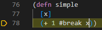
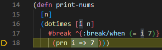
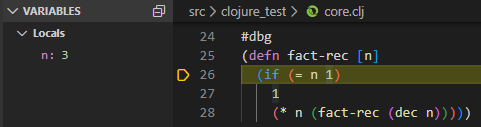
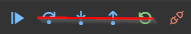

# Debugger

Calva's debugger allows you to place breapoints via reader tags so that execution will pause at those locations. During paused execution, you can see the value of local variables in the side pane, as well as evaluate code within the local context - via the editor or the repl-window, just as you normally would evaluate code.

The debugger is in an early release stage. Some functionality does not yet work. See the [features](#features) section for details.

Note: The debugger currently does not support ClojureScript. Calva's debugger utilizes cider-nrepl for debugging. See [this Cider issue](https://github.com/clojure-emacs/cider/issues/1416) for more information.

## Using the Debugger

### Setting Breakpoints with `#break`

You can insert a breakpoint manually into any code by placing a `#break` in front of the form where you want execution to pause, and then evaluating the top level form with `ctrl+alt+c space`. When you evaluate a call to this code the VS Code debugger will start, the cursor will move to right after the form that's preceded by `#break`, and the line will be highlighted so show execution is paused there.

Note: Code will be executed up to and including the form preceding the cursor.

You can also set conditional breapoints by adding metadata before the form that the `#break` applies to.

### Instrumenting a Function with `#dbg`

Adding `#dbg` before a function definition then evaluating the top-level form with `ctrl+alt+c space` will instrument the function, meaning breakpoints will be added in places where it makes sense. When you evaluate a call to this function, execution will pause wherever breakpoints were added. These breakpoints are not visible in the editor. If you notice execution does not pause, it's likely that no reasonable place was found to place a breakpoint.

### Evaluating Code in the Paused Context

When execution is paused at a breakpoint, you can evaluate code in that context. This can be done in the editor or in the REPL window, as usual. In the REPL window, the prompt changes to `<<debug-mode>>=>` to show that evaluations will occur in the debug context.

### Viewing Variable Values While Debugging

While debugging, you can view the values of variables in VS Code's debugger side pane. You can also view values by hovering over the variables in the editor. Currently, values for collections and maps are shown as strings, but we plan to make them structured in the future. For now, if you want to see the value of a large structured variable, you can evaluate the variable, either from the editor or from the REPL window.

### Navigation

You can use VS Code's debugger UI to navigate while debugging. Currently only the continue functionality is implemented, but in the future step over, step into, and step out will be implemented as well. Clicking the step buttons currently does nothing. Also, clicking restart does nothing, since this functionality does not make sense for our debugger.

## Features

### Current

- Set breakpoints with `#break`
- Instrument functions with `#dbg`
- Continue to next breakpoint
- Evaluate code in the debug context
- See variable values in the debugger side pane
- See variable values on hover in the editor

### Upcoming

- Step over form
- Step into form
- Step out of form
- See structured variables in the debugger side pane (currently maps and collections are just shown as strings)
