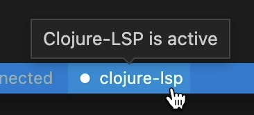
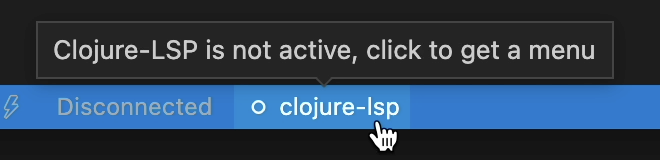
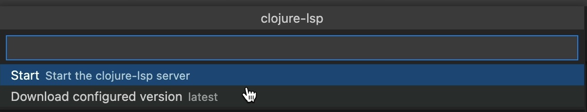

# Clojure-lsp

Calva uses a mix of static and dynamic analysis to power the experience. A lot of the static abilities come from [clojure-lsp](https://github.com/snoe/clojure-lsp). This enables you to check something up in a project, with a lot of navigational and contextual support, without starting a REPL for it. (And once you do start a REPL you'll get even more capabilities, enabled by the dynamic analysis.)

!!! Note "Which clojure-lsp does Calva use?"
    Calva defaults to using the `latest` clojure-lsp released. To use a different version of clojure-lsp, see the [configuration](#configuration) section. **Calva does not use the clojure-lsp installed on your system, unless you [set the path for clojure-lsp](#using-a-custom-clojure-lsp-native-binary) to the installed binary in your settings**. You can see what version is being used by running the `Clojure-lsp Server Info` command, which will also show the version of clj-kondo that's being used as well as other info. 

## The LSP server starts automatically

Unless you set `calva.enableClojureLspOnStart` to `false`, Calva will automatically start clojure-lsp. And you won't need to install antyting, because Calva handles that. It can take a while for clojure-lsp to start. Especially the first time for a new project, when clojure-lsp (via `clj-kondo`) indexes the project files.

## LSP server process control

It is highly recommended to let clojure-lsp start automatically, and most often you can just let it do its wonderful magic without bothering with it. There are times when you might want to control and inspect the process, though. Calva has commands for:

* Inspecting the clojure-lsp server information
* Read the clojure-lsp server log
* Stopping clojure-lsp
* Starting clojure-lsp
* Download the configured clojure-lsp version

In the status bar, Calva will show an indicator with the clojure-lsp status.

### Active clojure-lsp

When clojure-lsp is downloaded, started and initialized the status bar indicator will look like so:



Clicking the item will bring up this menu:


See below about the [server info](#server-info-command) and [server log](#opening-the-server-log-file) commands.

### Stopped clojure-lsp

When clojure-lsp is stopped the status bar indicator will look like so:



The clojure-lsp inactive menu:



The download option here will download the configured clojure-lsp version regardless if it is already installed or not. This can be useful when some earlier download has failed resulting in that clojure-lsp can't be started. *NB: It will not download anything if `calva.clojureLspPath` is set to something non-blank.*

### Downloading and starting

The statusbar item also will indicate when clojure-lsp is being downloaded and while it is starting.

## Ignoring LSP cache files

Clojure-lsp stores its project analysis information in your project. Git users can add these lines to their project root directory `.gitignore`:

```
.clj-kondo/cache/
.clj-kondo/.cache/
.lsp/sqlite.*.db
```

## Configuration

For information about how to configure clojure-lsp, see the [settings](https://clojure-lsp.github.io/clojure-lsp/settings/) page of the clojure-lsp docs.

### Changing the Version of Clojure-lsp Used by Calva

By default, Calva will use the latest released **clojure-lsp**. You can change the version of clojure-lsp used by Calva by setting the `calva.clojureLspVersion` property to a version of clojure-lsp found in its GitHub [releases](https://github.com/clojure-lsp/clojure-lsp/releases). This can be helpful if you're debugging an issue with clojure-lsp or you want to try out a feature of a new release that Calva does not yet use. However, you must remember to reset this setting in order for Calva to automatically use newer versions of clojure-lsp that are released with new versions of Calva.

Example:

```json
"calva.clojureLspVersion": "2021.04.07-16.34.10"
```

If you have specified a version and want to use the latest release, either remove the setting, or set it to `latest`.

### Using a Custom Clojure-lsp Native Binary

You can set a path to a clojure-lsp binary to be used by Calva by setting the `calva.clojureLspPath` setting. This should be an absolute path. When this is set, the binary at the path will be used and the `calva.clojureLspVersion` setting will be ignored.

Example:

```json
"calva.clojureLspPath": "/usr/local/bin/clojure-lsp"
```

## Troubleshooting

### Viewing the Logs Between the Client and Server

If something doesn't seem to be working correctly, and you suspect the issue is related to clojure-lsp, a good place to start investigating is the request and response logs between the LSP client and server. In your settings, set `clojure.trace.server` to `verbose`, then in the VS Code output tab, select the `Clojure Language Client` output channel.


It may be helpful to clear the output channel, then perform the action with which you're experiencing a problem, then read through the log for clues or paste the logs into a related issue in the Calva repo.

### Server Info Command

You can run the `Clojure-lsp Server Info` command to get information about the running clojure-lsp server, such as the version the server being used, the version of clj-kondo it's using, and more. This info is printed to the "Calva says" output channel.

### Opening the Server Log File

You can open the clojure-lsp log file by running the command `Calva Diagnostics: Open Clojure-lsp Log File`. The log file will only be opened with this command if the clojure-lsp server is running and has finished initializing. If you need to open the file when the server is failing to run or initialize, see the [clojure-lsp docs](https://clojure-lsp.io/troubleshooting/#server-log) for information on the file location.

## Related

See also:

* [Connecting the REPL](connect.md)
* [Refactoring](refactoring.md)
