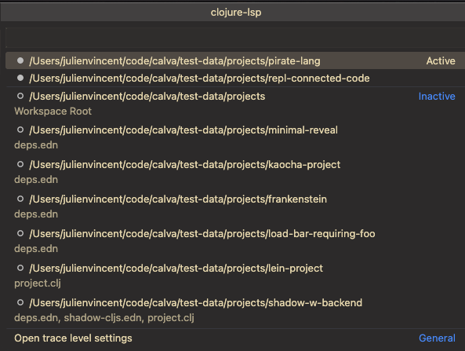
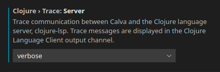

# Clojure-lsp

Calva uses a mix of static and dynamic analysis to power the experience. A lot of the static abilities come from [clojure-lsp](https://github.com/snoe/clojure-lsp). This enables you to check something up in a project, with a lot of navigational and contextual support, without starting a REPL for it. (And once you do start a REPL you'll get even more capabilities, enabled by the dynamic analysis.)

!!! Note "Which clojure-lsp does Calva use?"
    Calva defaults to using the `latest` clojure-lsp released. To use a different version of clojure-lsp, see the [configuration](#configuration) section. **Calva does not use the clojure-lsp installed on your system, unless you [set the path for clojure-lsp](#using-a-custom-clojure-lsp-native-binary) to the installed binary in your settings**. You can see what version is being used by running the `Clojure-lsp Server Info` command, which will also show the version of clj-kondo that's being used as well as other info.

## The LSP server lifecycle

By default you won't need to install/setup anything as Calva handles that for you by automatically downloading the latest clojure-lsp binary. It can take a while for clojure-lsp to start, especially the first time opening a new project, as clojure-lsp (via `clj-kondo`) indexes the project files.

Calva is able to automatically start the clojure-lsp server for you and can be configured to start the server under various different conditions. These behaviours can be configured through the `calva.enableClojureLspOnStart` setting, which takes the following options:

+ "when-workspace-opened-use-workspace-root"
+ "when-file-opened-use-furthest-project"
+ "never"

#### "when-workspace-opened-use-workspace-root" [default]

When set to `"when-workspace-opened-use-workspace-root"` Calva will start the clojure-lsp in the root of all opened vscode workspaces. All Clojure files in a workspace will be serviced by the clojure-lsp server running in that workspace. This behavior requires that you are opening workspaces with a valid Clojure project in the root (the directory must contain a `deps.edn`, `project.clj` or `shadow-cljs.edn` file).

This is the default auto-start behaviour.

#### "when-file-opened-use-furthest-project"

When set to `"when-file-opened-use-furthest-project"` Calva will attempt to start the clojure-lsp server whenever a Clojure file is opened. The LSP server will be started in the outermost valid Clojure project or will fall back to starting in the workspace root if no valid Clojure project can be found. A directory is considered a Clojure project if it contains typical Clojure project files such as a `deps.edn`, `project.clj`, or `shadow-cljs.edn` file. When working in a mono-repo style project or in a multi-workspace VS Code configuration you may have multiple LSP servers running, one for each independent Clojure project opened.

#### "never"

When set to `"never"` Calva will never attempt to automatically start the clojure-lsp server. In this case you are responsible for manually starting the server. More advanced users might want to do this in order to have more control over which projects have a clojure-lsp server running for them. To manually start the clojure-lsp server you can run the `calva.clojureLsp.start` or the `calva.clojureLsp.manage` command and pick the project root. You can also click the `clojure-lsp` status bar icon to open the Management Menu.

Additionally Calva has commands for:

* Inspecting the clojure-lsp server information
* Read the clojure-lsp server log
* Stopping any running clojure-lsp processes
* Starting clojure-lsp
* Restarting any running clojure-lsp processes
* Downloading the configured clojure-lsp version

Note that the download command will download the configured clojure-lsp version regardless if it is already installed or not. This can be useful when some earlier download has failed resulting in that clojure-lsp can't be started. *NB: It will not download anything if `calva.clojureLspPath` is set to something non-blank.*

### Status bar

In the status bar Calva will show an indicator with the clojure-lsp status. This status will track the currently open project, showing the status (`stopped`, `starting` or `active`) for the relevant clojure-lsp server.

You can click on the status-bar item to open the clojure-lsp management menu which will look as follows:



The menu shows which clojure-lsp servers are active and which are stopped. Selecting a project will allow you to start/stop/restart the server for that project.

## Ignoring LSP cache files

Clojure-lsp stores its project analysis information in your project. Git users can add these lines to their project root directory `.gitignore`:

```
.clj-kondo/cache/
.clj-kondo/.cache/
.lsp/sqlite.*.db
```

## Configuration

For information about how to configure clojure-lsp, see the [settings](https://clojure-lsp.github.io/clojure-lsp/settings/) page of the clojure-lsp docs.

### Changing the Version of Clojure-lsp Used by Calva

By default, Calva will use the latest released **clojure-lsp**. You can change the version of clojure-lsp used by Calva by setting the `calva.clojureLspVersion` property to a version of clojure-lsp found in its GitHub [releases](https://github.com/clojure-lsp/clojure-lsp/releases). This can be helpful if you're debugging an issue with clojure-lsp or you want to try out a feature of a new release that Calva does not yet use. However, you must remember to reset this setting in order for Calva to automatically use newer versions of clojure-lsp that are released with new versions of Calva.

Example:

```json
"calva.clojureLspVersion": "2021.04.07-16.34.10"
```

!!! Note "Special ”version” values"
    Apart from the actual versions you can use two special values for this setting:

    * `latest`: Will download and use the latest stable build of clojure-lsp, when one becomes available. This is the default
    * `nightly`: Will always download and use the latest nightly build, _whether there is a new version available or not_.

### Using a Custom Clojure-lsp

You can set a path to a custom clojure-lsp to be used by Calva by configuring the `calva.clojureLspPath` setting. This should be an absolute path to a native binary or JAR file.

Example:

```json
"calva.clojureLspPath": "/usr/local/bin/clojure-lsp"
```

!!! Note "Will override any `calva.clojureLspVersion` setting"
    When `calva.clojureLspPath` is set, the binary at the path will be used uncoditionally, and the `calva.clojureLspVersion` setting will be ignored.

## clojure-lsp drag fwd/back

clojure-lsp contributes two commands for dragging forms forward or backward. They are similar to Calva's [Paredit](paredit.md) corresponding commands.

!!! Warning "Experimental"

    Consider the addition of these commands to the command palette as an experimental feature. We might remove the commands later if they cause confusion or if Calva's commands improve about contextual support.

There are reasons you might prefer the clojure-lsp versions over the Calva built-ins:

* Better comment affinity. Comments stay affiliated with clauses as they're dragged.
* Better contextual support. In addition to the [bindings mentioned below](#drag-bindings-forwardbackward), also `assoc`, `case`, `cond`, and some more forms get adapted drag treatment.

There are also reasons why you might want to stick with Calva's built-ins. See [this PR](https://github.com/BetterThanTomorrow/calva/pull/1698) and its links for a detailed discussion of the differences. TL;DR:

* clojure-lsp is not active in all Calva Clojure files, the [REPL/output window](output.md) being an extra noticeable example. If you bind the clojure-lsp commands in a way that replaces the key bindings for Calva's drag commands, add `&& !calva:outputWindowActive` to the `when` clause.
* clojure-lsp does not honor Calva's [Current Form](https://www.youtube.com/watch?v=8ygw7LLLU1w) semantics. You might be in for some surprises in what gets dragged.
* The cursor does not stay in place within the dragged form when dragging, breaking with how all Paredit edit commands work, and with how VS Code built in drag-line works.
* Performance is not as as good as Calva's built-ins. This gets noticeable in large files.
* Semantic token styling gets out-of-wack, leaving symbols having several stylings and other artifacts. (With Calva's commands, the styling gets invalidated for the current enclosing form, which looks less jarring.)

To use the clojure-lsp commands, search for "clojure-lsp drag" in the command palette or the keyboard shortcut preferences menu, or choose them from the _Quick Fix_ suggestion lightbulb.

## Troubleshooting

### Viewing the Logs Between the Client and Server

If something doesn't seem to be working correctly, and you suspect the issue is related to clojure-lsp, a good place to start investigating is the request and response logs between the LSP client and server. In your settings, set `clojure.trace.server` to `verbose`, then in the VS Code output tab, select the `Clojure Language Client` output channel.



It may be helpful to clear the output channel, then perform the action with which you're experiencing a problem, then read through the log for clues or paste the logs into a related issue in the Calva repo.

### Server Info Command

You can run the `Clojure-lsp Server Info` command to get information about the running clojure-lsp server, such as the version the server being used, the version of clj-kondo it's using, and more. This info is printed to the "Calva says" output channel.

### Opening the Server Log File

You can open the clojure-lsp log file by running the command `Calva Diagnostics: Open Clojure-lsp Log File`. The log file will only be opened with this command if the clojure-lsp server is running and has finished initializing. If you need to open the file when the server is failing to run or initialize, see the [clojure-lsp docs](https://clojure-lsp.io/troubleshooting/#server-log) for information on the file location.

## Related

See also:

* [Connecting the REPL](connect.md)
* [Refactoring](refactoring.md)
