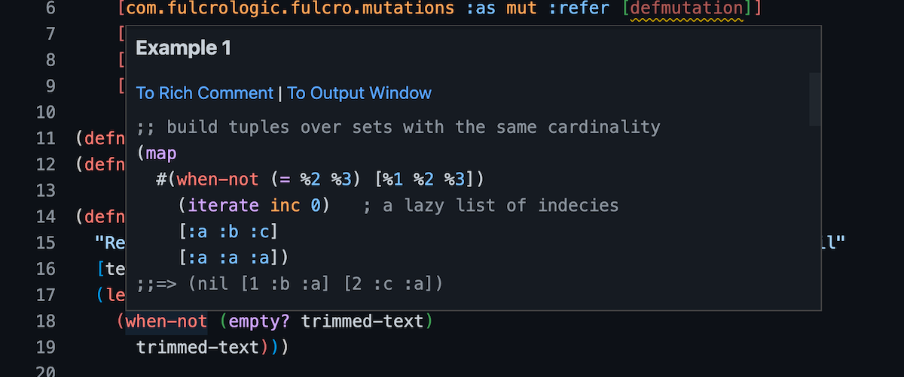

# ClojureDocs integration

[clojuredocs.org](https://clojuredocs.org) is the goto place #1 for finding out more about Clojure core(-ish) functions, macros, etcetera. It contains the doc strings from the functions and adds crowd sourced examples of usage and see alsos. You can surf for quite long on that site without getting bored. 😄

<figure markdown>
  <iframe width="560" height="315" src="https://www.youtube.com/embed/a4sm_B_mqhs" title="YouTube video player" frameborder="0" allow="accelerometer; autoplay; clipboard-write; encrypted-media; gyroscope; picture-in-picture" allowfullscreen></iframe>
  <figcaption>You can surf ClojureDocs in Calva</figcaption>
</figure>

Calva integrates this information in two ways:

1. Commands for requesting the ClojureDocs information for a symbol under the cursor:
    * **Print clojuredocs.org examples to Rich Comment**, default keybinding: `ctrl+alt+r d`
    * **Print clojuredocs.org examples to OutputWindow**, `ctrl+alt+o d`
2. ClojureDocs information is included in the symbol lookup hovers, where each example has two buttons:
    * **To Rich Comment**
    * **To Output Window** 

That means that if you just want to glance at the examples, you look in the hover. And when you want to bring the examples to the REPL to play with them, you can do so very easily.

!!! Note "ClojureScript support"
    ClojureDocs information is available both for Clojure and ClojureScript files. However, clojuredocs.org only keeps info for Clojure. Thus: _All information Calva shows about a symbol will be about the Clojure respresentation of that symbol._ (The symbol might not even exist in ClojureScript.)

## ClojureDocs REPL Surfing

Since the ClojureDocs information includes see-alsos, you can go for super interactive ClojureDocs surfing right in the file you are editing. Say you have this function:

```clojure
(defn trim-text
  "Returns text without surrounding whitespace if not empty, otherwise nil"
  [text]
  (let [trimmed-text (clojure.string/trim text)]
    (when-not (empty? trimmed-text)
      trimmed-text)))
```

Then you hover on `when-not` and scroll down a bit in the hover:



That first example would be interesting to play with, right? Click **To Rich Comment** and you will get:

```clojure
(defn trim-text
  "Returns text without surrounding whitespace if not empty, otherwise nil"
  [text]
  (let [trimmed-text (clojure.string/trim text)]
    (when-not (empty? trimmed-text)
      trimmed-text)))

(comment
  ;; = when-not - Example 1 = 

  ;; build tuples over sets with the same cardinality 
  (map
   #(when-not (= %2 %3) [%1 %2 %3])
   (iterate inc 0)   ; a lazy list of indecies
   [:a :b :c]
   [:a :a :a])
  ;;=> (nil [1 :b :a] [2 :c :a])

  ;; See also:
  when
  when-let
  if
  )
```

There you can evaluate the `(map ...)` form using `alt+enter`, modify it and evaluate again. You can also hover over `map`, `iterate`, or any of the ”See also:” symbols to find more fun examples to play with. And so on and so forth.

See these two tweets for some videos of early versions of this functionality:

* [Rich Comments surfing ClojureDocs Examples](https://twitter.com/pappapez/status/1452325865933746185)
* [Clojuredocs in #Calva WIP 2: Hover examples -> RFC](https://twitter.com/pappapez/status/1452409528511762444)

Please retweet!

## Quirks

Some of the ClojureDocs entries have text that is not really Clojure code, and sometimes even structural errors. This can break the structural integrity of your Clojure file. If you run into trouble trying to heal things, you can always use **Undo** until the Rich Comment is gone.