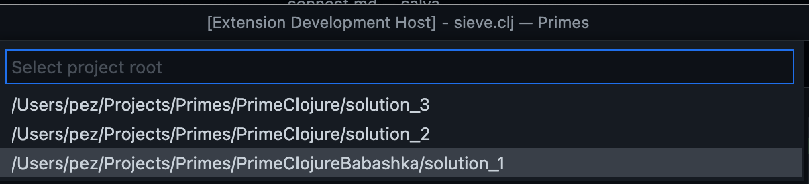

# Connect Calva to Your Project

When connected to your project's REPL Calva lets you evaluate code, supporting Interactive Programming. The REPL connection is also used to provide IDE functionality through the dynamic knowledge about the project that the REPL enables. The REPL communication depends on that your project has an [nREPL](https://github.com/nrepl/nrepl) server running, and that the [cider-nrepl](https://github.com/clojure-emacs/cider-nrepl) middleware is enabled.

For the easiest way to provide your project with these dependencies, the recommended way to connect is to use the so called **Jack-in** command.

## Jack-in: Let Calva Start the REPL For You

This way Calva can make sure it is started with the dependencies needed for a working Clojure and/or ClojureScript session. This is often referred to as **Jack in** (because that is what it is called in CIDER).

Jack-in supports both CLJ and for CLJS, and has built-in configurations for **Leiningen**, **deps.edn**, **shadow-cljs**, **Gradle** projects, as well as for the CLJS repl types: **Figwheel Main**, **lein-figwheel** (legacy Figwheel), **shadow-cljs**, and ClojureScript built-ins for both browser and node.js. Using jack-in provides your development environment with all the dependencies you need for Calva to work.

It works like so:

1. Open your project in VS Code.
1. Issue the command **Start a Project REPL and Connect**: `ctrl+alt+c ctrl+alt+j`.
1. Answer the quick-pick prompts telling Calva about project types and what profiles to start. (See the [Jack-in Project Types and Profiles](https://github.com/BetterThanTomorrow/calva/wiki/Jack-In-Project-Types-and-Profiles) wiki page for more info if needed.)

See also: [Workspace Layouts](workspace-layouts.md)

!!! Note "About project roots"
    You must have a project file, such as `project.clj` for Leiningen, or `deps.edn` for deps.edn, or `shadow-cljs.edn` for shadow-cljs, or `settings.gradle`/`settings.gradle.kts` for Gradle in the directory opened in VS Code in order for jack-in to work. If, after adding the project file, you experience an error during jack-in that says something could not be located, make sure you have the correct dependencies in your project file. For example, when using the **Figwheel Main** project type, you should have `com.bhauman/figwheel-main` in your project dependencies.

    See also below, regarding [multiple projects in a workspace](#monorepos-multiple-clojure-projects-in-one-workspace)

### Aliases, Profiles, Builds

When Jack-in starts it will depend on the project type, and whether ClojureScript is involved or not, and if it is, what kind of ClojureScript project, what will happen next. Calva will analyze the project files and will then give you prompts with selections based on what is found there.

You will need some basic knowledge about the project and the project type terminologies to answer the prompts.

There are ways to tell Calva the answers to these prompts beforehand, so that Jack-in can be a zero-prompting command. Read on.

### Customizing Jack-in

The main mechanism for customizing your Jack-in, including automating menu selections, and custom CLJS REPL types is [Custom Connect Sequences](connect-sequences.md). See also [Customizing Jack-in and Connect](customizing-jack-in-and-connect.md)

## Connecting Without Jack-in

If, for whatever reasons, you can't use Jack-in with your project (possibly because the REPL is started as part of some other job) all is not lost. Old fashioned **Connect to a running REPL** is still there for you. For all features to work in Calva while connecting to a running REPL, your environment needs to have REPL related dependencies set up.

However, just as before it can be tricky to get the dependencies right. Consider using **Jack in** to inform yourself on how to start your REPL to Calva's satisfaction. When you use Jack in, Calva starts a VS Code task for it and the command line used is displayed in the terminal pane used to handle the task. Reading that command line tells you what dependencies are needed for your project.

Even better: Copying that command line gives you the command to start the REPL with the correct dependencies.

All this said, I still recommend you challenge the conclusion that you can't use Jack-in.

!!! Note "Copy the Jack-in command line"
    There is a Calva command for copying the Jack-in command line to the clipboard. It will copy the command line including commands to change to the current REPL project root, avoiding hard-to-detect errors when starting the REPL in the wrong directory.

!!! Note "The Generic Project Type"
    A reason to use the connect to a running REPL way, can be that Calva does not have a built in [connect sequence/project type](connect-sequences.md) for the particular REPL you want to connect to. Maybe it is something like [Lingy](https://github.com/ingydotnet/lingy) which doesn't yet have a built in Calva connect sequence. As long as there is an nREPL server to connect to, you can Connect with Calva, using the **Generic** connect sequence/project type. (You can also create a [connect sequence with a custom command line](connect-sequences.md#custom-command-line), and use Jack-in anyway.)


See also [Customizing Jack-in and Connect](customizing-jack-in-and-connect.md)

### Starting the REPL from application code?

If your project is setup so that the REPL server is started by the application code, you will need to get the cider-nrepl middleware in place. See the cider-nrepl docs about [embedding nREPL in your application](https://docs.cider.mx/cider-nrepl/usage.html#via-embedding-nrepl-in-your-application).

## Auto-select Project Type and Project Root

You can make both Jack-in and Connect stop prompting you for project type and project root path in projects where you always want to use the same. See [Connect Sequences](connect-sequences.md).

## Monorepos / multiple Clojure projects in one workspace

If the workspace is a monorepo, Polylith repo or just a repository with more than one Clojure project, Calva will start the connect sequence with prompting for which project to start/connect to.



## shadow-cljs

Please see the [shadow-cljs](shadow-cljs.md) page.

## Troubleshooting

### Jack-in and `:main-opts`

When Calva starts the project REPL and connects to it (a.k.a. Jack-in), this is done by starting an nREPL server. For deps.edn projects this by default means that Calva will add `-m ...` with options that starts the server.

_However_: If you choose an alias at Jack-in that specifies `:main-opts`, it will make the Clojure CLI to add main opts and Calva will then not override these by adding `-m ...` to the command line. This means that an alias that specify `:main-opts` must result in an nREPL server being started, or else Calva won't have a server to connect to. Calva won't further analyze this, but will just warn you at Jack-in.

If you don't know if an alias starts an nREPL server or not, by all means, try it, if you have reasons for using that alias. You will notice if Jack-in works or not. If it doesn't work, you will need to run without that alias, or fix what happens when that alias is used so that an nREPL server is started. See https://nrepl.org/nrepl/usage/server.html about ways to do this.

### Command Not Found Errors When Jacking In

If you get `command not found` error when Calva tries to start your project, and you know you have the command installed, it's probably because VS Code starts from an environment where the command is not on the `$PATH`. It can look like so:

```sh
lein update-in :dependencies conj '[nrepl,"0.8.3"]' -- update-in :plugins conj '[cider/cider-nrepl,"0.25.8"]' -- update-in '[:repl-options,:nrepl-middleware]' conj '["cider.nrepl/cider-middleware"]' -- repl :headless
/bin/sh: lein: command not found
Jack-in process exited. Status: 127
```

The fix is to always start VS Code from the command line:

```sh
$ code
```

You might need to first run the **Shell Command: Install `code` command in PATH**.

This will also make sure your REPL has access to the environment you probably expect it to have access to. See below.

### Go to Definition Not Working for Java Definitions

On some systems, the Java source may not be installed along with the JDK. The source must be present on your system in order to navigate to Java definitions. See [this comment](https://github.com/clojure-emacs/orchard/issues/103#issuecomment-764936527) for more details.

### Environment Variables Are Not Readable From REPL

If you've added environment variables in your OS, such as in your `~/.bashrc` file (Linux), in order for them to be read in a REPL created by Calva's jackin command, VS Code must be started from a shell where the environment variables are defined. For example, if you can open a bash terminal and run `echo $SOME_VAR` and see the value there, then open VS Code from that terminal with `code <project path>`.

### Viewing the Communication Between nREPL and Calva

It may be helpful to view the messages sent between nREPL and Calva when troubleshooting an issue related to the REPL. See how to do that [here](../nrepl_and_cider-nrepl/#viewing-the-communication-between-calva-and-nrepl).
