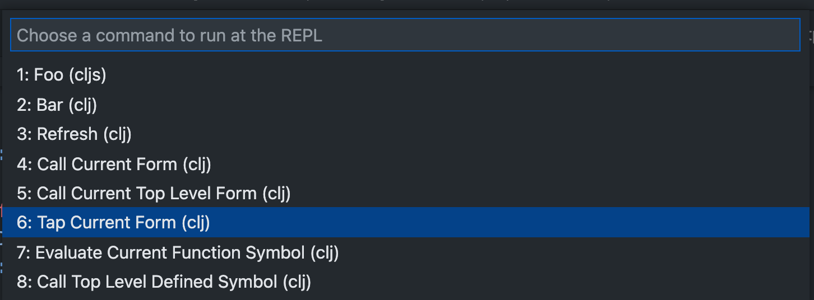

# Custom REPL Commands

Calva supports configuration of custom command snippets that you can evaluate in the REPL at will. If your workflow has you repeatedly evaluate a particular piece of code, you can use the setting `calva.customREPLCommandSnippets` to configure it. Then either bind keyboard shortcuts to them or use the command **Run Custom REPL Command** to access it. The command will give you a menu with the snippets you have configured.

The `calva.customREPLCommandSnippets` is an array of objects with the following fields (required fields in **bold**):

* **`name`**: The name of the snippet as it will appear in the picker menu
* **`snippet`**: The code that will be evaluated
* `key`: A key can be used to reference the snippet from **Run Custom REPL Command** keyboard shortcut arguments. It will also be used in the quick-pick menu.
* `ns`: A namespace to evaluate the command in. If omitted the command will be executed in the namespace of the current editor.
* `repl`: Which repl session to use for the evaluation. Either `"clj"` or `"cljs"`. Omit if you want to use the session of the current editor.

There are also substitutions available, which will take elements from the current state of Calva and splice them in to the text of your command before executing it. They are

* `$line`: Current line number in editor
* `$column`: Current column number in editor
* `$file`: Full name of current file edited
* `$ns`: The namespace used for evaluating the command
* `$selection`: The currently selected text
* `$current-form`: The text of the [current form](evaluation.md#current-form)
* `$enclosing-form`: The text of the [current enclosing form](evaluation.md#evaluate-enclosing-form)
* `$top-level-form` The text of the [current top level form](evaluation.md#current-top-level-form)
* `$current-fn`: The sexpr/form at call position in the current list, e.g. `str` with `(defn foo [] (str "foo" "bar|"))`
* `$top-level-defined-symbol`: The second symbol of the top level form, e.g. `foo` with `(defn foo [] (str "foo" "bar|"))`
* `$head`: The text between the start of the current list to the cursor
* `$tail`: The text between the cursor and the end of the current list

## User and Workspace settings

Settings from your User (global) level and the workspace are merged.

With these **User** settings:

```json
    "calva.customREPLCommandSnippets": [
        {
            "name": "Call Current Form",
            "key": "c",
            "snippet": "($current-form)"
        },
        {
            "name": "Call Current Top Level Form",
            "key": "t",
            "snippet": "($top-level-form)"
        },
        {
            "name": "CLJ Test Top Level Defined Symbol",
            "repl": "clj",
            "snippet": "(clojure.test/test-var #'$top-level-defined-symbol)"
        },
        {
            "name": "CLJS Test Top Level Defined Symbol",
            "repl": "cljs",
            "snippet": "(cljs.test/test-var #'$top-level-defined-symbol)",
            "key": "tab"
        }
    ],
```

And these **Workspace** settings:

```json
    "calva.customREPLCommandSnippets": [
        {
            "name": "Remount CLJS App",
            "key": "r",
            "repl": "cljs",
            "ns": "example.app",
            "snippet": "(start)"
        }
    ],

```

Issuing **Run Custom REPL Command** will then render this VS Code menu:



The default keyboard shortcut for the command is `ctrl+alt+space space`.

## Binding keyboard shortcuts

There are three ways to bind shortcuts to custom commands:

1. Use a predefined `key` shortcut. These are predefined as `ctrl+alt+space <something>`, where `<something>` is one of:
    * The digits `0` through `9`
    * The English letters `a` through `z`
    * Arrow keys `right`, `left`, `up`, or `down`
    * One of `tab`, `backspace`, `,`, `.`, or `-` 
2. Bind `calva.runCustomREPLCommand` to a shortcut with whatever code you want to evaluate in `args` key. You have access to the substitution variables here as well.
3. Bind `calva.runCustomREPLCommand` to a keyboard shortcut referencing the `key` of one of your `calva.customREPLCommandSnippets`. (If not using any of the `key`s mentioned in **1.**)
