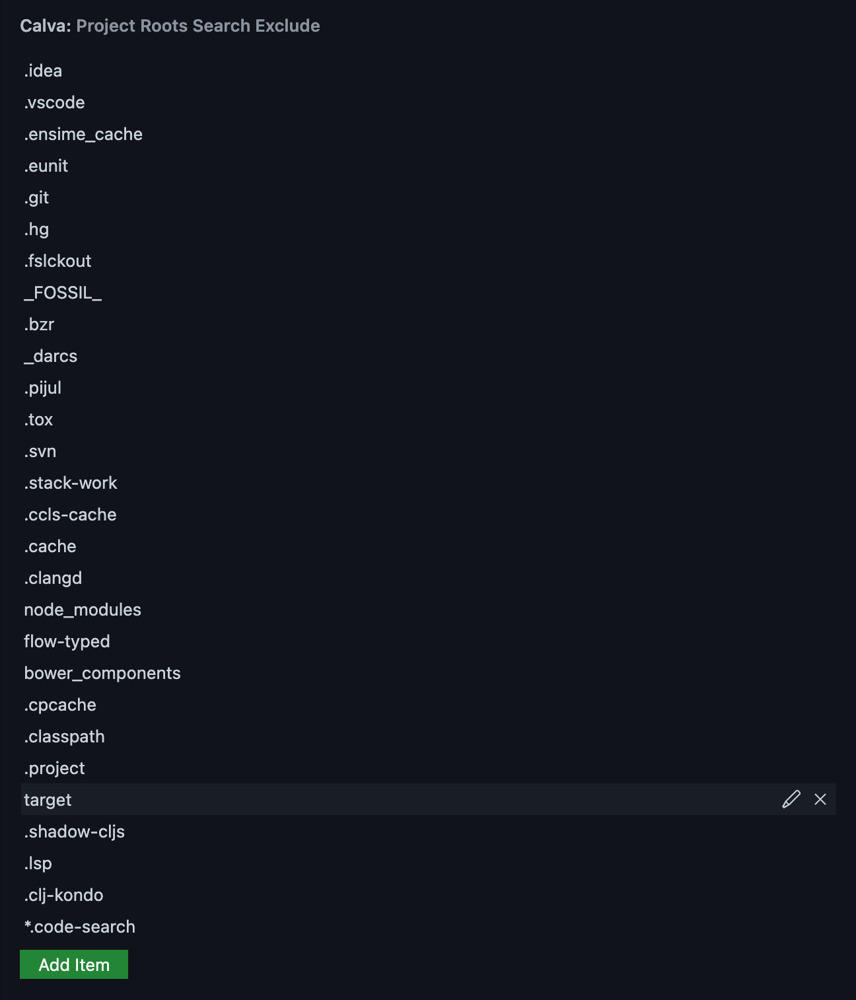

# Customize Jack-in and Connect

Since Jack-in and connect both are about connecting the REPL, and only differ in how the REPL is started, many settings and configuration points are shared between the two concepts. A major customization point is [Custom Connect Sequences](connect-sequences.md), which are relevant for both Jack-in and Standalone Connect scenarios.

This page lists some more Jack-in and Connect configuration options.

## Customizing Jack-in
The main mechanism for customizing your Jack-in, including automating menu selections, and custom CLJS REPL types is [Custom Connect Sequences](connect-sequences.md).

There are also these settings:

* `calva.autoStartRepl`: If true, Calva will auto-start and connect the REPL (a.k.a. Jack-in) when a Clojure project is opened. **NB:** To fully automate the jack-in process, you need to configure [`calva.replConnectSequences`](connect-sequences.md) such that one sequence is marked with `autoSelectForJackIn`, has `projectRootPath` set, and has `menuSelections` configured.
* `calva.jackInEnv`: An object with environment variables that will be added to the environment of the Jack-in process.
* `calva.myCljAliases`: An array of `deps.edn` aliases not found in the project file. Use this to tell Calva Jack-in to launch your REPL using your user defined aliases.
* `calva.myLeinProfiles`: An array of Leiningen profiles not found in `project.clj`. Use this to tell Calva Jack-in to launch your REPL using your user defined profiles.
* `calva.openBrowserWhenFigwheelStarted`: _For Legacy Figwheel only._ A boolean controlling if Calva should automatically launch your ClojureScript app, once it is compiled by Figwheel. Defaults to `true`.
* `calva.depsEdnJackInExecutable`: A string which should either be `clojure` or `deps.clj`, or `clojure or deps.clj` (default). It determines which executable Calva Jack-in should use for starting a `deps.edn` project. With this setting at its default, `clojure or deps.clj`, Calva will test if the `clojure` executable works, and use it if it does, otherwise `deps.clj` will be used, which is bundled with Calva.
* `calva.jackInDependencyVersions`: See [below](#jack-in-dependency-versions)

!!! Note
    When processing the `calva.jackInEnv` setting you can refer to existing ENV variables with `${env:VARIABLE}`.

### Options for the Jack-in Command

The `calva.jackIn` command takes an optional options argument defined like so:

```typescript
  options?: {
    connectSequence?: string | ReplConnectSequence;
    disableAutoSelect?: boolean;
  }
```

Where `ReplConnectSequence` is a [Connect Sequences](connect-sequences.md). If you provide a string it needs to match against a built-in or custom connect sequence. With `disableAutoSelect` you can force the jack-in menus to be provided even if a custom connect sequence is set to be autoSelected.

You can provide these options from keyboard shortcuts or from [Joyride](https://github.com/BetterThanTomorrow/joyride) scripts.

Here's a keyboard shortcut for connecting to a running REPL bypassing any connect sequence with `autoSelectForConnect`.

```json
    {
        "command": "calva.jackIn",
        "args": {"disableAutoSelect": true},
        "key": "ctrl+alt+c shift+j",
    },
```

A Joyride command for starting a `deps.edn` REPL for a project in the root of the workspace.

```clojure
(vscode/commands.executeCommand
 "calva.jackIn"
 (clj->js {:connectSequence {:projectType "deps.edn"
                             :projectRootPath ["."]}}))
```

It will prompt for any aliases it finds in the `deps.edn` file.

## Customizing Connect

If there is an nRepl port file, Calva will use it and not prompt for `host:port` when connecting. You can make Calva prompt for this by setting the boolean config `calva.autoSelectNReplPortFromPortFile` to `false`.

With the setting `calva.autoConnectRepl` you can make Calva automatically connect the REPL if there is an nRepl port file present when the project is opened.

With this and the below mentioned auto-select options you can make connect a prompt-less experience. See: [Connect Sequences](connect-sequences.md).

#### Options for the Connect Command

The `calva.connect` command takes an optional options argument defined like so:

```typescript
  options?: {
    host?: string;
    port?: string;
    connectSequence?: string | ReplConnectSequence;
    disableAutoSelect?: boolean;
  }
```

Where `ReplConnectSequence` is a [Connect Sequences](connect-sequences.md). If you provide a string it needs to match against a built-in or custom connect sequence. With `disableAutoSelect` you can force the connect menus to be provided even if a custom connect sequence is set to be autoSelected.

You can provide these options from keyboard shortcuts or from [Joyride](https://github.com/BetterThanTomorrow/joyride) scripts.

Here's a keyboard shortcut for connecting to a running REPL bypassing any connect sequence with `autoSelectForConnect`.

```json
    {
        "command": "calva.connect",
        "args": {"disableAutoSelect": true},
        "key": "ctrl+alt+c shift+c",
    },
```

A Joyride command for connecting to a REPL on port 55555, without being asked for project type:

```clojure
(vscode/commands.executeCommand "calva.connect" (clj->js {:port "55555" :connectSequence "Generic"}))
```

## Auto-evaluate Code on Connect

You can have Calva evaluate code whenever a REPL has been connected via the `calva.autoEvaluateCode.onConnect` setting. It has two entries `clj` and `cljs`:

- `clj`: "Code to evaluate when the **Clojure** REPL has been connected.
    - The default is code that refer in the `repl-requires`/REPL utilities (like `source`, `doc`, etcetera). (Note that there is also a command to do this on demand.).
    - Overriding the default replaces it. If you want to add code to be evaluated on connect this way, and keep the behaviour of auto-refering REPL utilities, you need to provide code for the latter (copy/pasting the default code will do). See also note below about concatenation of configurations.
    - The code will be evaluated *before* the `afterCLJReplJackInCode` in any [connect sequence](https://calva.io/connect-sequences/) used.
- `cljs`: Code to evaluate when the **ClojureScript** REPL has been connected.
    - The default is code that refer in the `repl-requires`/REPL utilities (like `source`, `doc`, etcetera). (Note that there is also a command to do this on demand.).
    - Same deal with overriding the default as with `clj`.

Set either of these to `null` to disable the feature for that REPL type. (The Settings linter will complain, but it works.)

!!! Note "For Clojure this is in addition to `afterCLJReplJackInCode`"

    There are two mechanisms for evaluating code when a Clojure REPL is connected. The `afterCLJReplJackInCode` setting of custom connect sequences, and this `calva.autoEvaluateCode.onConnect.clj` setting. There is no _fundamental_ difference between them. This one has a default function of auto-refering in the Clojure REPL utilities. And it will be run *before* the connect sequence after-Jack-in code.

!!! Note "All configured code is concatenated"
    If you configure this both in User/global settings and in a Workspace, the workspace configured code will be concatenated on the user level code. Meaning both code snippets will be evaluated, first the User level code, then the Workspace level code. Also `null` disables the feature:

    - If you use `null` in the User level code, you will disable the onConnect code evaluation for all workspaces that do not configure code for this.
    - If you configure code on the User level it will be evaluated in all workspaces, except those that disable the feature by configuring `null`.

## Auto-evaluate Code at file/namespace load/evaluation

You can also make Calva auto-evaluate code when a file has been loaded in the REPL (via the Calva command for loading files). You add code for this via the `calva.autoEvaluateCode.onFileLoaded` setting. Like with `onConnect` you provide code for `clj` and `cljs` separately.

* Note that [custom commands](https://calva.io/custom-commands/) substitutions are in play here as well.
* Calva's does not provide defaults for this setting.
* Merging works the same as with `onConnect`.

## Starting the REPL from application code?

If your project is setup so that the REPL server is started by the application code, you will need to get the cider-nrepl middleware in place. See the cider-nrepl docs about [embedding nREPL in your application](https://docs.cider.mx/cider-nrepl/usage.html#via-embedding-nrepl-in-your-application).

## Auto-select Project Type and Project Root

You can make both Jack-in and Connect stop prompting you for project type and project root path in projects where you always want to use the same. See [Connect Sequences](connect-sequences.md).

## Project roots search globing

When searching for project roots in your workspace, Calva will glob for all files matching `project.clj`, `deps.edn`, or `shadow-cljs.edn`. This is done using VS Code's workspace search engine, and is very efficient. However, in a large monorepo, it is still a substantial task. In order to not waste resources Calva will exclude any directories in the setting `calva.projectRootsSearchExclude`.



!!! Note "Exclude entry globs"
    Each entry is a partial *glob* and will be part of a resulting *glob* of the form `**/{glob1,glob2,...,globN}`. This means that all directories in the workspace matching an entry will be excluded, regardless of where in the workspace they reside.

## Troubleshooting

### Viewing the Communication Between nREPL and Calva

It may be helpful to view the messages sent between nREPL and Calva when troubleshooting an issue related to the REPL. See how to do that [here](../nrepl_and_cider-nrepl/#viewing-the-communication-between-calva-and-nrepl).

## Etcetera

### Jack-in Dependency Versions

[Calva Jack-in](jack-in-guide.md) injects the following dependencies in order for the REPL session to support IDE features

- [nrepl](https://github.com/nrepl/nrepl): nREPL is the wonderful piece of software that gives Calva a structured and extensible connection to the REPL in your Clojure and ClojureScript projects.
- [cider-nrepl](https://github.com/clojure-emacs/cider-nrepl): cider-nrepl is middleware that extends the nREPL connection with all sorts of nice stuff that Calva uses to give you a delightful IDE experience.
- [cider/piggieback](https://github.com/nrepl/piggieback): Piggieback is used to create nREPL sessions in ClojureScript projects. (Not with [shadow-cljs](http://shadow-cljs.org) projects though, which provides its own middleware for this.)

The versions used are configurable via the VS Code settings `calva.jackInDependencyVersions`.

!!! Note "Java 1.8 compatible versions"
    The default dependency versions are not compatible with Java 1.8. If your project needs that version of Java you can use these settings in your Workspace `.vscode/settings.json`:

    ```json
    "calva.jackInDependencyVersions": {
      "nrepl": "1.0.0",
      "cider-nrepl": "0.28.5",
      "cider/piggieback": "0.5.3"
    }
    ```

