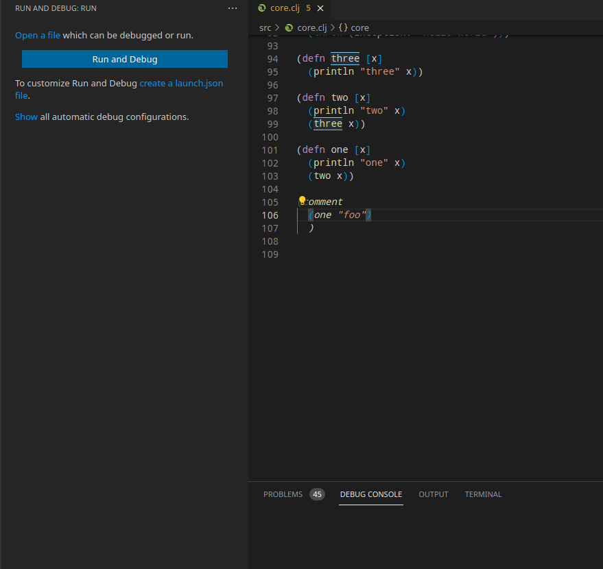

# Debugger

Calva comes with a powerful expression-based debugger, inspired by [Cider](https://cider.mx/)'s debugger, and using the same underlying library, [cider-nrepl](https://github.com/clojure-emacs/cider-nrepl). We hope you love it!


!!! note
    The debugger currently does not support ClojureScript. Calva's debugger utilizes cider-nrepl for debugging. See [this Cider issue](https://github.com/clojure-emacs/cider/issues/1416) for more information.

## Features

### Current

* Instrument functions for debugging with `ctrl+alt+c i`
* Instrument a function manually with `#dbg` (as opposed to the above command)
* Set individual breakpoints with `#break`
* Continue to next breakpoint
* Step over form
* Step into form
* Step out of form
* Evaluate code in the debug context
* See variable values in the debugger side pane
* See variable values on hover in the editor

### Future goals

* See structured variables in the debugger side pane (currently maps and collections are just shown as strings)
* Inject values into the debug context
* Trace: continue, printing expressions and their values

## Dependencies

The debugger itself relies pretty heavily on [cider-nrepl](https://github.com/clojure-emacs/cider-nrepl), as do other parts of Calva. This library is loaded as a dependency when you use Calva Jack-in. If you are not using Calva Jack-in, you can add these dependencies in your project definition or user profile. See the [Calva Jack-in guide](jack-in-guide.md) for more information.

## Using the Debugger

If you're new to Clojure or expression-based debuggers, this debugger may function differently than what you're used to. Instead of placing breakpoints in the side margin and then hitting F5 to start debugging, you instead use Clojure reader tags, `#break` and `#dbg`, to denote breakpoints anywhere in a Clojure form. When you evaluate a call to a function that has been evaluated with that reader tag, the debugger will start when execution reaches the first breakpoint. There's also a convenience command to instrument functions. Read below about both options.

!!! note
    The debugger is not configured via a `launch.json` file, and is not started in the same way as you may be used to when working with other languages in VS Code. The debugger is used by way of the REPL. If you are new to Clojure, please visit the [Getting Started](getting-started.md) section of the documentation and get familiar with evaluating code using the REPL before using the debugger.

### Instrumenting a Function

You can instrument a top level function for debugging with `ctrl+alt+c i`. This places invisible breakpoints throughout the function where pausing makes sense. When you evaluate a call to this function, the debugger will start and execution will pause at the first breakpoint. Annotations show the value of the form at the cursor.

A border is placed around the definition of the instrumented function and its references to show that it's instrumented. You can remove instrumentation by evaluating the function again normally, such as with `alt+enter`.


### Setting Breakpoints with `#break`

You can insert a breakpoint manually into any code by placing a `#break` in front of the form where you want execution to pause, and then evaluating the top level form with `alt+enter`. When you evaluate a call to this code the VS Code debugger will start, the cursor will move to right after the form that's preceded by `#break`, and the line will be highlighted to show execution is paused there.


!!! note
    Code will be executed up to and *including* the form after the breakpoint.

### Conditional Breakpoints

You can set conditional breakpoints by adding metadata before the form that the `#break` applies to.

```clojure
(defn print-nums [n]
  (dotimes [i n]
    #break ^{:break/when (= i 7)} ;; This breakpoint will only be hit when i equals 7
    (prn i)))
```

### Instrumenting a Form with `#dbg`

Adding `#dbg` before a form then evaluating the form with `alt+enter` will instrument the form. This has the same effect as using [the instrument command](#instrumenting-a-function).


### Evaluating Code in the Paused Context

When execution is paused at a breakpoint, you can evaluate code in that context. This can be done in the editor or in the REPL window, as usual.


### Viewing Variable Values

While debugging, you can view the values of variables in VS Code's debugger side pane. You can also view values by hovering over the variables in the editor.


!!! Note "Metadata not available"
    The variable viewer does not have access to any metadata attached to the variable values.

### Viewing the Call Stack

While debugging, you can view the call stack in VS Code's call stack side pane. Clicking the stack frames will show the related line of code in an editor.

!!! Note
    You may only see one stack frame in the call stack side pane, as the change for adding additional frames was rolled back due to an issue. You can follow the change for this at [#1150](https://github.com/BetterThanTomorrow/calva/issues/1150).



### Stepping Commands

You can use VS Code's debugger UI to advance execution while debugging.


!!! note
    Clicking restart does nothing, since this functionality does not make sense for our debugger.

* **Continue** - Continues without stopping for the current breakpoint
* **Step over** - Continues to the next breakpoint
* **Step in** - Steps in to the function about to be called. If the next breakpoint is not around a function call, does the same as next. Note that not all functions can be stepped in to - only normal functions stored in vars, for which cider-nrepl can find the source. You cannot currently step in to multimethods, protocol functions, or functions in clojure.core (although multimethods and protocols can be instrumented manually).
* **Step out** - Steps to the next breakpoint that is outside of the current sexp
* **Restart** - Does nothing. To restart debugging, you can hit disconnect or continue execution through the final result, then re-evaluate the expression that started the debugger.
* **Disconnect** - Disconnects the debugger

## Caveats

### Breakpoints in loop/recur

One construct where the debugger is limited is `loop`/`recur`. As recur always has to appear in a tail-position inside a `loop` or a `fn` and the debugger uses macros to interleave breakpoints in the forms, it **might** happen that a `recur` no longer appears in a tail position. In that case we have to avoid setting up the breakpoint. An example of such a case is:

```clojure
(loop [i 0]
  #break
  (when (< i 10)
    (println i)
    (recur (inc i))))
```

Here the breakpoint is exactly in front of a form that contains as its last expression a `recur` which is wrapped in a loop. This breakpoint has no effect. This does not mean you cannot use the debugger with `loop`, it just means you have to set your debug statements more carefully.

### Loading the File and "Eval On Save"

When you load a file, any breakpoints that were previously set in functions will be unset. If you have the "Eval On Save" setting enabled, your file is also loaded with each save, therefore saving the file will remove breakpoints previously set.

## Clashes with Emacs/CIDER debugger

When both CIDER and Calva is connected to the same REPL, stepping the debugger in one editor may have it stop on the breakpoint in the other one. Reported here: https://github.com/BetterThanTomorrow/calva/issues/2496

## Troubleshooting

### Debugger hangs when stepping over infinite seqs

This is because the debugger tries to evaluate the form when it's stepped over, and if `clojure.core/*print-length*` is set to `nil` as it is by default, evaluation will never complete. If you want to debug a form with an infinite seq, make sure to set `*print-length*` beforehand. For example:

```clojure
(set! *print-length* 3)
;; Or, to be more precise
(set! clojure.core/*print-length* 3)
```

Calva does not set this for you during debug mode, instead leaving it up to you to decide the value.

### My breakpoint isn't being hit

It's likely that your breakpoint is in a place that cider-nrepl does not see as an appropriate place to break execution. For example, if you put a breakpoint before a literal number, it will not be hit, because there's no need to show the value of a literal.

```clojure
(defn simple [x]
  (+ 1 #break 1)) ;; This breakpoint will not be hit
```

Another possible issue is that you're loading the file again after setting breakpoints, which unsets them. See [Loading the File and "Eval On Save"](#loading-the-file-and-eval-on-save) under Caveats.

### My breakpoint in a test isn't being hit

If you're using the test commands like "Run current test" to run your tests, breakpoints will not be hit. This is because Calva loads the file before running the tests to make sure the latest version of test code is being run, and when the file is loaded, breakpoints are unset.

If you want a breakpoint to work within the test, evaluate the test form with a breakpoint tag in it, then call the test directly.


### "No reader function for tag" error

If you get an error like this, it's likely that you connected to a REPL instead of jacking in, and you don't have the proper dependencies loaded in your REPL. You can run the command "Copy Jack-in Command Line to Clipboard" to see what command would be run if you jacked in.

Most importantly, make sure you have `cider/cider-nrepl` as a dependency, and `cider.nrepl/cider-middleware` as middleware loaded in your REPL. For example, this is a jack-in command line for a deps.edn project:

```sh
clojure -Sdeps '{:deps {nrepl/nrepl {:mvn/version,"0.8.3"},cider/cider-nrepl {:mvn/version,"0.25.8"}}}' -m nrepl.cmdline --middleware "[cider.nrepl/cider-middleware]"
```

## Passing options to the REPL JVM

There are times when Clojure debugging tools are not enough or not right for the job.
This is usually true when use an (open source) Java library and you want to set some breakpoints in Java code.
For those cases and others, you need to start the JVM in debug mode.

Typical use cases:

* Change Java logger configuration for the REPL via java system properties: e.g `-Dorg.slf4j.simpleLogger.defaultLogLevel=TRACE`
* Enable JVM debugger, change VM memory size, etc.

Calva supports passing environment variables via `jackInEnv`.
You can set that option inside VSCode `settings.json` file.

You can configure global `settings.json` file or a project wide version, inside `<project-root>/.vscode/settings.json`.

Configuring the global option will impact all projects you work on using Calva, so be aware.
See [the documentation for `settings.json`](https://code.visualstudio.com/docs/getstarted/settings) for more information.

The bellow snippet configures `JAVA_TOOL_OPTIONS` environment variable.
We configure slf4j-simple logging level via a Java system property (`-D`) and JVM specific options (`-X`).

NOTE: You can of course pass other env variables here.

.vscode/settings.json

```json
{
    "calva.jackInEnv": {
        "JAVA_TOOL_OPTIONS": "${env:JAVA_TOOL_OPTIONS} -Dorg.slf4j.simpleLogger.defaultLogLevel=TRACE -Xdebug -Xrunjdwp:transport=dt_socket,server=y,suspend=n,address=7896"
    }
}
```

Once you saved the file, the next time you `Jack in` the project, this variable is read by the JVM and the configuration is applied accordingly.

You should see something like the message below in the Calva jack-in terminal:

```shell
clojure -Sdeps '{:deps {nrepl/nrepl {:mvn/version,"0.8.3"},cider/cider-nrepl {:mvn/version,"0.26.0"}}}' -A:debug -m nrepl.cmdline --middleware "[cider.nrepl/cider-middleware]"
Picked up JAVA_TOOL_OPTIONS:  -Dorg.slf4j.simpleLogger.defaultLogLevel=TRACE -Xdebug -Xrunjdwp:transport=dt_socket,server=y,suspend=n,address=7896
Listening for transport dt_socket at address: 7896
nREPL server started on port 46691 on host localhost - nrepl://localhost:46691
```
