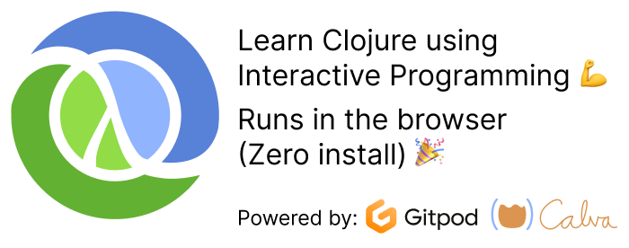

# Get Started with Clojure

Welcome to an interactive guide to get you started with [Clojure](https://clojure.org/). You will learn Clojure in the way it is intended to be used: from within your editor, jacked in to the running application.

You will need [Java](https://www.oracle.com/java/), [VS Code](https://code.visualstudio.com), and [Calva](https://marketplace.visualstudio.com/items?itemName=betterthantomorrow.calva) (a Clojure extension to VS Code).  Instructions for where to find installers are provided [further down on this page](#install). You will also install the Clojure CLI tools, because this is about **Getting Started with Clojure**.

??? Note "I am new to VS Code"
    You may want to have a look at [this Getting Started with VS Code video](https://code.visualstudio.com/docs/introvideos/basics). Also, have [this overview of the VS Code interface](https://code.visualstudio.com/docs/getstarted/userinterface) handy.

If you have these things installed, and just want to get going, jump to [Start the Guide](#start-the-guide) below.

## What you'll learn

* The basics of the Clojure language (at least the start of the basics)
* The basics of Calva (It's a bit as a side effect. You need it to learn Clojure this way, and by learning Clojure this way, Calva knowledge trickles in.)
* What is meant by, and some ways to perform, *Interactive Programming* (aka REPL Driven Development)
* Where to find Clojurians, i.e. folks who use Clojure and care about it (you will thus find help, the friendliest help you have ever seen a community provide)

??? Note "I am not convinced I should spend time on learning Clojure"
    Fair enough. We can recommend watching any or all of these videos to get excited about Clojure and the rather unique mood of development it offers:

    <iframe width="560" height="315" src="https://www.youtube.com/embed/C-kF25fWTO8" title="YouTube video player" frameborder="0" allow="accelerometer; autoplay; clipboard-write; encrypted-media; gyroscope; picture-in-picture" allowfullscreen></iframe>

    * [Solving Problems the Clojure Way](https://www.youtube.com/watch?v=vK1DazRK_a0) - with Rafal Dittwald (using JavaScript, so no new syntax to grasp to get the message)
    * [Developer Ergonomics with VS Code, Clojure, and ClojureScript](https://www.youtube.com/watch?v=LR7Wv6bSZqE) - with Peter Strömberg
    * [Clojure in VS Code Workflow using FizzBuzz](https://www.youtube.com/watch?v=d0K1oaFGvuQ) - with Peter Strömberg

    There is also this zero-threshold way you can **Try Clojure** in the browser: [https://tryclojure.org/](https://tryclojure.org/)

## What you won't learn

* About various old and new build and dependency tools
* How to create projects

??? Note "Why won't I learn about this?"
    All in due time. 😄 Creating a Clojure project can mean a lot of different things, and demand different tooling, depending on a what kind of project it is. That said, the Getting Started Guide itself is a small Clojure project, so you can keep building on it as your first Clojure project.

## Install

1. **Java**: There are downloads and instructions for your system here: [Oracle: Java Downloads](https://www.oracle.com/java/technologies/downloads/). Or, to give yourself a great Java SDK manager, consider using [SDK-MAN!](https://sdkman.io/). (Even works on Windows under Windows Subsystem for Linux, aka WSL.)
2. **Clojure CLI**: Follow the instructions at: [Clojure CLI tools](https://clojure.org/guides/install_clojure).
3. **VS Code**: Download installer for your system here: [VS Code Downloads](https://code.visualstudio.com/Download).
4. **Calva**: Start VS Code and search for Calva in the **Extensions** pane. You can open the Extensions pane by running the command **Extensions: Install Extensions...** from the VS Code command palette.

??? Note "Using Windows?"
       The official Clojure CLI tools can be hard to get working on Windows. Consider using [deps.clj](https://github.com/borkdude/deps.clj), a cross platform drop-in replacement for the `clojure` tool, written in Clojure. Here's [a Windows installer that will install the deps.clj versions of `clojure` and `clj`](https://github.com/casselc/clj-msi) on your system. (Instructions at the link.)

       If installing `clojure` proves to be a problem on your machine, you can skip it for now. The guide will work without it.

??? Note "I don't want to install anything"

    OK. There is actually a zero-install option, at least until April 1 2025, using only the the browser (utilizing [https://gitpod.io](Gitpod)).

    **NB: This Zero install option will stop working on April 1, 2025, when Gitpod is sunsetting what they now call Gitpod Classic. Enjoy it while it lasts! And uncountable thanks to Gitpod for having made this option possible for three years! 🙏❤️**

    Click this button to start the guide.

    

    

    <a href="https://gitpod.io/#https://github.com/PEZ/get-started-with-clojure">https://gitpod.io/#https://github.com/PEZ/get-started-with-clojure</a>

    

    You will need a GitHub account to access the workspace.

    

    The defaults for the new workspace are fine. Click **Continue**.

    

## Start the Guide

To start the guide, begin with starting VS Code, with Calva installed (as per [instructions above](#install))

You will be using the VS Code command palette to run the guide.

The guide will:

1. Ask you to select a folder to create the Getting Started project in
1. Create and open that project
1. Open a few Clojure files, introducing you to some basics of how to use Calva and then to learning Clojure.

The instructions will be in the form of Clojure comments, and you will be running the Clojure code snippets in the files, as well as be encouraged to edit and add code.

The command to run is: **Calva: Create a Getting Started REPL project**.

That's it. Do it now. This page has some more information to make the start of your Clojure adventure fun and smooth. It ain't going anywhere, though. 😀 Come back to it.

???+ Note "Stuck? Something not working? Or just unclear?"
     Please don't hesitate to reach out for help, should you get stuck. See below for where to find Clojurians. As for the Calva team, we are almost always (true story) to be found at the Clojurians Slack, especially in the `#calva` Channel.

Happy Interactive Programming! ❤️

## More resources

### And where do I find those Clojurians?

We Clojurians inhabit a lot of community platforms. I'll list some of the more popular ones here in some order of popularity.

* [The Clojurians Slack](http://clojurians.net) - by far the largest and most active Clojure community, the `#beginners` channel is spectacularly fantastic
* [ClojureVerse](https://clojureverse.org) - a web forum. Lots of Clojurians, lots of Clojure knowledge collected, easy to search, easy to join
* [/r/Clojure](https://www.reddit.com/r/Clojure/) - Reddit when Reddit is at its best, lots of Clojurians here
* [Clojurians on Zulip](https://clojurians.zulipchat.com/) - An other web forum using the Zulip platform
* On Discord there are two active servers: [Clojurians](https://discordapp.com/invite/v9QMy9D) and [Discord](https://discord.gg/)

You can also ask questions, and find answers, about Clojure at [ask.clojure.org](https://ask.clojure.org)

### Learn and Practice Clojure using Rich 4Clojure

If you like the style of interactive learning that this guide provides, you should definitely check [Rich 4Clojure](https://github.com/PEZ/rich4clojure) out. It also can be used in the zero-installed way.

You can regard it as a companion to this guide. It is aimed at practicing Clojure, starting at the elementary levels, bringing you to advanced stuff.

??? Note "Can I use Rich 4Clojure instead of this guide?"
    We suggest you start by opening up this guide and do the Calva part of the excerises. Then use the `welcome_to_clojure.clj` guide in combination with **Rich 4Clojure**..

### Run the Clojure Exercism Track in your browser

In a similar manner to the Get Started with Clojure project, you can run the Clojure Exercism Track in your browser without installing anything and with full Interactive Programming enabled using this [Template project](https://github.com/PEZ/clojure-exercism-template).

### ClojureDocs

Clojurians draw tremendous value from [ClojureDocs](https://clojuredocs.org). At ClojureDocs the concise documentation for Clojure core functions, etcetera, are amended with examples and advice from fellow Clojurians. Crowdsourcing at its very best! It is a big part of the reason why you won't find an abundance of Clojure information at StackOverflow.

### Other learning resources

* [CalvaTV](https://www.youtube.com/c/CalvaTV) - Calva's YouTube channel often focuses on beginning with Clojure and ClojureScript. Subscribe, please!
* [Clojure Beginner Resources](https://gist.github.com/yogthos/be323be0361c589570a6da4ccc85f58f) - a much more comprehensive list than this one
* [clojure.org Getting Started](https://clojure.org/guides/getting_started) - the source of truth, includes installing and stuff
* [The Exercism Clojure track](https://exercism.org/tracks/clojure) - Learn solving carefully crafted Clojure exercises, get mentor feedback if you like.
* [Clojure for the Brave and True](https://www.braveclojure.com) - helping you from beginner to pretty advanced stuff, very popular among Clojurians
* [on the code again](https://www.youtube.com/user/VideosDanA) - often features Clojure concepts, with snappy, well communicated, and entertaining videos
* [Clojure Koans with VS Code/Calva instructions](https://github.com/DanBunea/clojure-koans)
* [Try Clojure](https://tryclojure.org/) - Try some Clojure really quickly and conveniently in the browser.

### Help us help beginners

Give us feedback. Spread the word. Please consider:

* Join the `#improve-getting-started` channel at the Clojurian Slack
* Linking to this page from your blog
* Tweeting about this guide
* [Contributing to the Calva project](contribute.md)
* Wearing [Calva and RFC T-shirts](merch.md)
* Starring these repositories:
    * [Get Started with Clojure](https://github.com/PEZ/get-started-with-clojure) - (the repository powering this guide)
    * [Rich 4Clojure](https://github.com/PEZ/rich4clojure)
    * [Clojure Exercism Track Template](https://github.com/PEZ/clojure-exercism-template)
    * [Calva](https://github.com/BetterThanTomorrow/calva)
    * [Dram](https://github.com/BetterThanTomorrow/dram) - Where this guide (the Getting Started REPL) is authored
* [What do beginners struggle with?](https://clojureverse.org/t/what-do-beginners-struggle-with/5383) - a ClojureVerse thread, where you can tell us about what you have found hard in picking up Clojure. It's what spawned the creation of this guide.

Please also consider other ways to [contribute](contribute.md).

Thanks! 🙏
