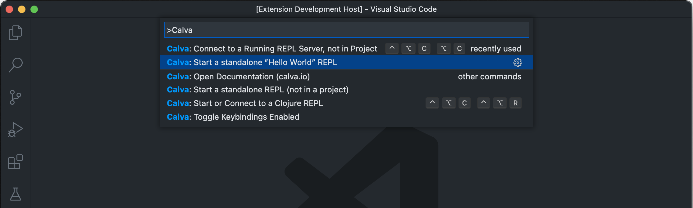
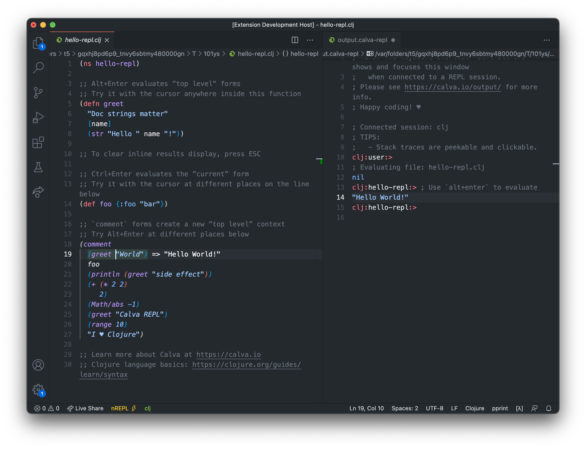
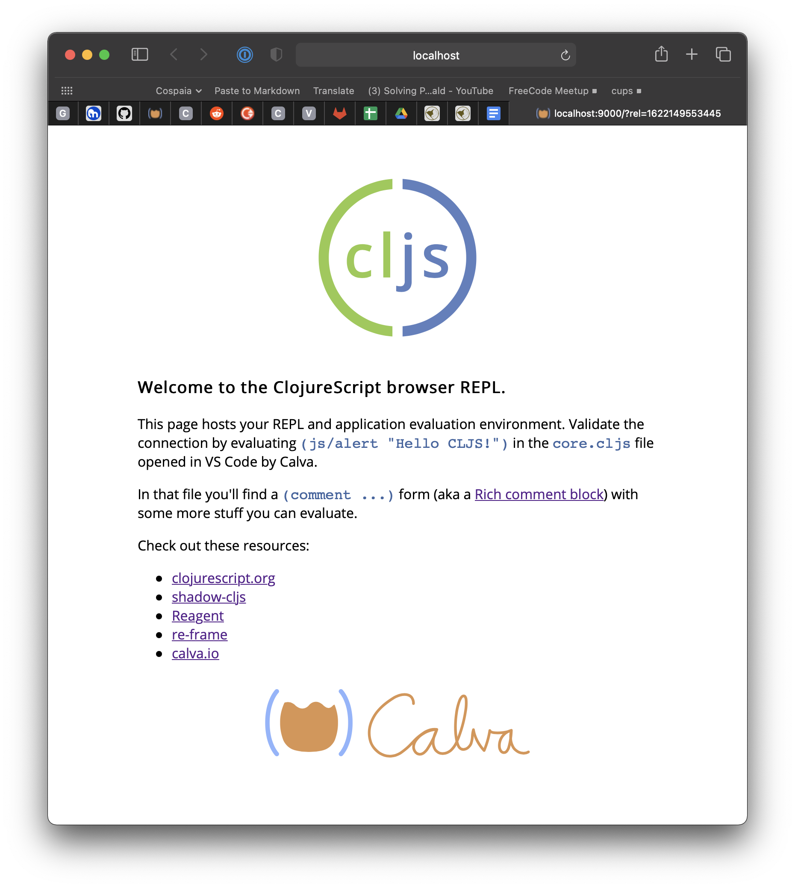

# Getting Started

Depending on wether you want to just start a Clojure REPL or you have a project you want to work with, getting started looks similar but a bit different. Regardless, you need to install Calva in VS Code.

??? Note "I am completely new to Clojure"
    The ”Getting Started” REPL below introduces you to Clojure as well as to Calva. You might however, not want to start with installing the right version of Java and such to run the guide. If so you should definitely check the [Get Started with Clojure](get-started-with-clojure.md) guide on this site.
    
    Three clicks will have you running Calva in your browser with the REPL ready to serve.

??? Note "I don't have Java installed"
    If you like, you can defer installing anything at all and still get started with Calva (not kidding).
    
    See [Get Started with Clojure](get-started-with-clojure.md).

If you have a Clojure or ClojureScript project, you will be interested in how to get [Calva connected to the REPL of your project](connect.md). But before you run over there, you might want to familiarize yourself with Calva a bit, which you can do without a project.

<iframe width="560" height="315" src="https://www.youtube.com/embed/O6GrXXhCzCc" frameborder="0" allow="accelerometer; autoplay; clipboard-write; encrypted-media; gyroscope; picture-in-picture" allowfullscreen></iframe>

The demo tells you about the command (and some about the Clojure Beginner's material that it makes available).

## There's a ”Getting Started” REPL

If you are new to Calva, a good place to start is using the command **Fire up the ”Getting Started” REPL**. Demo:

It will open up a three files in a temporary directory, and start and connect a REPL. The files are:

- `hello_repl.clj` – The basics of how to evaluate code in Calva
- `hello_paredit.clj` - A super brief intro to Calva structural editing
- `welcome_to_clojure.clj` - The very basics of the Clojure language

The only prerequisite here is that you have Java installed. _No pre-installed clojure tools required._ (You will want to install these tools later, of course.)

!!! Note
    On Windows the Oracle Java installer sets Java up in some funny way so that the Getting Started REPL fails to start. We are figuring about workarounds for this, but for now, if you are on Windows, you will need to make VS Code have some other Java in the `PATH` of its environment for this feature to work. See [this issue on the Calva repo](https://github.com/BetterThanTomorrow/calva/issues/1162) for more on this, including any progress.

## There are standalone ”ClojureScript Quick Start” REPLs

Without creating a project structure or installing anything but Calva, you can start standalone ClojureScirpt REPLs both in a browser and for node:

* Fire up the ClojureScript Quick Start **Browser** REPL
    * Opens the files `core.cljs` and `index.html` and starts the ClojureScript app, opening it in the browser.
* Fire up the ClojureScript Quick Start **Node** REPL
    * Opens a file, `core.cljs`, and starts a nodejs REPL where it loads the file.

The browser REPL app looks like so:

## You have a Project?

If you are new to Calva, please consider the above option first. Then when it it will be time to get [Calva connected to the REPL of your project](connect.md).

## Clojure Resources

If you are new to Clojure or ClojureScript altogether, please check out the guide material on the respective official sites:

- [Getting Started with Clojure](https://clojure.org/guides/getting_started)
- [ClojureScript Quick Start](https://clojurescript.org/guides/quick-start)

There are also many great books on Clojure. [Clojure for the Brave and True](https://www.braveclojure.com/clojure-for-the-brave-and-true/) can be read for free online. It is a great resource for beginners.

## There is also Standalone REPL

When you are more familiar with Calva, and want a standalone REPL, there is a separate command: **Start a standalone REPL (not in project)**. It will open up a `user.clj` in a temporary directory, containing only an `(ns user)` form, and start and connect the REPL. 

## Dram - Where the Guides Live

The command for starting the Getting Started REPL will download the files from [this repository](https://github.com/BetterThanTomorrow/dram). It is very much work in progress, and there is not even a finished Clojure Beginner's Guide there yet. WHen you run the command again, and from then on, you will get the option to download new files or keep using your existing. Downloading new ones will not overwrite your existing ones, because they will be downloaded to a new temp directory. You can find the directory easily using VS Codes context menu command for revealing a file in the Explorer/Finder.

## One Last Thing

Happy coding! ♥️
