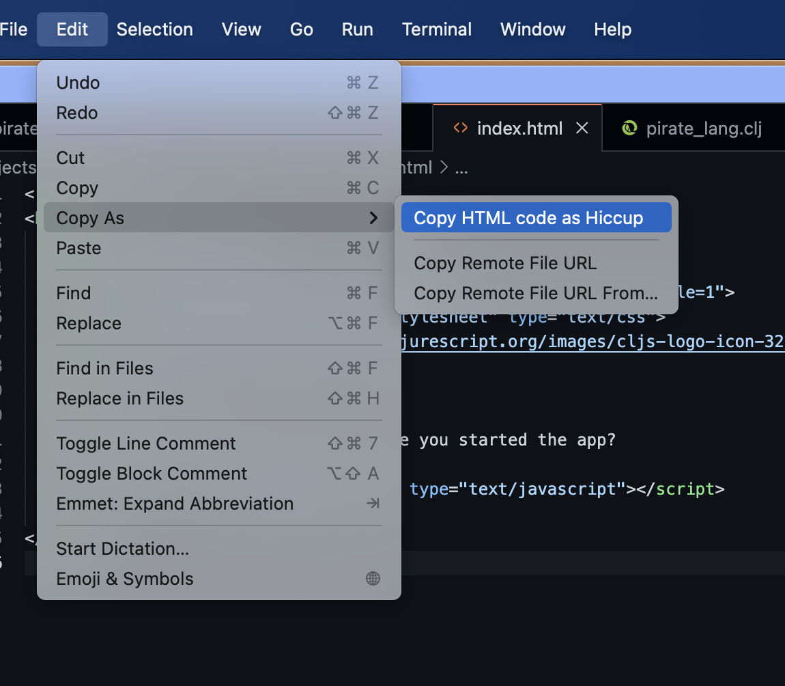

# Converting HTML to Hiccup

Calva can help you convert HTML to Hiccup:

<video controls>
  <source src="/images/calva-convert-html-to-hiccup.mp4">
</video>

## There are three Commands

* **Convert HTML to Hiccup**, will convert the selected text, or the entire file, to Hiccup and open up an Untitled Clojure file with the result.
* **Copy HTML as Hiccup**, will convert the selected text, or the entire file, to Hiccup and copy it to the clipboard.
* **Paste HTML as Hiccup**, will convert the contents of the clipboard to Hiccup and paste it. (The clipboard will then be restored to the original content.)

The Hiccup converstion can be tweaked with two options using the setting `calva.html2HiccupOptions`, which is a map/object:

* `mapify-style`: boolean, default `false`. When `true` any `style` attribute will be converted to a map (Reagent supports this)
* `kebab-attrs?`: boolean, default `false`. When `true` attribute names will be converted from *camelCase*, or *snake_case/SNAKE_CASE* to *kebab-case*. (Reagent wants most attribute names like this.)

## The commands take arguments

This options map can also be provided as an argument to the commands, so you can bind keyboard shortcuts to a particular configuration for the conversion. 

The command `calva.convertHtml2Hiccup` takes a map as an argument:

* `toUntitled`: `boolean`, default `false`. When `false` the result of the conversion will be returned to the caller (This is intended for Joyride, or some other VS Code extension). When `true` it will behave like the default command does, placing the result of the conversion in an Untitled Clojure file.
* `options`: Same as those `calva.html2HiccupOptions` mentioned above.

The `calva.pasteHtmlAsHiccup` and `calva.copyHtmlAsHiccup` commands takes only a `calva.html2HiccupOptions` map.

## Example keyboard shortcuts

The commands have no default keyboard shortcuts, you use the Command Palette to execute them, or you bind your own shortcuts. Here are some examples:

```json
    {
        // With args, `"toUntitled": true` is necessary for keyboard shortcuts
        // without it, the command just returns the result to the caller
        "key": "ctrl+alt+c ctrl+h",
        "command": "calva.convertHtml2Hiccup",
        "args": {"toUntitled": true, "options": {"kebab-attrs?": false}}
    },
    {
        // Only for testing, providing the HTML is only useful from e.g. Joyride 
        "key": "ctrl+alt+c shift+h",
        "command": "calva.convertHtml2Hiccup",
        "args": {"html": "<foo style='a: b' bar='baz'>gaz<foo>", "toUntitled": true}
    },
    {
        // Override the `calva.html2HiccupOptions` configuration
        "key": "ctrl+alt+c ctrl+alt+h",
        "command": "calva.pasteHtmlAsHiccup",
        "args": {"mapify-style?": true, "kebab-attrs?": true}
    },
    {
        // Override the `calva.html2HiccupOptions` configuration, using Calva defaults
        "key": "ctrl+alt+c alt+h",
        "command": "calva.pasteHtmlAsHiccup",
        "args": {}
    },
    {
        // Without args, the command uses the `calva.html2HiccupOptions` configuration
        // And writes the results to an Untitled document
        "key": "ctrl+alt+c cmd+h",
        "command": "calva.convertHtml2Hiccup",
    },
    {
        // Without args, the command uses the `calva.html2HiccupOptions` configuration
        "key": "ctrl+alt+c h",
        "command": "calva.pasteHtmlAsHiccup"
    },
    {
        // Override the `calva.html2HiccupOptions` configuration
        "key": "ctrl+alt+b h",
        "command": "calva.copyHtmlAsHiccup",
        "args": {"mapify-style?": true, "kebab-attrs?": true}
    },
```

The two default/args-less bindings are placed last [because reasons](https://github.com/microsoft/vscode/issues/176890).

## Copy as menus: Copy HTML as Hiccup 

The Copy HTML as Hiccup command is available from VS Code's **Edit** menu, as well as the editor context menu, in both cases under the **Copy as** sub menu.



## Using from Joyride (or some other VS Code extension)

As with any VS Code command using these from Joyride is a matter of calling `executeCommand`.

#### `calva.pasteHtmlAsHiccup` and `calva.pasteHtmlAsHiccup`:

```clojure
(-> (vscode/commands.executeCommand "calva.pasteHtmlAsHiccup"
                                    #js {:mapify-style? true})
    (.then ...))

(-> (vscode/commands.executeCommand "calva.copyHtmlAsHiccup"
                                    #js {:mapify-style? true})
    (.then ...))
```


#### `calva.convertHtml2Hiccup`

Without options the command behaves just like selecting the command from the command palette. If there is a selection it will be converted, otherwise the whole file. The result will be opened in a new Untitled document.

```clojure
(-> (vscode/commands.executeCommand "calva.convertHtml2Hiccup")
    (.then ...))
```

Called with arguments it will by default return an object with a `.-result` member which is a string with the Hiccup.


```clojure
(-> (vscode/commands.executeCommand "calva.convertHtml2Hiccup" 
                                    #js {:html "<foo class='clz1 clz2>bar</foo>"})
    (.then #(println (.-result %))))

(-> (vscode/commands.executeCommand "calva.convertHtml2Hiccup" 
                                    #js {:options #js {:mapify-style? false}})
    (.then #(println (.-result %))))
```


To make it put the text in a new Untitled document instead, provide the argument option `:toUntitled true`

```clojure
(-> (vscode/commands.executeCommand "calva.convertHtml2Hiccup" 
                                    #js {:toUntitled true
                                         :html "<foo class='clz1 clz2>bar</foo>"
                                         :options #js {:mapify-style? true
                                                       :kebab-attrs? true}})
    (.then ...))
```