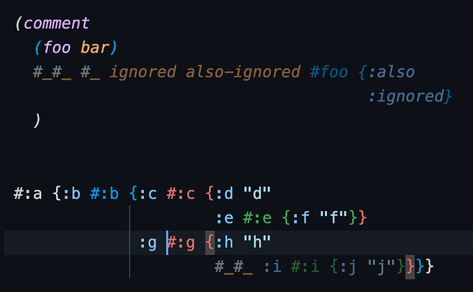

# Calva Highlight

Calva takes care of syntax highlighting, and also provides some features not available through VS Code's highlighting mechanism. These extras include Clojure aware rainbow parens and vertical guides, sane bracket matching, and comment form dimming/highlighting.

1. Dimming of ignored forms (or whatever style you customize it to)
2. Italics for `(comment ...)` forms (or your preferred highlight style)
3. Colorize the tags/dispatches of tagged lists the same as the bracket color.
4. Highlight matched brackets at the tag for a tagged list
5. Option to display colorized indent guide for the active indent only

<figure markdown>
  
  <figcaption>The cursor is that light-blue bar before the `#:g` namespace tag. The corresponding brackets highlight and the cursor is marked as being inside the blue `#:b` map (by the blue vertical guide).</figcaption>
</figure>

You are in charge of how brackets and comments are highlighted via the `calva.highlight.<setting>` settings:

| Setting | Meaning | Example |
| --- | ------- | ------- |
| `enableBracketColors` | Enable rainbow colors |  `true` |
| `rainbowIndentGuides` | Enable rainbow indent guides |  `true` |
| `highlightActiveIndent` | Highlight the active indent guide |  `true` |
| `bracketColors` | Which colors to use |  `["#000", "#999"]` |
| `cycleBracketColors` | Whether same colors should be <br> reused for deeply nested brackets | `true` |
| `misplacedBracketStyle` | Style of misplaced bracket | `{ "border": "2px solid #c33" }` |
| `matchedBracketStyle` | Style of bracket pair highlight | `{"backgroundColor": "#E0E0E0"}` |
| `ignoredFormStyle` | Style of `#_...` form | `{"textDecoration": "none; opacity: 0.5"}` |
| `commentFormStyle` | Style of `(comment ...)` form | `{"fontStyle": "italic"}` |

!!! Note "Calva disables the VS Code built-in indent guides"
    The VS Code built-in settings `editor.renderIndentGuides` and `editor.highlightActiveIndent` do not have any effect, since the former is switched off by the **Clojure Defaults**, mentioned above. Use Calva Highlight's `rainbowIndentGuides` and `highlightActiveIndent` instead. They are different from the built in ones in that they are independent, meaning you can choose to have active indent highlighted while the guides generally are not rendered (this is the default, even).

!!! Note "VS Code bracket coloring vs Calva's"
    Calva's bracket coloring is more Clojure aware than VS Code's built-in coloring. And also will chime better with Calva's indent guides. If you like to have bracket coloring outside Clojure code, by all means enable it. Calva's bracket coloring will ”over paint” in Clojure files, when enabled. These settings work nicely:

    ```clojure
    "calva.highlight.highlightActiveIndent": true,
    "editor.bracketPairColorization.enabled": true,
    ```

    The `calva.highlight.bracketColors` setting can be used to harmonize the coloring between VS Code and Calva.

