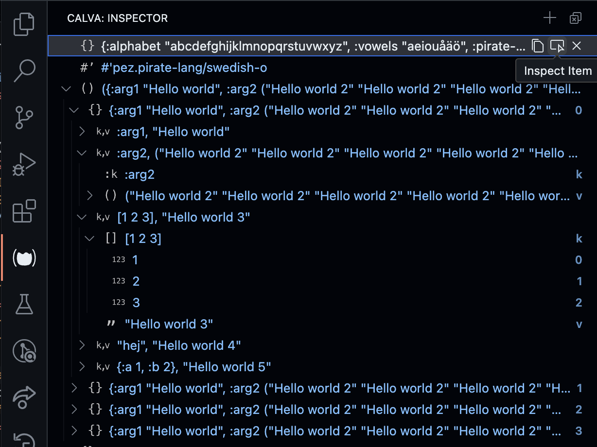

# Unfold that data

All REPL evaluation results are added to the Calva Inspector, a tree view that lets you expand and collapse Clojure data structures.

!!! Note "Only for realized data"
    Results are added to the inspector after they have been processed by your pretty printer, if you have pretty printing enabled. This means that [maxLength and maxDepth](pprint.md#configuration) applies. The inspector can't be used to explore infinite sequences.

## UI/Features

The inspector view can be placed in the left or right side bars, or in the bottom panel. It can also be placed as a section in an existing side bar view, or in split with any existing bottom panel view.

Inspector items are not expandable until you make them so with the Inspect Result Item button. This is because parsing and building the structure for the tree can take a little while and we don't want it to lock the UI for you when you edit and evaluate code.

Speaking of buttons. Items in the view have context commands that show up as buttons on hover. The Inspect Result Item button is one of them. All rows in the inspector have a **Copy** button, letting you copy the data at any folding level to the clipboard.All root items also have a clear button for removing the item from the inspector.

The view itself has two buttons, one for clearing all results and one for pasting whatever is on the clipboard as an inspector item.

## Commands

There are two commands for the inspector:

* **Calva: Reveal Inspector**. Reveals/shows the inspector. Default keybinding is `ctrl+alt+o i`
* **Calva: Add Selection or Current Form to Inspector**. Adds the current form (without evaluating it) to the inspeector. If there is text selected, will add that text instead. (Only the first selection, if there are multiple). There is no default keybinding for this command.

The command for adding the current form to the inspector has a command ID of `calva.addToInspector`. The command takes an optional argument, a string to be added. This is meant for [Joyride](https://github.com/BetterThanTomorrow/joyride) scripts that want to add things to the inspector.

## Configuration

There is only one setting for the inspector: `calva.autoOpenInspector` controls wether the view is revealed as part of connecting the REPL to Calva. It defaults to `true`.
