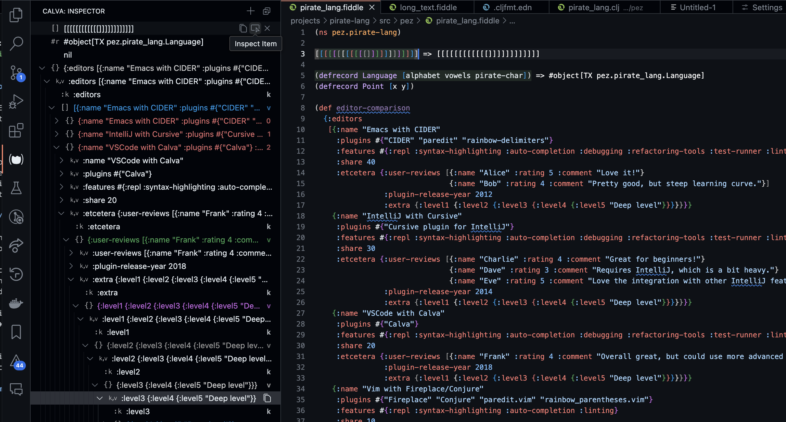

# Unfold that data

All REPL evaluation results are added to the Calva Inspector, a tree view that lets you expand and collapse Clojure data structures. (This happens in _addition_ to results being printed to the configured [Output Destination](output.md).)

!!! Note "Only for realized data"
    Results are added to the inspector after they have been processed by your pretty printer (if you have pretty printing enabled). This means that [maxLength and maxDepth](pprint.md#configuration) applies. The inspector can't be used to explore infinite sequences. Also, any metadata is lost in the translation.

## UI/Features

The inspector view can be placed in the left or right side bars, or in the bottom panel. It can also be placed as a section in an existing side bar view, or in split with any existing bottom panel view.

Inspector items are not expandable until you make them so with the **Inspect Result Item** button. This is because parsing and building the structure for the tree can take a little while and we don't want it to lock the UI for you when you edit and evaluate code.

Speaking of buttons. Items in the view have context commands that show up as buttons on hover. The **Inspect Result Item** button is one of them. All rows in the inspector have a **Copy** button, letting you copy the data at any folding level to the clipboard. All root items also have a **Clear** button for removing the item from the inspector.

The view itself has two buttons, one for clearing all results and one for pasting whatever is on the clipboard as an inspector item.

## Commands

These are the commands available for the inspector:

* **Calva: Reveal Inspector**. Reveals/shows the inspector without focusing it. Default keybinding is `ctrl+alt+o i`
  * This command, when used from keyboard shortcuts or [Joyride](https://github.com/BetterThanTomorrow/joyride), has the command ID of `calva.revealInspector`, and takes an object argument: `{ focus: boolean, select: boolean, expand: boolean | number }`. `focus` lets you focus the inspector view (or not), `select` and `expand` lets you select or expand the current item which, like with several of the inspector commands, will be the already selected item, or the topmost item if none is selected. It is passed to the TreeView backing the inspector, see [the VS Code API docs regarding revealing tree view items](https://code.visualstudio.com/api/references/vscode-api#TreeView.reveal) for details.
* **Calva: Add Selection or Current Form to Inspector**. Adds the current form (without evaluating it) to the inspector. If there is text selected, the command will add that text instead. (Only the first selection, if there are multiple). There is no default keybinding for this command.
  * This command has the ID of `calva.addToInspector`. The command takes an optional argument, a string to be added. This is meant for Joyride scripts that want to add things to the inspector.
* **Calva: Clear All Inspector Items**. You can use the command or the button for this in the view. No default keybinding.
* **Calva: Paste as Inspector Item**. Same as the view button. No default keybinding.
* **Calva: Inspect Item**. Makes the selected item inspectable, expands it one level, selects it, and focuses the inspector. Works on the topmost item if none is selected. No default keybinding.
* **Calva: Copy Inspector Item**. Copies the text of the selected inspector item, or the topmost item if none are selected. No default keybinding.
* **Calva: Clear Inspector Item**. Clears the selected inspector item, or the topmost item if none are selected. No default keybinding.

The VS Code Shortcuts editor is a good tool for looking up command IDs and, duh, register custom shortcuts for these commands.

## Configuration

There is only one setting for the inspector: `calva.autoOpenInspector` controls wether the view is revealed as part of connecting the REPL to Calva. It defaults to `false`.
