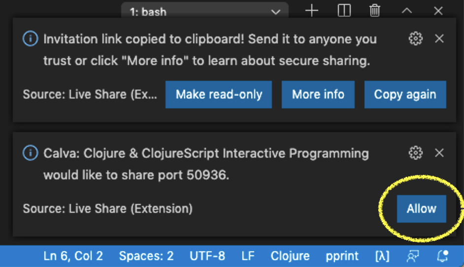

# Using Calva with Live Share

[Live Share][liveshare] is a Microsoft provided VS Code extension. 
It allows you to share the workspace that you have open in your
computer with somebody else. Everybody is then working on the same source code
files, namely those on your computer. You can edit files at the same time,
everyone has their own caret. You can follow each other (i.e. when someone
switches to a different file, you will as well). This is great for remote pair
programming, for example.

An extra nice thing is that each participant is using their own VSCode configuration, including fonts, colors,
keyboard shortcuts, etc.

## Calva Supports Live Share

When using Calva, you can use Live Share as well. Editing works exactly the same
as for any other programming language. What makes Calva a bit special, is the
REPL. When using Live Share, Calva allows the host to share the REPL with guests
as well. If you use any of the supported configuration, this will be pretty much
automatic.

This is what a typical scenario looks like:

1. **The host** jacks-in.
1. **The host** shares its workspace using Live Share. Calva will detect that
   the workspace is being shared, so it will offer to share the REPL port that
   was opened when jacking in. The host clicks "Allow" to start sharing the
   port. (Note: steps 1 and two can also be done in the reverse order.)
   
3. **The host** sends the Live Share URL to the guest(s).
4. **The guest** joins the Live Share session using the URL it received.
5. **The guest** connects to the host's REPL using the command "Connect to a
   running REPL server in the project". If needed, the guest chooses the same
   build configuration as the host.

Voila! Both the guest and the host can now use the REPL that is running on the
host. Things like documentation lookup now also work on the guest's machine.

## Control Visibility of `.calva` Folder

Calva depends on the `output.calva-repl` file to be available. If you have the
`.calva` folder listed in your `.gitignore`, this also causes the folder to be
hidden from guests in Live Share by default. In order to make the folder
visible, you can put a file called `.vsls.json` in your project. In its simplest
form, the contents can be this:

```json
{
  "$schema": "http://json.schemastore.org/vsls",
  "hideFiles": [
    "!.calva"
  ]
}
```

Now the `.calva` folder is shared as well. But also any other file and folder
that you may have in your `.gitignore`. If you want to have more fine-grained
control, please refer to the section [Controlling file access and
visibility][visibility] of the Live Share documentation.

## Some Things To Keep In Mind

* As a guest, you're connected to a REPL running on the host's machine. With
  power comes responsibility; **be nice, and be careful**!
* There is only one `output.calva-repl` file, which all participants are
  sharing. It may work better to **evaluate things in the source code editors**
  instead of from the REPL window. Otherwise you will end up in a situation
  where one person is typing something in the `output.calva-repl` window, and
  somebody else is evaluating something (hence sending the output there) at the
  same time. That gets confusing quickly.
* When you're working on a **CLJS-based web development** project, things may
  get extra confusing. By default, Live Share will share any HTTP ports on the
  host automatically, and also offer to open the URL on the guest. (You can
  disable using the setting "Liveshare: Open Shared Servers".) As a guest, you
  **do not** want to open that browser window normally. Think about it: where is
  the REPL running? Yes: in the browser! But Calva connects to the REPL running
  in the browser on the host's machine, so if you open a browser as a guest, you
  will also get a REPL there, but you won't be connected to it in Calva.
* Currently Live Share does not allow Calva to know whether the workspace is
  shared read-only or read-write. If you share read-only, and you don't want the
  guests to have access to your REPL, don't click "Allow" when VSCode asks you
  to share the REPL port.

[liveshare]: https://docs.microsoft.com/en-us/visualstudio/liveshare/
[visibility]: https://docs.microsoft.com/en-us/visualstudio/liveshare/reference/security#controlling-file-access-and-visibility
