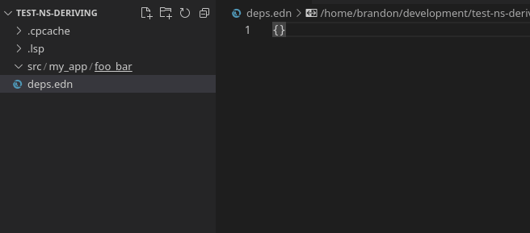

# Namespace Form Auto-creation

When you create a new clojure file, a file with `.clj`, `.cljc` or `.cljs` extension, an appropriate namespace form will be added to the file. This feature is provided by [clojure-lsp](https://clojure-lsp.github.io/clojure-lsp/).

