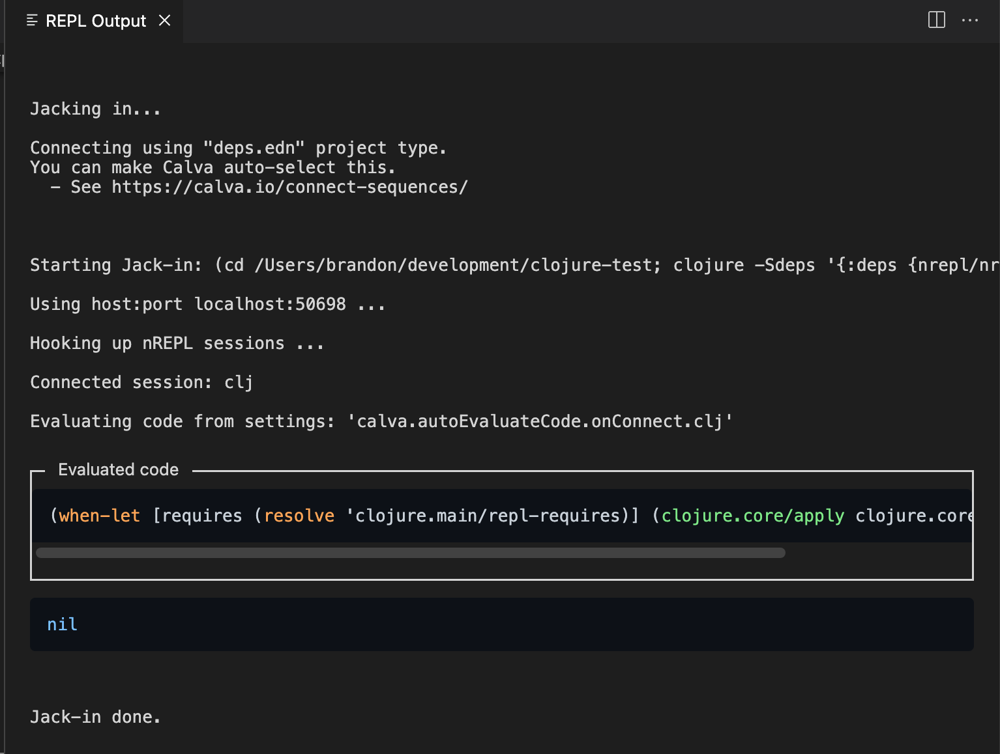
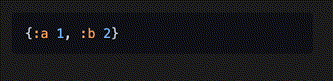
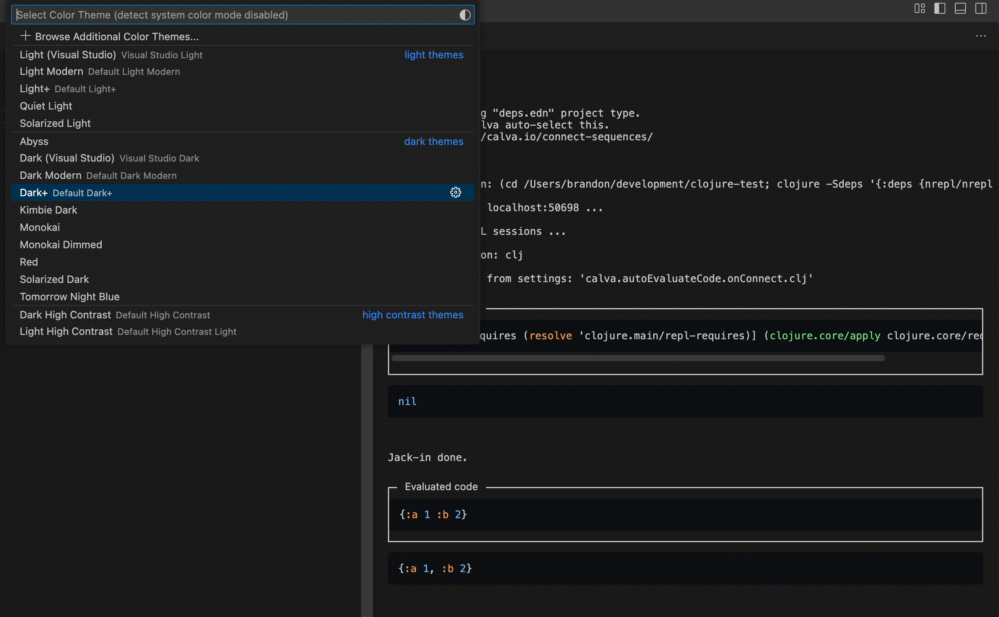

The `output-view` editor tab and `output-sidebar` sidebar are separate destinations that share the same read-only webview page. They are more performant than [the editor-based REPL window](repl-window.md). To see a feature comparison of all output destinations, see [Output Destinations Feature Comparison](output.md#output-destinations-feature-comparison).

The output views are two, performant, custom web views which can be configured as [Output Destinationsn](output.md). They largely share features (and implementation), the main difference being their placement in the VS Code UI.

* `output-view` is an editor tab, which can be placed anywhere an editor can be placed.
* `output-sidebar` is a sidebar/panel view, which can be placed in the sidebars, or in the Panel view container.

## Show the Output Views

Run **Calva: Show/Open the REPL output view** for the editor tab or **Calva: Show/Open the REPL output sidebar** for the sidebar.

## Clear Output

Use the commands **Calva: Clear Ouput View** and **Calva: Clear Ouput Sidebar** to clear the respective view. The sidebar view also has a title  clear button.

## Search/Find

The find widget (<kbd>cmd/ctrl</kbd>+<kbd>f</kbd>) is only available in the editor tab. Because ([vscode#173643](https://github.com/microsoft/vscode/issues/173643)).

## Copy Code Snippets

To copy code in the output views, hover your cursor over the code snippet you want to copy. A "copy" button will appear in the top right corner of the code snippet. Click this button to copy the code to your clipboard.

## Theming

[highlight.js](https://highlightjs.org/) is used for syntax highlighting of code blocks. The theming of other output is controlled by VS Code. As you change the VS Code theme, the syntax hightlighting of code blocks will change to one of four different themes, one for each VS Code [ColorThemeKind](https://code.visualstudio.com/api/references/vscode-api#ColorThemeKind):

| ColorThemeKind | hightlight.js theme |
| -------------- | ------------------- |
| Dark | github-dark |
| Light | github |
| HighContrast | windows-high-contrast |
| HighContrastLight | windows-high-contrast-light |

## It's readonly

You may be used to typing "into the REPL," meaning typing into a terminal REPL or the [the editor-based REPL window](repl-window.md). But with Clojure and Calva, we can evaluate code directly from code files. Using `comment` forms (Rich Comments) to evaluate code, we not only don't have to leave the file our cursor is currently in, but we have all the history of code we've evaluated right in a file, which we can save and commit, or remove later if we want.

!!! Tip "Quickly create Rich Comments with a Calva command"
    Use the Calva command "Add Rich Comment," which will add a `comment` form right below the form your cursor is currently at. Memorize the keyboard shortcut for this, and you can very easily create Rich Comments near the code you're working on to try out code in the REPL before adding it to your actual code.

!!! Note "Don't like adding scratch code to code files?"
    If you prefer not to leave scratch code in your code files or prefer not to have to remove it later, then create a separate scratch code file. This file can be your own personal scratch file, which you can commit, giving you a versioned history of all your scratch work, which may come in handy later. Calva has rich support for this, via the [Fiddle files](fiddle-files.md) feature.
