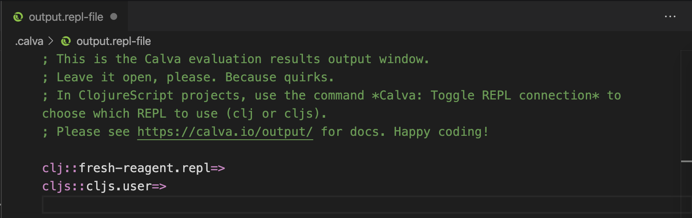
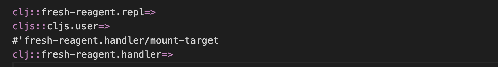
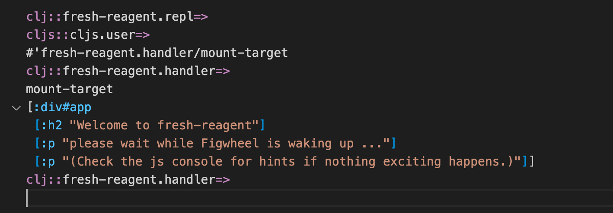
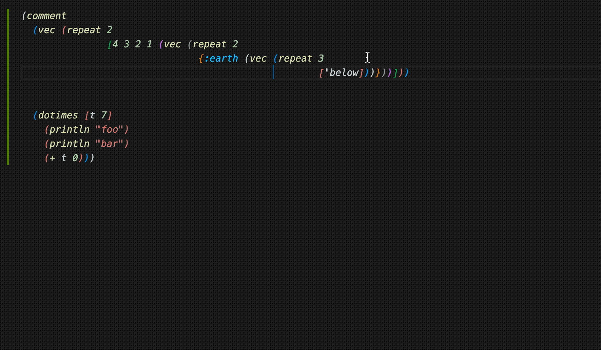
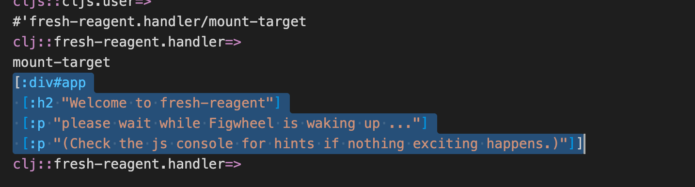

# The Output/REPL Window/File

!!! Note
    As of version **v2.0.109** the old REPL Window was replaced by the new one described below. Read [this article on ClojureVerse](https://clojureverse.org/t/calva-summer-of-bugs-2020/) for some of the rationale behind the change.

When Calva evaluates Clojure/ClojureScript code, the results are displayed inline as well as printed to the results output window/file. This file is created and opened when Calva is connected to a REPL.

In ClojureScript projects the window will be associated with the `cljs` REPL once this one is connected. It will then look something like so:



The first prompt is from when the `clj` REPL is connected, the second when Calva has a `cljs` REPL connection. The first part of the prompt tells you which REPL type the window is currently connected to. This gets important when the file/window is used as an interactive REPL.

## Evaluating code

The window will be automatically associated with the REPL and the namespace of any project Clojure/ClojureScript file you evaluate code in. So for instance if you evaluate this code in a `clj` file with the namespace `fresh-reagent.handler`:

```clojure
(def mount-target
  [:div#app
   [:h2 "Welcome to fresh-reagent"]
   [:p "please wait while Figwheel is waking up ..."]
   [:p "(Check the js console for hints if nothing exciting happens.)"]])
```

The output window will print the defined var and then a new prompt reflecting the current REPL connection and namespace:



If you then switch to the output window (`ctrl+alt+c o`), and enter this at the prompt:

```clojure
mount-target
```

then evaluate it using `alt+enter`, you'll get:



This, since the namespace ”followed” the first evaluation over to the output window.

## REPL History

Recently evaluated forms in the REPL file are persisted and can easily be shown again for modifying and re-evaluating.

### Navigate REPL History

You can navigate up and down the last forms evaluated in the REPL file by using `alt+up` and `alt+down`, provided your cursor is at the end of the last form after the prompt. If the cursor is not at the end of the last form, then `alt+up` and `alt+down` will do what they are mapped to, which is by default "Move Line Up" and "Move Line Down," respectively.

If you have typed some text after the prompt before you start traversing up the history, this text will be preserved and will display when you traverse back down the history. If you modify some text in the history while traversing, the modification will be saved at that location in history.

### Clear REPL History

You can clear the repl history by running the command "Clear REPL History" from the command palette.

## Peek at Results

On smaller screens (or just depending on your taste) you might not have the output window visible side-by-side with your code, but rather in a tab in the same editor group.

Then your immediate feedback will be the inline display, which is limited to the first line of the results. All is not lost, however, you can peek at the full results using VS Code's command **Peek Definition**. Calva adds a definition pointer ”in” to the evaluated code in the output window.



(On Mac the default keyboard shortcut for the peek command is `alt+f12`.)

In the demo gif we utilize two things about this peek widget:

1. It stays open until you close it. So you can keep evaluating different versions of your form and see the results get printed.
2. The widget displays a ”full” Calva editor, so you can use Paredit to conveniently select forms.

## Stacktraces

When an evaluation produces an error, the output window will automatically print the stacktrace (when available). It will be printed as an EDN structure. And when source locations are available you will be able to navigate to them by `command+click` (Mac) or `ctrl+click` (Windows and Linux).

## Find the Output/REPL Window

If you quickly want to open and switch to the output window there is the command **Calva: Show Output Window**, `ctrl+alt+c o`.

## Paredit Enabled

The output window is mostly a regular Calva Clojure/ClojureScript file, which make everything that works in a regular file work in this file, including [Paredit](paredit.md). This makes it easy to navigate the input and output. For instance, to select the last evaluation results you can press `ctrl+w`:



## Debugger Enabled

The output window is mostly a regular... (you get it), which means you also have the [Calva debugger](debugger.md) at your command at the REPL prompt (only for `clj` sessions, so far). So instead of evaluating a function definition using `alt+enter` you can evaluate it and instrument it for debugging using `ctrl+alt+c i`. Then call the function.


## It is Ephemeral

The contents of the output/REPL window is written to a file named `output.repl` in the `.calva/output-window` directory of your project. The file is recreated at every new session. And you should copy anything you want to keep from this file to wherever you want to keep it.

You probably want to add `.calva/output-window/` to your `.<something>ignore` files. (There are some more files in that directory that you shouldn't keep under source control.)

## Choose CLJ or CLJS REPL Connection

In full stack projects, you will probably use the window as a REPL for both `clj` and `cljs`. You can toggle which REPL the window is connected to using the command **Calva: Toggle REPL Connection for CLJC files**. There is a button for this in the status bar:


## Known Quirks

Due to limitations in the VS Code API it is hard for Calva to know if the output file is opened, and also if it is opened more than once. Make it a habit to leave this window opened. And if it is opened in several tabs, expect evaluation printouts to be a bit unpredictable.

If you save the output/REPL file (which most often does not make much sense, but anyway) you will sometimes be presented with a message about VS Code being confused about the file contents being out of sync. Just choose to *Overwrite* the currently saved version and you should be fine.