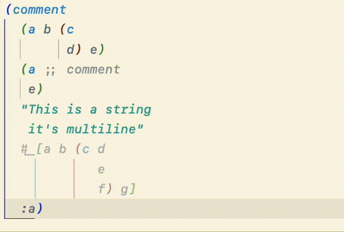

# Paredit – a Visual Guide

Structural editing and navigation for Clojure.

## What is Paredit?

Calva Paredit helps you navigate, select and edit Clojure code in a structural way. LISP isn't line or character oriented, it is based around [S-expressions](https://en.wikipedia.org/wiki/S-expression), a.k.a forms. We strongly recommend that you take advantage of the structural nature of Clojure, and have therefore put a lot of work into making Calva Paredit extra awesome.

If you are new to Paredit, consider starting with learning the **Slurp Forward** (pull in the next form into this form) and **Barf Forward** (push the last form out of this form). It will take you quite far.

## Strict Mode

To protect the integrity of your code, **Strict mode** is enabled by default.

Strict mode keybinding              | Action | Description
----------------------              | ------ | -----------
 `backspace`                | **Delete Backward** | Deletes one character backwards, unless it will unbalance a form. Otherwise moves past the character instead of deleting it. If the list is empty, it will remove both open and close brackets. <br> 
 `delete`                   | **Delete Forward** | Deletes one character forwards, unless it will unbalance a form. Otherwise moves past the character instead of deleting it. If the list is empty, it is removed. <br> 
 `alt+backspace` | **Force Delete Backward** | Deletes one character backwards, even if it will unbalance a form. <br> 
 `alt+delete`    | **Force Delete Forward** | Deletes one character forwards, even if it will unbalance a form. <br> 

_Disable at your own peril._ Strict mode can be toggled on/off using the **Toggle Paredit Mode** command, and there is a status bar indicator telling you:

Indicator | Paredit Mode
:-------: | ------
`[λ]`     | Strict
`(λ)`     | Cave Man (strict mode off)
 `λ`      | No default key bindings

Toggle between Strict and Cave Man using: `ctrl+alt+p ctrl+alt+m`

### A keybinding for protecting the structure from semi-colon

Semi-colons (`;`) in Clojure are non-structural because they comment out the rest of the line regardless of brackets. In a way they can _delete_ brackets. There is a somewhat secret command in Paredit that can be used to insert `;` in a safe way:

`paredit.insertSemiColon`

Bind it to the `;` key with a `when` clause that activates it together with the other Strict mode commands:

```json
{
    "command": "paredit.insertSemiColon",
    "key": ";",
    "when": "calva:keybindingsEnabled && editorLangId == clojure && editorTextFocus && paredit:keyMap == strict && !editorReadOnly && !editorHasMultipleSelections && !calva:cursorInComment"
 },
```

## Commands

The Paredit commands are sorted into **Navigation**, **Selection**, and **Edit**. As mentioned, **Slurp** and **Barf** are power commands, which go into the editing category. Learning to navigate structurally, using shortcuts, also saves time and adds precision to your editing. It has the double effect that you at the same time learn how to select structurally, because that is the same, just adding the shift key.

To make the command descriptions a bit clearer, each entry is animated. When you try to figure out what is going on in the GIFs, focus on where the cursor is at the start of the animation loop.

### Command Args

Some Paredit commands accept arguments. You can utilize this in keybindings and from [Joyride](https://github.com/BetterThanTomorrow/joyride).

#### **`copy` for all `kill*` commands**

When specified, will control whether killed text will be copied to the clipboard.
This is an alternative to, or supports binding-specific overrides for, `calva.paredit.killAlsoCutsToClipboard`.

For example, here's 2 keybindings for `paredit.killRight` with different `copy` args, allowing you to choose when or if you want killed text copied at keypress-time, regardless of global `calva.paredit.killAlsoCutsToClipboard` setting:

```json
{
  "key": "ctrl+k",
  "command": "paredit.killRight",
  "when": "... your when conditions ...",
  "args": {"copy": false}
},
{
  "key": "cmd+k ctrl+k",
  "command": "paredit.killRight",
  "when": "... your when conditions ...",
  "args": {"copy": true}
},
```

Or, you can even have both of them use the **same `key`**, but **separate `when` conditions** to taste, to allow context-conditional copying.

### Strings are not Lists, but Anyway...

In Calva Paredit, strings are treated in much the same way as lists are. Here's an example showing **Slurp** and **Barf**, **Forward/Backward List**, and **Expand Selection**.


### Navigating

(Modify these with `shift` to select rather than move, see below.)

Default keybinding      | Action | Description
------------------      | ------ | -----------
 `ctrl+right` (win/linux)<br>`alt+right` (mac)          | **Forward Sexp** | Moves the cursor forward, to the end of the current form. If at the end, moves to the end of the next form. Will not move out of lists.<br> 
 `ctrl+left` (win/linux)<br>`alt+left` (mac)          | **Backward Sexp** | Moves the cursor backward, to the start of the current form. If at the start, moves to the start of the previous form. Will not move out of lists.<br> 
 `ctrl+down`               | **Forward Down Sexp** | Moves the cursor into the following list.<br> 
 `ctrl+alt+up`             | **Backward Down Sexp** | Moves the cursor into the preceding list.<br> 
 `ctrl+alt+down`           | **Forward Up Sexp** | Moves the cursor forwards, out of the current list.<br> 
 `ctrl+up`                 | **Backward Up Sexp** | Moves the cursor backwards, out of the current list.<br> 
 Unbound                   | **Forward Sexp Or Up** | Moves the cursor forward, to the end of the current form. If at the end, moves to the end of the next form. Moves out of the lists if at the end of it. <br> 
 Unbound                   | **Backward Sexp Or Up** | Moves the cursor backward, to the start of the current form. If at the start, moves to the start of the previous form. Moves out of the list if at the start of it. <br> 
 `ctrl+end`                | **Forward to List End/Close** | Moves the cursor forwards, staying within the current list.<br> 
 `ctrl+home`               | **Backward to List Start/Open** | Moves the cursor backwards, staying within the current list.<br> 

### Selecting

Most of these commands are selecting ”versions” of the navigation commands above. Repeated use will grow the current selection step by step.

Default keybinding    | Action | Description
------------------    | ------ | -----------
 `shift+alt+right` (win/linux)<br>`ctrl+w` (mac)                | **Expand Selection** | Starts from the cursor and selects the current form. Then will keep expanding to enclosing forms.<br> 
 `shift+alt+left` (win/linux)<br>`ctrl+shift+w` (mac)         | **Shrink Selection** | Contracts back from an expanded selection performed by any Paredit selection command.<br> <br>(In the animation the selection is first grown using a combination of **Expand Selection** and some lateral selection commands, then shrunk all the way back down to no selection.)
 `ctrl+alt+w space`      | **Select Top Level Form** | Top level in a structural sense. Typically where your`(def ...)`/`(defn ...)` type forms. Please note that`(comment ...)` forms create a new top level. <br> 
 `shift+ctrl+right` (win/linux)<br>`shift+alt+right` (mac)  | **Select Forward Sexp** | 
  `ctrl+shift+k`         | **Select Right**          | Select forward to the end of the current form or the first newline. See **Kill right** below. (The animation also shows **Shrink Selection**).<br> 
 `shift+ctrl+left` (win/linux)<br>`shift+alt+left`(mac)   | **Select Backward Sexp** | 
 `ctrl+shift+down`       | **Select Forward Down Sexp** |  <br>(You probably do not need to select like this, but you can!)
 `ctrl+shift+alt+up`     | **Select Backward Down Sexp** |  <br>(You probably do not need to select like this, but you can!)
 `ctrl+shift+alt+down`   | **Select Forward Up Sexp** |  <br>(You probably do not need to select like this, but you can!)
 `ctrl+shift+up`         | **Select Backward Up Sexp** |  <br>(You probably do not need to select like this, but you can!)
 Unbound                 | **Select Forward Sexp Or Up** |  <br>(You probably do not need to select like this, but you can!)
 Unbound                 | **Select Backward Sexp Or Up** |  <br>(You probably do not need to select like this, but you can!)
 `ctrl+shift+end`        | **Select Forward to List End/Close** | 
 `ctrl+shift+home`       | **Select Backward to List Start/Open** | 

### Editing

Default keybinding                | Action | Description
------------------                | ------ | -----------
 `ctrl+alt+right` (mac/win)<br>`ctrl+alt+.` (linux)                       | **Slurp Forward** |  Moves the _closing_ bracket _forward_, _away_ from the cursor, past the following form, if any. <br> 
 `ctrl+alt+left` (mac/win)<br>`ctrl+alt+,` (linux)                       | **Barf Forward** | Moves the _closing_ bracket _backward_, _towards_ the cursor, past the preceding form. <br> 
 `ctrl+alt+shift+left`                   | **Slurp Backward** | Moves the _opening_ bracket _backward_, _away_ from the cursor, past the preceding form, if any. <br> 
 `ctrl+alt+shift+right`                  | **Barf Backward** | Moves the _opening_ bracket _forward_, _towards_ the cursor, past the following form. <br> 
 `ctrl+alt+s`                      | **Splice Sexp** | Remove enclosing brackets. <br> 
 `ctrl+shift+s`                  | **Split Sexp** | Splits a string, or a list, into two strings, or lists of the same type as the current. <br> 
 `ctrl+shift+j`                  | **Join Sexps/Forms** | Joins two strings, or two lists of the same type, into one form (string/list). <br> 
 `ctrl+alt+p ctrl+alt+r`                        | **Raise Sexp** | Replaces the enclosing list with the current form. <br> 
 `ctrl+alt+t`                        | **Transpose Sexps/Forms** | Swaps place of the two forms surrounding the cursor. <br> 
 `alt+up`<br>`alt+down` | **Drag Sexp Backward/Forward** | Moves the current form to the behind/in front of the previous/next one. (See below about behavior in maps and binding boxes.) <br> 
 `ctrl+alt+shift` `u`<br>`ctrl+alt+shift` `d` | **Drag Sexp Backward Up**<br>**Drag Sexp Forward Down** | Moves the current form up/out of the current list, *backwards*, and down/in to the following list, *forwards*, keeping the cursor within the sexpr being dragged.<br> 
 `ctrl+alt+shift` `k`<br>`ctrl+alt+shift` `j` | **Drag Sexp Forward Up**<br>**Drag Sexp Backward Down** | Moves the current form up/out of the current list, *forwards*, and down/in to the preceding list, *backwards*, keeping the cursor within the sexpr being dragged.<br> 
 `ctrl+shift+c`                      | **Convolute** | ¯\\\_(ツ)_/¯ <br> 
 `ctrl+shift+delete`                   | **Kill Sexp Forward** | Deletes the next form in the same enclosing form as the cursor.<br> 
 `ctrl+k ctrl+k` (win/linux)<br>`ctrl+k` (mac)                     | **Kill Right**          | Delete forward to the end of the current form or the first newline.<br> 
 `ctrl+k ctrl+h` (win/linux)<br>`cmd+backspace` (mac)                     | **Kill Left**          | Delete backward to the start of the current form or the start of the line.<br> 
 `ctrl+alt+backspace`                | **Kill Sexp Backward** | Deletes the previous form in the same enclosing form as the cursor.<br> 
 `ctrl+delete`                       | **Kill List Forward** | Deletes everything from the cursor to the closing of the current enclosing form.<br> 
 `ctrl+backspace`                    | **Kill List Backward** | Deletes everything from the cursor to the opening of the current enclosing form.<br> 
 `ctrl+alt+shift+delete`                 | **Splice Killing Forward** | Delete forward to end of the list, then Splice. <br> 
 `ctrl+alt+shift+backspace`              | **Splice Killing Backwards** | Delete backward to the start of the list, then Splice. <br> 
 `ctrl+alt+shift+p`                        | **Wrap Around ()** | Wraps the current form, or selection, with parens. <br> 
 `ctrl+alt+shift+s`                        | **Wrap Around []** | Wraps the current form, or selection, with square brackets. <br> 
 `ctrl+alt+shift+c`                        | **Wrap Around {}** | Wraps the current form, or selection, with curlies. <br> 
 `ctrl+alt+shift+q`                        | **Wrap Around ""** | Wraps the current form, or selection, with double quotes. Inside strings it will quote the quotes. <br> 
 `ctrl+alt+r`<br>`ctrl+alt+p`/`s`/`c`/`q`/`h`                        | **Rewrap** | Changes enclosing brackets of the current form to parens/square brackets/curlies/double quotes and set (`#{}`) <br> 

!!! Note "Copy to Clipboard when killing text"
    You can have the *kill* commands always copy the deleted code to the clipboard by setting `calva.paredit.killAlsoCutsToClipboard` to `true`.  If you want to do this more on-demand, you can kill text by using the [selection commands](#selecting) and then *Cut* once you have the selection.

!!! Note "clojure-lsp drag fwd/back overlap"
    As an experimental feature, the two commands for dragging forms forward and backward have clojure-lsp alternatives. See the [clojure-lsp](clojure-lsp.md#clojure-lsp-drag-fwdback) page.

### Drag bindings forward/backward

When dragging forms inside maps and binding boxes, such as with `let`, `for`, `binding`, etcetera, it often makes most sense to drag each binding as a pair. And this is what Calva will do. Like so:


And like so (wait for it):


## About the Keyboard Shortcuts

Care has been put in to making the default keybindings somewhat logical, easy to use, and work with most keyboard layouts. Slurp and barf forward are extra accessible to go with the recommendation to learn using these two super handy editing commands.

You can relax how Paredit's shortcuts replace VS Code built in shortcuts a bit by setting `calva.paredit.hijackVSCodeDefaults` to `false`.

There are some context keys you can utilize to configure keyboard shortcuts with precision. See [Customizing Keyboard Shortcuts](customizing.md#when-clause-contexts).

*The Nuclear Option*: You can choose to disable all default key bindings by configuring `calva.paredit.defaultKeyMap` to `none`. (Then you probably also want to register your own shortcuts for the commands you often use.)

### When Clauses and VSCode Default Bindings

There are instances where VSCode's built-in command binding defaults are the same as Paredit's, where Paredit's version has less functionality. For example, Calva's _Expand Selection_ and _Shrink Selection_ doesn't support multiple selections (though this may change in the future - see Multicursor section below). In this particular case, adding `!editorHasMultipleSelections` to the `when` clause of the binding makes up for this gap by letting the binding fall back to VSCode's native grow/shrink selection.

For example, here's the JSON version of the keybindings settings demonstrating the above. Note this can also specified in the Keyboard Shortcuts UI:

```json
{
  "key": "shift+alt+right",
  "command": "paredit.sexpRangeExpansion",
  "when": "calva:keybindingsEnabled && editorLangId == clojure && editorTextFocus && paredit:keyMap =~ /original|strict/ && !calva:cursorInComment"
}
```

to

```json
{
  "key": "shift+alt+right",
  "command": "paredit.sexpRangeExpansion",
  "when": "!editorHasMultipleSelections && calva:keybindingsEnabled && editorLangId == clojure && editorTextFocus && paredit:keyMap =~ /original|strict/ && !calva:cursorInComment"
}
```

The point is that when the bindings overlap and default functionality is desired peaceful integration can be achieved with the right `when` clause. This is left out of Paredit's defaults to respect user preference, and ease of maintenance.

Happy Editing! ❤️

## Experimental Feature: Multicursor support

There is an ongoing effort to support simultaneous multicursor editing with Paredit. This is an experimental feature and is not enabled by default. To enable it, set `calva.paredit.multicursor` to `true`. This feature is still in development and may not work as expected in all cases. Currently, this supports the following categories:

- Movement
- Selection (except for `Select Current Form` - coming soon!)
- Rewrap

### Toggling Multicursor per command

The experimental multicursor-supported commands support an optional command arg - like `copy` for the `kill*` commands [mentioned above](#command-args) - to control whether multicursor is enabled for that command. This is an alternative to, or supports binding-specific overrides for, `calva.paredit.multicursor`.

For example:

```json
{
  "key": "ctrl+k",
  "command": "paredit.sexpRangeExpansion",
  "when": "... your when conditions ...",
  "args": {"multicursor": false}
}
```
