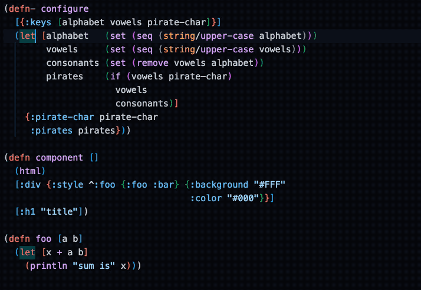

# Calva Parinfer Mode

[Parinfer](https://shaunlebron.github.io/parinfer/) is a system for editing the structure of LISP text without explicit commands. The structure can be regarded as already being expressed through indentation. With Parinfer you can use your intuition about the structure _inferred_ from the indentation to perform surprisingly many structural edits.



## Infer Parens

When you enable Calva's Parinfer it is all about infering brackets from indentation. There are no modes further Parinfer modes. Calva's auto-formatter will take care ofb keeping the code correctly indented.

Currently Paredit is added as an experimental features, enable it with from this setting: `calva.fmt.experimental.inferParensAsYouType`

!!! Note "Multi-cursors not supported"
    Calva only really considers the first cursor in a multi-cursor senario. Sometimes that's enough, often it is not. During the experiment we will try to figure out if we should disable Parinfer during multi-cursor edits.

## Some VS Code Settings automatically changed

In order for some automatic VS Code behaviour not to interfere with Parinfer the following settings are automatically configured when you toggle Parinfer ON:

```json
    "[clojure]": {
        "editor.autoClosingBrackets": "never",
        "editor.autoClosingOvertype": "never",
        "editor.formatOnPaste": false
    },
```

And when you toggle Parinfer OFF:

```json
    "[clojure]": {
        "editor.autoClosingBrackets": "always",
        "editor.autoClosingOvertype": "always",
        "editor.formatOnPaste": true
    },
```

It is recommended that you let Calva handle these settings to avoid weird behaviour.

## No Tab indenting

As the `tab` key is used for formatting the current form in Calva, it is ”taken”. The closest equivalents you have are `space` and `backspace`. At least for now. We'll see if we can find out a good way for supporting `tab` and `shift+tab` for indent and dedent.

`tab` for formatting is of course just a default key binding and you can assign it to something else to get it to do indenting. However, it will not be a very smart indent anyway, there is no Clojure awareness about it. You are hereby adviced to instead use some more spaces.

## Paredit is still there

In Calva, Parinfer and [Paredit](paredit.md) are designed to coexist and both be there to let you edit the structure easily and efficiently. Since Paredit commands are always formatted, they leave the code in a state where Parinfer has what it needs to infer bracket placement as you either edit the indentation, or remove/add brackets.

## Disable the Parinfer Extension

If you want to have Parinfer you are probably best served by Calva's built-in version. It is designed, and will continue to be improved to function well together with Calva's other structural editing and formatting features. _It will also probably conflict with the Parinfer Extension._

## See also

* [Paredit](paredit.md)
* [Formatting](formatting.md)