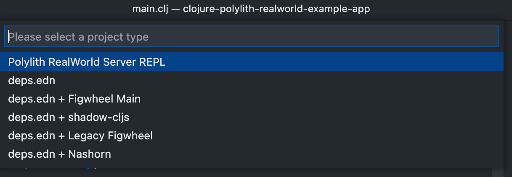

# How to Use Calva with Polylith

[Polylith](https://polylith.gitbook.io/) is an architecture for backend projects that maximizes development ergonomics and code reuse.

[](https://polylith.gitbook.io/)

When developing a Polylith application you use one REPL for everything. And as such it is a rather vanilla `deps.edn` project, so there is really not much more to using Calva with Polylith than:

1. Jack in, selecting the `deps.edn` project type
1. Select aliases, most often `:dev` and `:test`
1. Hack away!

## The RealWorld Example



To make it easy to try Polylith out with Calva, the [Polylith RealWorld example implementation](https://github.com/furkan3ayraktar/clojure-polylith-realworld-example-app) has some Calva config to get the server started and Calva connected to its REPL quickly:

0. Fork the [project](https://github.com/furkan3ayraktar/clojure-polylith-realworld-example-app) and open it in VS Code
1. Jack-in, selecting the `Polylith RealWorld Server REPL` project type
1. Wait for the REPL prompt to read `clj꞉dev.server꞉>`
1. Evaluate `(start! 6003)`
1. Hack away!

### Try it with a Frontend

A ClojureScript frontend, of course:

0. Fork the [jacekschae/conduit](https://github.com/jacekschae/conduit) project and open it in VS Code
1. Edit the `api-url` definition in `events.cljs` file to be
    ```clojure
    (def api-url "http://localhost:6003/api")
    ```
1. Jack-in, selecting to start and connect to the `:app` build
1. Wait for it to compile and then open http://localhost:3000
1. Hack away!