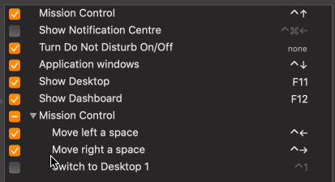

# Quirks

Here's a shocker for ya': Calva isn't perfect. 😄

There are quirks and things that flat out do not work. We'll try to collect info about such things here, providing workarounds when available (or, rather, known to us).

## Test features not available with ClojureScript

Currently [`cider-nrepl` does not provide its test functionality for ClojureScript](https://github.com/clojure-emacs/cider-nrepl/issues/555) code. Please consider contributing to fixing that.

## Using with Parinfer

Calva defaults to formatting as you type. If you use Parinfer this creates a conflict, since it auto-indents your code. If you want to use Parinfer you'll have to tell Calva not to do auto-formatting by disabling `calva.fmt.formatAsYouType`.

However, with VS Code and Calva it is probably better to learn to use [Paredit](paredit.md)'s **slurp** and **barf** and generally use Calva's automatic formatting.

## MacOS and the Slurp and Barf Keyboard Shortcuts

To make slurping and barfing forward really easy to perform they are bound to `ctrl+right` and `ctrl+left`, respectively. However, on MacOS those shortcuts are sometimes bound by Mission Control, causing the Calva shortcuts to not work. One way to solve it is to disable the shortcuts in *System Preferences -> Keyboard -> Shortcuts*:

## Calva and the VIM Extension

See [Using Calva with the VIM Extension](vim.md).

## ”Command not found” Errors on Jack-in

[Jack-in](jack-in-guide.md) starts by running a command in a new terminal. You will need the commands used installed on your computer:

* `clojure` for tools.deps/Clojure CLI
* `lein` for Leiningen
* `npx` for shadow-cljs

Also, in some circumstances VS Code is not spawned from a shell with the environment variables, especially `$PATH`, which might mean that even though you have the tools installed, they are not found when VS Code/Calva tries to execute them. To fix this you will need to do one of these two things:

1. Figure out from where VS Code is spawned, and make sure the `$PATH` there includes the directoy with the needed binary.
1. Start VS Code from a terminal where the `$PATH` is correctly configured. (Using the `code` commmand.)

See [this issue](https://github.com/BetterThanTomorrow/calva/issues/591) for more clues on this problem.

## Strange linting errors?

This is not really a quirk, and most linting errors are not strange when you learn about why they are there. Calva does not do any linting, btw, see also [linting](linting.md).
