# Refactoring

There are two ”flavours” to refactoring support. Some (just a few) refactorings are made available as _Quick Fix_ suggestions (the light bulb), the rest are regular commands in the *clojure-lsp Refactoring* category.

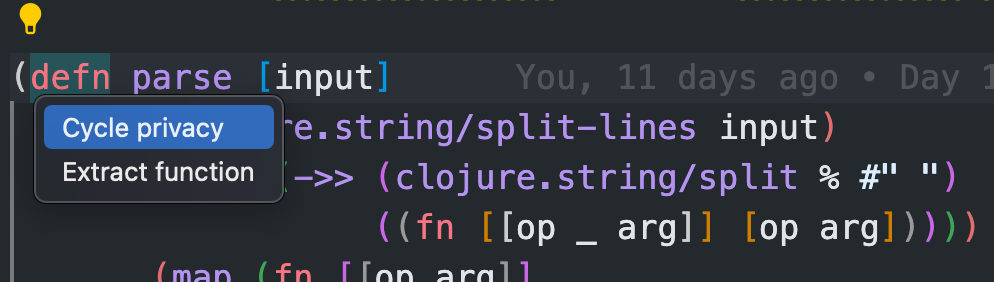

You can enable or disable the _Quick Fix_ suggestion lightbulb using the VS Code setting `editor.lightbulb.enabled`.

The refactoring commands do not have default keyboard shortcuts. You find them all by typing ”clojure-lsp Refactor” in the Command Palette.

## Commands

Command Title | Command Key | Description
------------- | ----------- | -----------
Clean NS Form | `clojureLsp.refactor.cleanNs` | 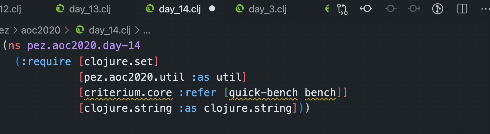
Add Missing Require | `clojureLsp.refactor.addMissingLibspec` | 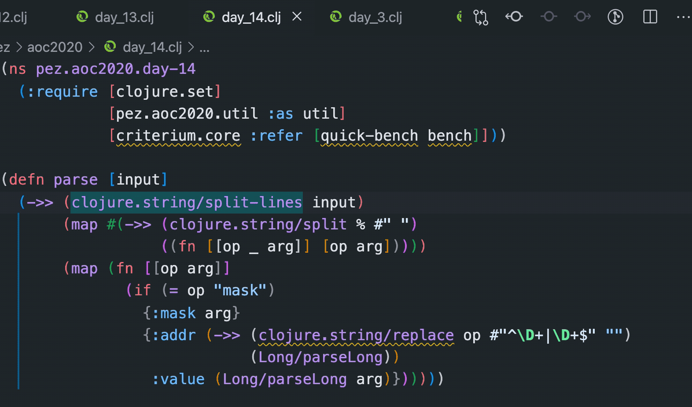
Extract to New Function | `clojureLsp.refactor.extractFunction` | 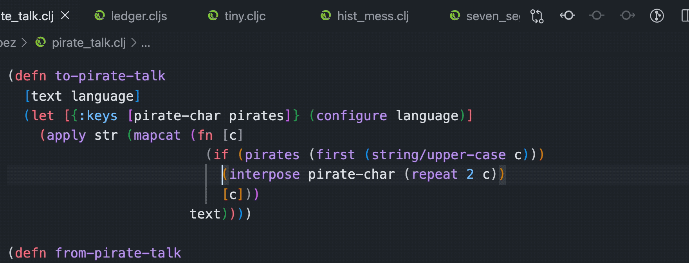
Cycle/Toggle Privacy | `clojureLsp.refactor.cyclePrivacy` | 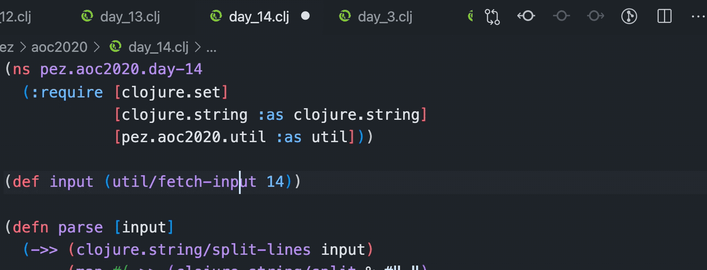
Inline Symbol | `clojureLsp.refactor.inlineSymbol` | 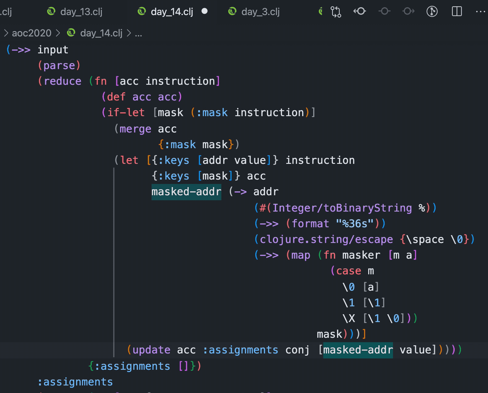
Introduce let | `clojureLsp.refactor.introduceLet` | Creates a new let box with the binding. Follow up with ”Expand let” to move it upwards. 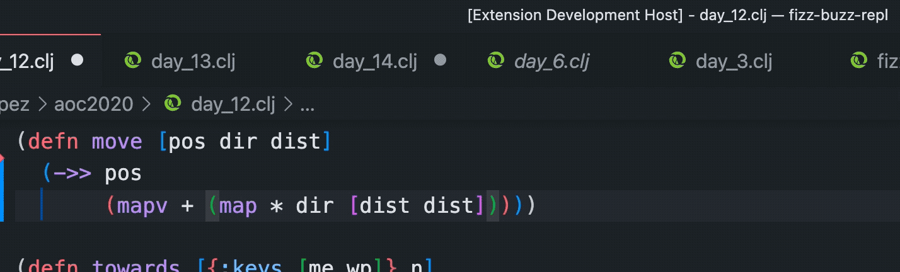
Expand Let | `clojureLsp.refactor.expandLet` | 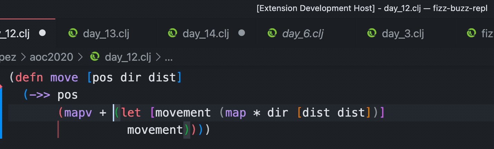
Move to Previous let Box | `clojureLsp.refactor.moveToLet` | 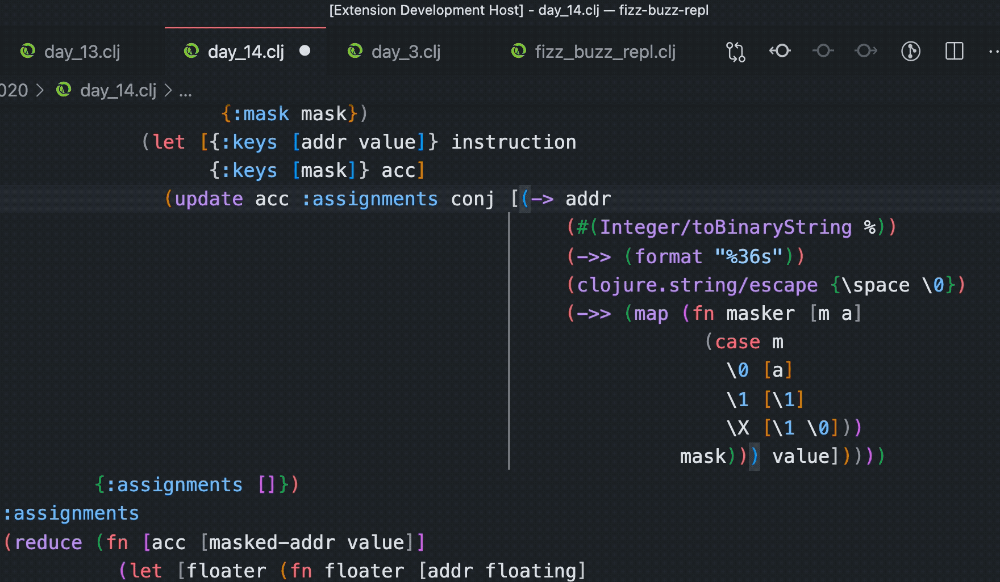
Thread First | `clojureLsp.refactor.threadFirst` | 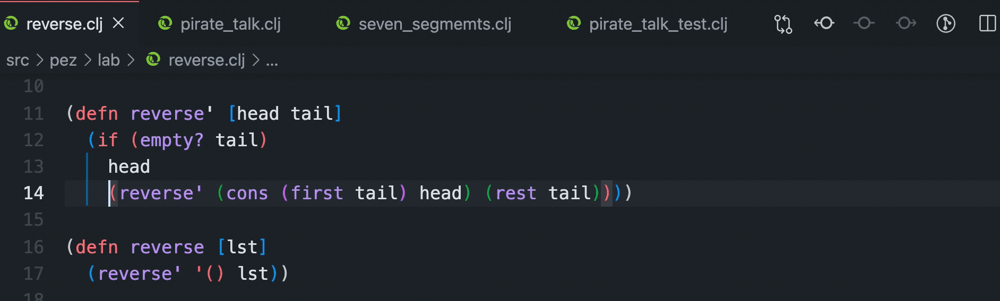
Thread First All | `clojureLsp.refactor.threadFirstAll` | 
Thread Last | `clojureLsp.refactor.threadLast` | 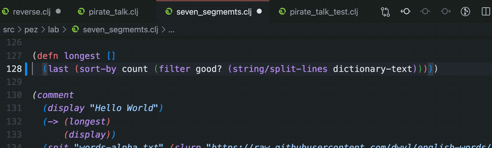
Thread Last All | `clojureLsp.refactor.threadLastAll` | 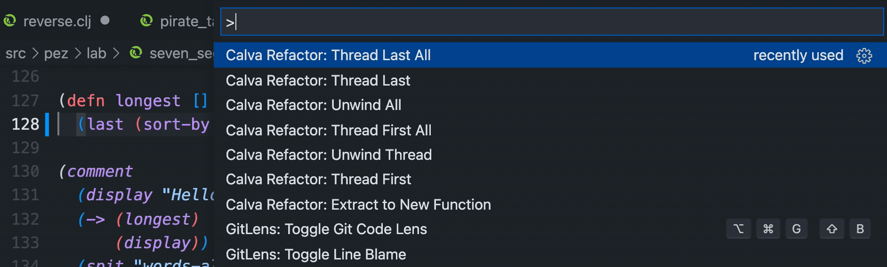
Unwind All | `clojureLsp.refactor.unwindAll` | 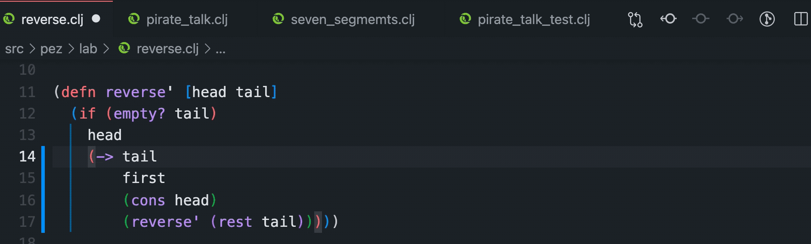
Unwind Thread | `clojureLsp.refactor.unwindThread` | 

!!! Note "Formatting"
    The way that some of the refactorings are applied to the document, makes it difficult for Calva to format the results. So, sometimes you'll need to navigate the cursor to the enclosing form and hit `tab` to tidy up the formatting after a refactoring. See also [Formatting](formatting.md).

## Thanks to clojure-lsp

Most of Calva's refactoring support is sourced directly from [clojure-lsp](clojure-lsp.md). This also means that most often, if you find issues with refactoring, or have suggestions about it, the clojure-lsp repo is where to direct your reporting.
