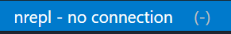
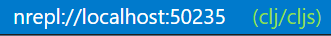

# The Calva REPL UI

When you connect Calva to a REPL, you gain access to a complete interactive development environment. The REPL UI consists of several components that work together to provide a seamless evaluation and feedback experience.

## Components Overview

### File Editors

Every Clojure/ClojureScript file you have open becomes a REPL-connected environment. You can evaluate code directly in your editor and see results displayed inline. The first line of evaluation results appears as an inline decoration, while complete output goes to your configured output destination.

### Output Destinations

Calva provides several output destinations where evaluation results, stdout/stderr, and other REPL messages can be displayed. Each destination has different capabilities suited for different use cases. See [Output Overview](output.md) for details on all available destinations, their feature comparison, and how to configure which output goes where.

### REPL Window

The [REPL Window](repl-window.md) is a special Clojure file that provides an interactive prompt for experimental code. It automatically tracks the namespace of whatever file you're evaluating code in, making it easy to explore your code interactively. The window supports full Paredit, history recall, and can be used with the [debugger](debugger.md).

### Inspector

The [Inspector](inspector.md) is a tree view that lets you explore evaluation results as expandable data structures. All REPL evaluation results are automatically added to the inspector, allowing you to drill down into nested collections and examine your data in detail.

### Command Palette

All REPL commands are available through VS Code's Command Palette (<kbd>Ctrl</kbd>+<kbd>Shift</kbd>+<kbd>P</kbd> / <kbd>Cmd</kbd>+<kbd>Shift</kbd>+<kbd>P</kbd>). Here are the most essential commands for interactive development:

* **Load/Evaluate Current File**: <kbd>Ctrl</kbd>+<kbd>Alt</kbd>+<kbd>C</kbd> <kbd>Enter</kbd> - Load the current file and its dependencies
* **Evaluate Current Form**: <kbd>Ctrl</kbd>+<kbd>Enter</kbd> - Evaluate the form at cursor and show result inline
* **Evaluate Top-Level Form**: <kbd>Alt</kbd>+<kbd>Enter</kbd> - Evaluate the enclosing top-level form (works inside `comment` blocks)
* **Show REPL Window**: <kbd>Ctrl</kbd>+<kbd>Alt</kbd>+<kbd>O</kbd> <kbd>R</kbd> - Open and focus the REPL Window
* **Send Form to REPL Window**: <kbd>Ctrl</kbd>+<kbd>Alt</kbd>+<kbd>C</kbd> <kbd>Ctrl</kbd>+<kbd>Alt</kbd>+<kbd>E</kbd> - Copy current form to REPL Window
* **Run Namespace Tests**: <kbd>Ctrl</kbd>+<kbd>Alt</kbd>+<kbd>C</kbd> <kbd>T</kbd> - Run all tests in the current namespace
* **Run Current Test**: <kbd>Ctrl</kbd>+<kbd>Alt</kbd>+<kbd>C</kbd> <kbd>Ctrl</kbd>+<kbd>Alt</kbd>+<kbd>T</kbd> - Run the test at cursor
* **Toggle Pretty Printing**: <kbd>Ctrl</kbd>+<kbd>Alt</kbd>+<kbd>C</kbd> <kbd>P</kbd> - Enable/disable pretty printing (also available via status bar)
* **Interrupt Running Evaluation**: Available in REPL status bar menu when connected
* **Show Output Destination**: <kbd>Ctrl</kbd>+<kbd>Alt</kbd>+<kbd>O</kbd> <kbd>O</kbd> - Open the configured output destination
* **Disconnect from the REPL**: Opens a quick pick listing every active connection so you can disconnect from a single connection or select **Close all REPL connections** when you need a fresh slate

Search the command palette for `Calva evaluate` to find some more commands related to code evaluation at the REPL.

## The Status Bar

The status bar displays REPL connection status and provides quick access to common REPL operations.

### Connection Status

The "REPL" connection indicator shows the current state of your REPL connection:



**States:**

* **Disconnected** - `REPL $(zap)` (gray) - Click to open the REPL menu and start Jack-in or Connect
* **Launching** - `Launching REPL using <method>` (orange/yellow) - Click to interrupt the launch process
* **Connecting** - `REPL - trying to connect` - Click to interrupt the connection attempt
* **Connected** - `REPL $(zap)` (green) - Click to open the REPL menu with commands for managing your connection. Calva keeps existing connections alive when you start another REPL

When connected, the tooltip displays the connection details: `nrepl://hostname:port`

#### REPL Status Colors

You can customize the REPL indicator colors for different connection states using these settings:

**For dark themes:**
* `calva.statusColor.dark.connectedStatusColor` - Color when connected (default: green)
* `calva.statusColor.dark.disconnectedColor` - Color when disconnected (default: gray)
* `calva.statusColor.dark.launchingColor` - Color during launch (default: orange)
* `calva.statusColor.dark.typeStatusColor` - Color for session type indicator

**For light themes:**
* `calva.statusColor.light.connectedStatusColor`
* `calva.statusColor.light.disconnectedColor`
* `calva.statusColor.light.launchingColor`
* `calva.statusColor.light.typeStatusColor`

### Session Type Status

Once connected, the session type indicator shows which REPL you're currently working with:




For `.cljc` files (Clojure Common files that can run on both CLJ and CLJS), the indicator shows `cljc/clj` or `cljc/cljs` depending on which REPL is active for that file.

The indicator is always clickable when the REPL is connected. Clicking it opens the **REPL Sessions** menu, which provides:

* A list of connected sessions – select one to pin it (the indicator will show `$(pin)` while pinned). When auto-routing is active, the currently selected session is marked with `$(check)` so you can see which REPL is in use at a glance. Sessions in pairs show a `cljc` indicator for the session that handles `.cljc` files, and non-target sessions have a button to become the cljc target.
* **Auto-route** – return to Calva's default routing based on connect sequence globs.
* **Select session for REPL window** – (Only shown when the REPL window is focused) Override which session the REPL window uses for evaluations.

The cljc routing preference is per-connection. When you have multiple REPL connections, each connection remembers its own cljc target session independently. If you pin a session, that pin takes precedence for all files until you return to auto-route.

These options make it easy to temporarily lock the routing, quickly inspect available sessions, or manage `.cljc` file routing per connection. See [The REPL Window](repl-window.md#choose-clj-or-cljs-repl-connection) for more details.

### REPL Window Session Command

The command **Calva: Select REPL Window Session** is also available from the command palette. It can be invoked programmatically with a session key argument to bypass the picker:

```javascript
// Via VS Code API
vscode.commands.executeCommand('calva.selectReplWindowSession', 'cljs');

// Or without argument to show the picker
vscode.commands.executeCommand('calva.selectReplWindowSession');
```

This is useful for keyboard shortcuts or automation scripts that need to quickly switch the REPL window's session.

## Managing Multiple Connections

Calva keeps every connected nREPL connection alive until you explicitly disconnect it. This makes it possible to work with several apps (or the same app in multiple environments) at once from the same VS Code window. By default Calva will automatically route evaluations to a session based on file path and file type.

- The REPL Sessions menu lists every registered session name, indicating which one is being targeted by the auto-router for the currently active file. You can bypass the auto-routing by pinning one of the sessions.
- The command palette entry **Calva: Disconnect from the REPL** (also available from the REPL menu) opens a menu that shows all active connections, with their sessions names, host/port, and project root. Pick a single connection to disconnect only that REPL or choose **Close all REPL connections**.
- Sessions names are defined by the [connect sequence](connect-sequences.md) used for connecting a REPL. Calva has built-in sequences for several Clojure dialects/runtimes, defining default session names. The session names are customizable via custom connect sequences.
- When two or more sessions use the same session name, suffixes based on a list of fruits will be used to separate the sessions.

  E.g. connect three Babashka repls and you will have one session named `bb` another named `bb:apple`, and a third named `bb:banana`. If you then connect two Clojure + ClojureScript repls using default session names, you will have four more sessions named: `clj`, `cljs`, `clj:cherry`, `cljs:cherry`.

### CLJS Build Selector

When connected to a ClojureScript REPL that supports builds (Figwheel or shadow-cljs), this indicator shows the currently connected build:

* **Build connected** - Shows the build name (e.g., `:app`)
* **No build** - Shows `No build connected`

Click the indicator to switch to a different build or connect to a build if none is selected.

### Shadow-CLJS Runtime Selector

When using shadow-cljs, this indicator shows the currently selected runtime:

* **Runtime selected** - Shows `rt: <runtime-id>` (e.g., `rt: 3`)
* **No runtime** - Shows `No Runtime`

Click the indicator to open the runtime selection menu. The tooltip displays additional details like the runtime description and how long it has been connected. See [shadow-cljs](connect-sequences.md) for more about runtime selection.

See also: [shadow-cljs](shadow-cljs.md).

### Pretty Print Toggle

The `pprint` indicator shows whether pretty printing is enabled for evaluation results:

* **Enabled** (default) - Shows in normal color, click to turn off
* **Disabled** - Shows in gray, click to turn on

Pretty printing formats evaluation results for better readability. See [Pretty Printing](pprint.md) for detailed configuration options including `maxLength`, `maxDepth`, and print engine selection.

## See Also

* [Output Overview](output.md) - Detailed comparison of output destinations
* [The REPL Window](repl-window.md) - Using the interactive REPL file
* [Output View](output-view.md) - The read-only output view
* [Inspector](inspector.md) - Exploring data structures
* [Pretty Printing](pprint.md) - Configuring result formatting
* [Evaluation](evaluation.md) - How to evaluate code