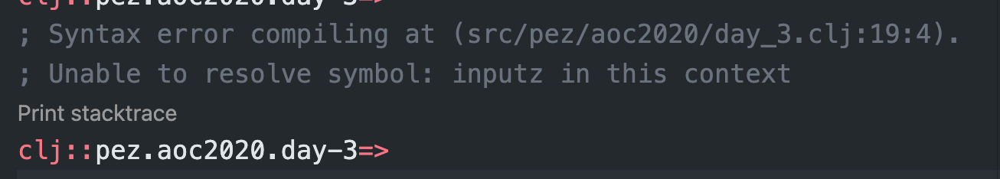
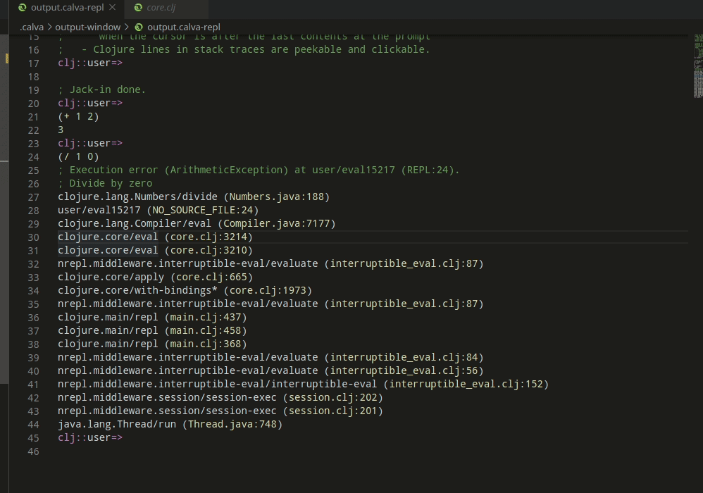
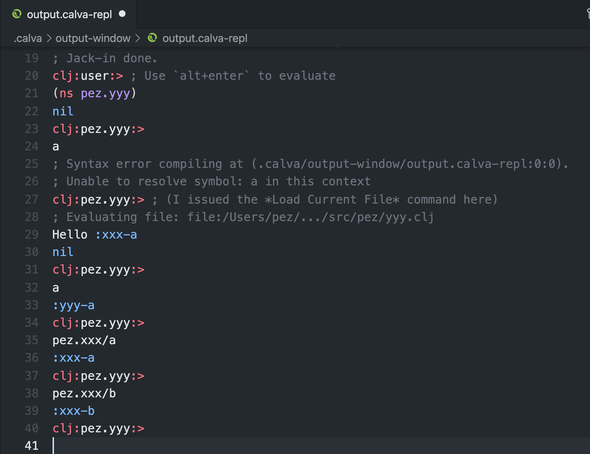

# The REPL Window/File

The Calva REPL Window is actually a regular file with some extra treatment from Calva, like displaying a prompt, offering evaluation history recall and generally “following” the current namespace. This file is created and opened when Calva is connected to a REPL. You can use it for experimental code (though there are also [Rich Comments](rich-comments.md) and [Fiddle Files](fiddle-files.md) for this).

In ClojureScript projects, the window will be associated with the `cljs` REPL once it is connected. It will then look something like this:


The first prompt is from when the `clj` REPL is connected, and the second from `cljs`. The first _part_ of the prompt tells you which REPL type the window is currently connected to.

## Using the REPL Window for output

By default the REPL Window doubles as the place where Calva sends output like stdout/stderr and other messages. See [Calva Output](output.md) for more about this and how to change this behaviour.

## Finding the REPL Window

If you quickly want to open and/or switch to the REPL Window there is the command **Calva: Show/Open REPL Window**, `ctrl+alt+o r`.

To sync the REPL window namespace with the current file before switching, use the **Switch Namespace of the REPL Window to Current Namespace** command, `ctrl+alt+c alt+n`.

## Find the File for the Current REPL Window Namespace

When you are editing things in the REPL window, and want to open the file that defines its current namespace, use the **Show File for the Current REPL Window Namespace** command, `ctrl+alt+o r`.

!!! Note
    This also works for Clojure core and library namespaces.

## Evaluating Code

The window will be automatically associated with the REPL and the namespace of any project Clojure/ClojureScript file you evaluate code in. So for instance if you evaluate this code in a `clj` file with the namespace `fresh-reagent.handler`:

```clojure
(def mount-target
  [:div#app
   [:h2 "Welcome to fresh-reagent"]
   [:p "please wait while Figwheel is waking up ..."]
   [:p "(Check the js console for hints if nothing exciting happens.)"]])
```

If the REPL Window is the configured destination for evaluation results, the defined var will be printed there. Otherwise, it will be printed to the destination you've configured. In either case, the REPL window will print a new prompt reflecting the current REPL connection and namespace:


If you then switch to the repl window (`ctrl+alt+o r`), and enter this at the prompt:

```clojure
mount-target
```

then evaluate it using `alt+enter`, you'll get this:


... because the namespace ”followed” the first evaluation in the REPL window.

## REPL History

Recently evaluated forms in the REPL file are persisted and can easily be shown again for modifying and re-evaluating.

### Navigate REPL History

You can navigate up and down the history of evaluated forms in the REPL file by pressing `alt+up` and `alt+down`, provided your cursor is at the end of the last form after the prompt. If the cursor is not at the end of the last form, then `alt+up` and `alt+down` will do whatever they are mapped to, which is by default "Move Line Up" and "Move Line Down," respectively.

If you have typed some text after the prompt before you start traversing up the history, this text will be preserved and will display when you traverse back down the history. If you modify some text in the history while traversing, the modification will be saved at that location in history.

### Clear REPL History

You can clear the repl history by running the command "Clear REPL History" from the command palette.

## Stack Traces

When an evaluation produces an error, it will automatically be printed in the REPL Window. If there is a stack trace associated with the error, it can now be printed on demand using the **Calva: Print Last Stacktrace to the REPL Window** command. You can also print the stack trace for any error message printed to the REPL Window via the Codelens button below it.



For printed stacktraces, when source locations are available (Clojure files), you will be able to navigate to them by pressing `ctrl+click` (`cmd+click` on Mac) on the file name. You can also hover over symbols in the stack trace to see the symbol's documentation, and `ctrl+click` (`cmd+click` on Mac) the symbol to Peek Definition.



!!! Note "Output destinations"
    If you have configured some other destination for stderr output, the error message will be printed there as well. But it will _also_ be printed to the REPL Window, because the augmented stack traces need this (because reasons).

## Load Current Namespace

When navigating namespaces it is easy to [forget to first require them](https://clojure.org/guides/repl/navigating_namespaces#_how_things_can_go_wrong) and that can be tricky to debug. To help with this, Calva's command **Load/Evaluate Current File and its Requires/Dependencies** also works in the REPL Window, but there, it acts like **Load Current Namespace**.

Suppose you have two files, `pez/xxx.clj` and `pez/yyy.clj`, where `pez.yyy` requires `pez.xxx`.

```clojure
(ns pez.xxx)

(def a :xxx-a)

(def b :xxx-b)
```

```clojure
(ns pez.yyy
  (:require [pez.xxx]))

(def a :yyy-a)

(println "Hello" pez.xxx/a)
```

Then, with a freshly jacked-in REPL, you evaluate `(ns pez.yyy)` and want to work with the vars defined there, Clojure will complain. But if you **Load/Evaluate Current File and its Requires/Dependencies**, it will start working. Something like so:



!!! Note
    This currently suffers from a limitation in Calva where it won't reload dependencies, so you will sometimes have to do this ”manually” anyways (by opening the files and loading them yourself). See [Calva issue #907](https://github.com/BetterThanTomorrow/calva/issues/907)

### Peek Current Namespace

A somewhat hidden feature: You can peek, see documentation for, and navigate to a namespace by hovering on the namespace symbol in one of the REPL Window prompts (just like you would if it was not in the prompt 😄).

## Paredit Enabled

The REPL Window is mostly a regular Calva Clojure/ClojureScript file, which makes everything that works in a regular file work in this file, including [Paredit](paredit.md). This makes it easy to navigate the input and output there. For instance, to select the last evaluation results, you can press `ctrl+w` (`shift+alt+right` on Windows and Linux):


## Debugger Enabled

The repl window is mostly a regular... (you get it), which means you also have the [Calva debugger](debugger.md) at your command at the REPL prompt (only for `clj` sessions, for now). So instead of evaluating a function definition using `alt+enter`, you can evaluate it and instrument it for debugging using `ctrl+alt+c i`, and then call the function.


## It is Ephemeral

The contents of the output/REPL window is written to a file named `output.repl` in the `.calva/output-window` directory of your project. The file is recreated every new session, so you should copy or save anything you want to preserve between sessions.

You probably want to add `.calva/output-window/` to your `.<something>ignore` files. (There are some more files in that directory that you shouldn't keep under source control.)

## Choose CLJ or CLJS REPL Connection

In full-stack projects, you will probably use the window as a REPL for both `clj` and `cljs`. You can toggle which REPL the window is connected to by using the command **Calva: Toggle REPL Connection for CLJC files**. There is also a button for this in the status bar:


## Known Quirks and Caveats

Due to limitations in the VS Code API it is hard for Calva to know if the REPL file is open, and if it was opened more than once. Therefore, we suggest you make it a habit to leave this window open, or even pinned. And if it is open in several tabs, expect evaluation printouts to be a bit unpredictable.

If you save the REPL file (which most often does not make much sense, but anyway) you will sometimes be presented with a message about VS Code being confused about the file contents being out of sync. Just choose to *Overwrite* the currently saved version and you should be fine.
