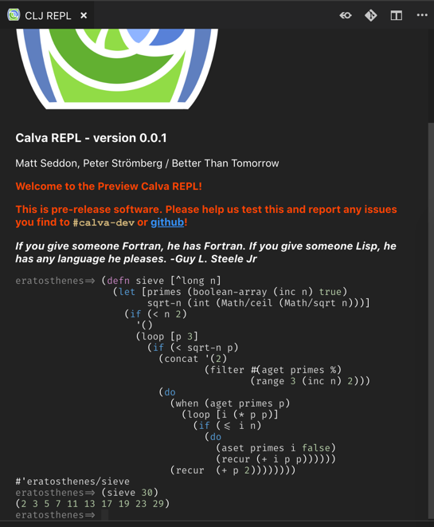

# Calva V2 - With a Real REPL Window and Jack-in

For a too long while [Calva](https://github.com/BetterThanTomorrow/calva) users haven’t had a decent REPL window in which to experiment with their system. Also, users have had to struggle with getting the dependencies right before Calva even works. This nonsense has now come to an end. Upgrade Calva and say hello to the brand new REPL Window and goodbye to soul-crushing, getting started-issues with the [Cider](https://github.com/clojure-emacs/cider) inspired **Jack-in** command.

## New REPL Window Improves Support for Interactive Programming

Experienced Clojurians, as well as new users of the language, are now much better served in their interactive development. Some of the features of the new REPL Window are:
* A real code editor:
  * Smooth Clojure code formatting
  * Structural editing with Paredit support
  * Syntax highlighting
  * Code completion
  * Command history
* Deep integration with Calva:
  * Commands for using the REPL Window to evaluate code in the edited files.
    * Automatic and temporary switching of the REPL window namespace when evaluating forms in editor files.
  * Keeping the predictable switching between Clojure and ClojureScript REPLs that Calva file editors have.
* Much improved results reporting:
  * Syntax highlighted
  * Pretty printed
  * Clear differentiation of evaluation results, output, and errors.
  * Stack traces with navigational links.

This is quite huge. Yes, certainly in terms of increased value to the Clojure developer using VS Code, but also in terms of what it actually took to bring this UI into VS Code, which lacks all the native UI building blocks to support this, except for WebViews.

This means the REPL window and its code editor is written completely from scratch. Think something like the essentials of Code Mirror. I can only take very partial credits for this. The actual coding is almost solely the work of Matt Seddon, where I have been acting the product owner and first line tester.

The Paredit powering the new REPL window is also written from scratch, by the way. This means we will be able to improve a lot on the Current Paredit implementation in Calva, which relies on an abandoned project.

## Jack-in

We have brought the Getting Started story from _reading pages of instructions and trial-and-horror with your profiles and/or project files_, to a simple command: *Calva Jack-in*. Inspiration is taken from Cider.

Calva Jack-in injects the dependencies Calva needs. It supports Leiningen, shadow-cljs and clj/deps. (There is some Boot support too, but it is quite untested.) Calva will try to figure out if ClojureScript support is needed and, via prompting, bring in any necessary Figwheel or Figwheel Main dependencies as well.

Like with Cider, you will get a chance to edit the command line before it is issued, which will be our version 1 of supporting more complex project setups.

We hope Calva with Jack-in will make Clojure more accessible to new users of the best programming language ever created.

## Get Started with Clojure on VS Code.

It really is super easy:

1. Install VS Code.
2. Install Calva (via the *Extensions* pane). 
3. Open a Clojure(Script) file in the root of your project.
4. Issue the **Calva Jack-in** command, `ctrl+alt+v ctrl+alt+v`

Calva includes code formatting, Paredit, and some little Parinfer support, so you are quite set. However, I recommend also installing [Clojure Warrior](https://github.com/tonsky/clojure-warrior) which brings in rainbow parens, highlighting of unmatched parens, and also sane highlighting of *matching* parens, which means you can disable VS Code's confusing paren highlighting for Clojure files.

See the Calva [README](https://github.com/BetterThanTomorrow/calva/blob/master/README.md) and [Wiki](https://github.com/BetterThanTomorrow/calva/wiki) for more information on usage. And of course, feel warmly welcome to join the [#calva-dev]() channel on the Clojurians Slack to get support or just to cheer us on.

## The Future of Calva

The new REPL window and Jack-in bring VS Code to be a much more useful editor for Clojure work. It is far from at par with Cider and Cursive, still, but we are moving along, trying to make Calva a viable option for people who like to keep using VS Code.

Now starts a period where most Calva development will be directed at supporting the new-to-Clojure users. We have gotten some great feedback lately, so we know about many of the things that trip new users up, and we want to contribute to Clojure by making Calva ease the path.

However, do not expect lightning speed. Calva is maintained mostly by me alone, with Matt being there for the wizardry things that are sometimes needed. I have a demanding day job and can only devote so much time to Calva.

It is a blessing that some other people have done lots of the hard work to make the building blocks of Calva, I don't want to forget anyone by starting to mention projects, but I must mention [The Orchard](https://github.com/clojure-emacs/orchard), which is where Calva finds most of the Cider it is distilled from. Thanks, @bbatsov, you rock!